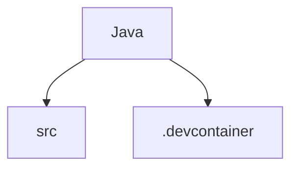

# 基础信息

|      |      |
|------|------|
| 名称 | Java |
| 编码语言 | .java |
| 代码路径 | Java |
| 概述说明 | 代码模块实现了多种搜索算法、数据结构、加密算法、数学计算、动态规划等，适用于不同业务场景。 |

# 说明

## 概述

该代码模块是一个功能丰富的Java库，涵盖了从基础算法到复杂数据结构和数学计算的多种实现。模块中的各个子模块专注于不同的领域，包括搜索算法、矩阵操作、动态规划、贪心算法、图论、几何计算、加密算法、字符串处理、位操作、递归、分治算法、回溯算法、排序算法、进程调度、CRDT数据结构、音频滤波、滑动窗口、线段裁剪、数值转换等。这些实现通过高效的算法和清晰的设计，提供了广泛的功能，适用于多种业务场景和需求。

## 主要业务场景

1. **搜索算法**：模块提供了多种搜索算法，包括线性搜索、二分查找、图搜索、字符串匹配等，适用于有序数组、无序数组、二维数组、树、图等数据结构的查找任务。
2. **矩阵操作**：模块实现了矩阵的求逆、旋转、镜像、秩计算、转置、中位数计算、线性方程组求解等操作，适用于数学计算、数据处理、图像处理等领域。
3. **动态规划**：模块通过动态规划算法解决了子序列问题、路径计算、背包问题、字符串匹配等复杂问题，适用于需要优化和递归的场景。
4. **贪心算法**：模块实现了资源分配、调度问题、数学计算等贪心算法，适用于需要高效解决方案的场景。
5. **图论**：模块提供了带资源约束的最短路径、旅行商问题、强连通分量等图论问题的解决方案，适用于网络路由、物流配送、社交网络分析等场景。
6. **几何计算**：模块实现了凸包计算、直线生成、圆生成、椭圆生成等几何算法，适用于计算机图形学、计算几何等领域。
7. **加密算法**：模块涵盖了对称加密、非对称加密、流密码、替换密码、转置密码等多种加密技术，适用于数据加密、信息安全、通信保护等场景。
8. **字符串处理**：模块提供了字符串检查、转换、匹配、压缩、排列等多种功能，适用于文本处理、数据清洗、算法设计等领域。
9. **位操作**：模块实现了二进制数据处理、逻辑运算、编码转换等功能，适用于算法优化、数据结构处理、加密算法等领域。
10. **递归与分治算法**：模块通过递归和分治策略解决了棋盘填充、中位数查找、矩阵乘法、最近点对查找等问题，适用于大规模数据处理和复杂问题求解。
11. **回溯算法**：模块实现了组合、排列、路径搜索、图着色、迷宫求解、填字游戏等回溯算法，适用于需要穷举所有可能解的场景。
12. **排序算法**：模块涵盖了从经典排序算法到特殊排序算法的多种实现，适用于大规模数据排序、小规模数据排序、特定数据结构排序等场景。
13. **进程调度**：模块实现了多种进程调度算法，包括先来先服务、短作业优先、优先级调度、时间片轮转等，适用于操作系统、实时系统、云计算平台等场景。
14. **CRDT数据结构**：模块实现了无冲突复制数据类型，如集合、计数器等，适用于分布式系统中的高效数据管理和协同操作。
15. **音频滤波**：模块实现了IIR滤波器和EMAFilter，适用于音频信号的实时处理、噪声抑制、信号增强等场景。
16. **滑动窗口**：模块通过滑动窗口技术解决了子数组或子串相关的优化问题，适用于数据分析、时间序列处理、字符串处理等场景。
17. **线段裁剪**：模块实现了Cohen-Sutherland算法和Liang-Barsky算法，适用于二维平面几何图形的线段裁剪场景。
18. **数值转换**：模块提供了进制转换、IP地址转换、单位转换、罗马数字转换、颜色模式转换等功能，适用于计算机科学、数学计算、数据处理等领域。

这些业务场景展示了该模块的多样性和广泛适用性，能够满足从基础算法到复杂数据处理的多方面需求，提升开发效率和代码质量。

### 包内部结构视图

该流程图展示了Java项目的目录结构，包含两个子目录：src和.devcontainer。src目录通常用于存放源代码，而.devcontainer目录则用于开发容器配置。这种结构有助于组织和管理项目文件，确保开发环境的统一性和可维护性。

# 文件列表 File List

| 名称   | 类型  | 说明 |
|-------|------|-------------|
| [_module.md](src/main/java/com/_module.md) | folder | 代码模块实现了多种搜索算法、数据结构、加密算法、数学计算、动态规划等，适用于不同业务场景。 |

