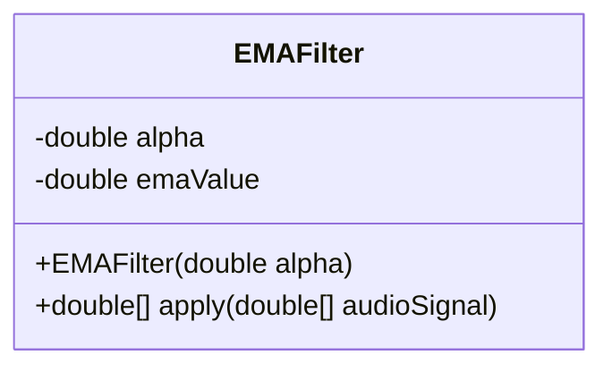
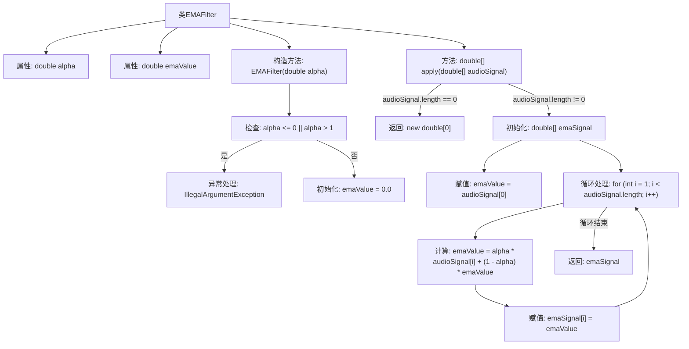

# 基础信息

|      |      |
|------|------|
| 名称 | EMAFilter |
| 编码语言 | .java |
| 代码路径 | Java/src/main/java/com/thealgorithms/audiofilters/EMAFilter.java |
| 包名 | com.thealgorithms.audiofilters |
| 依赖项 | [] |
| 概述说明 | EMAFilter类用于音频信号处理，采用指数移动平均滤波，alpha为平滑因子。 |

# 说明

EMAFilter类实现了指数移动平均滤波功能，通过alpha参数作为平滑因子，能够有效处理音频信号。该方法适用于需要平滑处理的场景，能够减少噪声并保留信号的主要特征。

# 类列表 Class Summary

| 名称   | 类型  | 说明 |
|-------|------|-------------|
| EMAFilter | class | EMAFilter类实现指数移动平均滤波，alpha为平滑因子，适用于音频信号处理。 |

## 类 EMAFilter

|      |      |
|------|------|
| 访问范围 | public |
| 类型 | class |
| 名称 | EMAFilter |
| 说明 | EMAFilter类实现指数移动平均滤波，alpha为平滑因子，适用于音频信号处理。 |

### UML类图

这段代码定义了一个名为 `EMAFilter` 的类，用于实现指数移动平均（EMA）滤波器。该类包含两个私有成员变量：`alpha`（平滑因子）和 `emaValue`（当前的EMA值）。构造函数 `EMAFilter` 接受一个 `alpha` 参数，并检查其是否在合法范围内（0 < alpha <= 1），否则抛出异常。`apply` 方法接受一个音频信号数组，并返回经过EMA滤波处理后的信号数组。该方法首先检查输入数组是否为空，然后计算每个样本的EMA值，并将其存储在结果数组中返回。

### 内部方法调用关系图

**描述：**  
这段代码实现了一个指数移动平均（EMA）滤波器类 `EMAFilter`。构造函数 `EMAFilter(double alpha)` 初始化滤波器的平滑因子 `alpha`，并检查其有效性。方法 `apply(double[] audioSignal)` 对输入的音频信号数组进行处理，通过循环计算每个样本的EMA值，并返回处理后的信号数组。如果输入数组为空，则返回空数组。流程图清晰地展示了类的构造、方法的调用以及异常处理的逻辑。

### 字段列表 Field List

| 名称  | 类型  | 说明 |
|-------|-------|------|
| alpha | double | 声明一个私有的、不可变的双精度浮点数变量alpha。 |
| emaValue | double | 私有双精度变量emaValue。 |

### 方法列表 Method List

| 名称  | 类型  | 说明 |
|-------|-------|------|
| apply | double[] | 该方法对音频信号应用指数移动平均滤波，返回处理后的信号。 |

