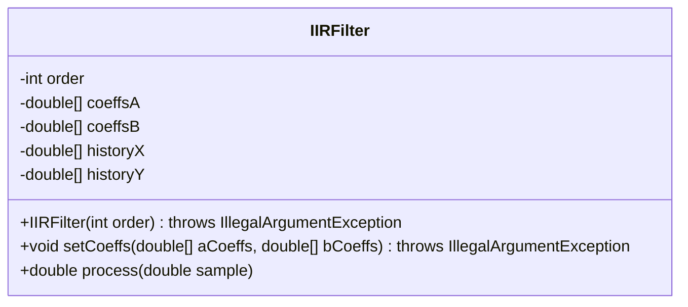
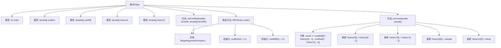

# 基础信息

|      |      |
|------|------|
| 名称 | IIRFilter |
| 编码语言 | .java |
| 代码路径 | Java/src/main/java/com/thealgorithms/audiofilters/IIRFilter.java |
| 包名 | com.thealgorithms.audiofilters |
| 依赖项 | [] |
| 概述说明 | IIR滤波器类，含阶数、系数、历史数据，支持系数设置和样本处理。 |

# 说明

IIR滤波器类是一个用于实现无限脉冲响应滤波器的工具，包含滤波器阶数、系数和历史数据等关键属性。该类支持用户设置滤波器的系数，以便根据具体需求调整滤波特性。同时，它还提供了处理样本的功能，能够对输入信号进行实时滤波处理。通过维护历史数据，IIR滤波器类能够有效地进行递归计算，从而实现高效的滤波操作。

# 类列表 Class Summary

| 名称   | 类型  | 说明 |
|-------|------|-------------|
| IIRFilter | class | IIR滤波器类，包含阶数、系数、历史数据，支持设置系数和处理样本。 |

## 类 IIRFilter

|      |      |
|------|------|
| 访问范围 | public |
| 类型 | class |
| 名称 | IIRFilter |
| 说明 | IIR滤波器类，包含阶数、系数、历史数据，支持设置系数和处理样本。 |

### UML类图

这段代码定义了一个IIRFilter类，用于实现无限脉冲响应滤波器。该类包含一个构造函数用于初始化滤波器的阶数和系数数组，以及两个方法：setCoeffs用于设置滤波器的系数，process用于处理输入样本并返回处理后的结果。类中的私有成员变量用于存储滤波器的阶数、系数数组以及历史样本数据。代码通过异常处理确保输入参数的合法性，并在处理样本时更新历史数据以便后续处理。

### 内部方法调用关系图

这段代码定义了一个IIRFilter类，用于实现无限脉冲响应滤波器。类中包含构造方法、设置系数的方法和处理单个样本的方法。构造方法初始化滤波器参数并设置默认值，设置系数的方法验证输入并更新滤波器系数，处理样本的方法计算滤波结果并更新历史数据。流程图展示了类的主要结构和方法的调用关系。

### 字段列表 Field List

| 名称  | 类型  | 说明 |
|-------|-------|------|
| order | int | 私有整型变量order用于存储顺序值。 |
| historyY | double[] | 私有双精度数组历史Y。 |
| historyX | double[] | 声明一个私有的双精度浮点数数组historyX。 |
| coeffsB | double[] | 私有双精度数组coeffsB。 |
| coeffsA | double[] | 声明一个私有的、不可变的双精度浮点数数组coeffsA。 |

### 方法列表 Method List

| 名称  | 类型  | 说明 |
|-------|-------|------|
| process | double | 该方法处理输入样本，计算并更新历史数据，返回结果。 |
| setCoeffs | void | 设置滤波器系数，验证数组长度及首元素非零，赋值给内部数组。 |

