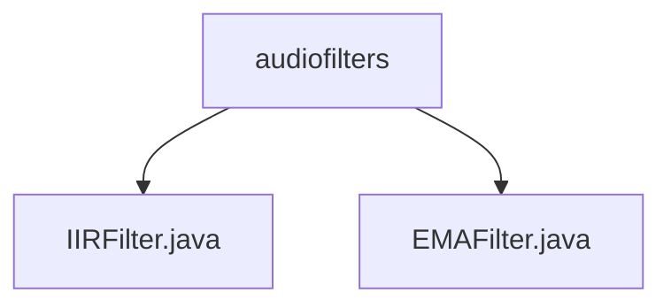

# 基础信息

|      |      |
|------|------|
| 名称 | audiofilters |
| 编码语言 | .java |
| 代码路径 | Java/src/main/java/com/thealgorithms/audiofilters |
| 包名 | Java.src.main.java.com.thealgorithms.audiofilters |
| 概述说明 | IIR滤波器类实现无限脉冲响应滤波，支持系数设置和实时处理。EMAFilter类通过alpha参数实现指数移动平均滤波，适用于信号平滑处理。 |

# 说明

## 概述
该代码模块主要实现了两种音频滤波器：IIR滤波器和EMAFilter。这些滤波器用于处理音频信号，适用于不同的滤波需求。IIR滤波器类提供了无限脉冲响应滤波功能，支持用户自定义滤波器系数，并通过维护历史数据进行递归计算，实现高效的实时滤波处理。EMAFilter类则实现了指数移动平均滤波功能，通过平滑因子alpha减少噪声，同时保留信号的主要特征。

## 主要业务场景
1. **IIR滤波器**：适用于需要实时处理音频信号的场景，用户可以根据具体需求调整滤波器系数，以实现特定的滤波特性。常见的应用包括音频信号处理、噪声抑制和信号增强等。
2. **EMAFilter**：适用于需要平滑处理音频信号的场景，特别是在噪声较多的情况下，能够有效减少噪声并保留信号的主要特征。常见的应用包括音频信号的平滑处理、噪声过滤和信号稳定等。

### 包内部结构视图

该流程图展示了`audiofilters`目录下的两个Java文件：`IIRFilter.java`和`EMAFilter.java`。这两个文件直接位于`audiofilters`目录下，没有更深层次的子目录结构。通过该图可以清晰地看到`audiofilters`目录与其包含的两个文件之间的层级关系。

# 文件列表 File List

| 名称   | 类型  | 说明 |
|-------|------|-------------|
| [EMAFilter.java](EMAFilter.md) | file | EMAFilter类用于音频信号处理，采用指数移动平均滤波，alpha为平滑因子。 |
| [IIRFilter.java](IIRFilter.md) | file | IIR滤波器类，含阶数、系数、历史数据，支持系数设置和样本处理。 |

