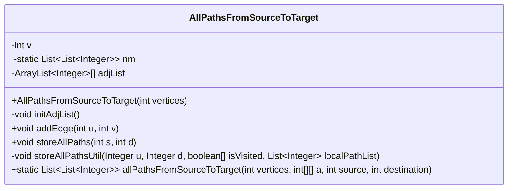
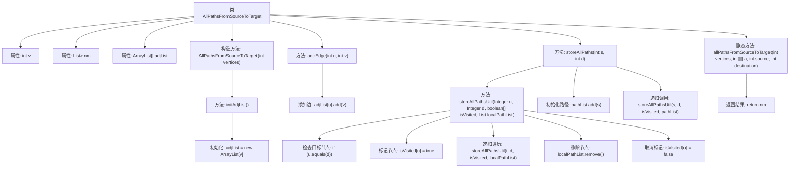

# 基础信息

|      |      |
|------|------|
| 名称 | AllPathsFromSourceToTarget |
| 编码语言 | .java |
| 代码路径 | Java/src/main/java/com/thealgorithms/backtracking/AllPathsFromSourceToTarget.java |
| 包名 | com.thealgorithms.backtracking |
| 依赖项 | ['java.util.ArrayList', 'java.util.List'] |
| 概述说明 | 该类通过邻接表存储图结构，递归查找并存储源点到目标点的所有路径。 |

# 说明

该类用于在图中查找从源点到目标点的所有路径，采用邻接表作为图的存储结构，通过递归遍历图并记录所有可能的路径。

# 类列表 Class Summary

| 名称   | 类型  | 说明 |
|-------|------|-------------|
| AllPathsFromSourceToTarget | class | 该类用于查找图中从源点到目标点的所有路径，使用邻接表存储图结构，递归遍历并存储路径。 |

## 类 AllPathsFromSourceToTarget

|      |      |
|------|------|
| 访问范围 | public |
| 类型 | class |
| 名称 | AllPathsFromSourceToTarget |
| 说明 | 该类用于查找图中从源点到目标点的所有路径，使用邻接表存储图结构，递归遍历并存储路径。 |

### UML类图

### 描述
`AllPathsFromSourceToTarget` 类用于计算从图的源节点到目标节点的所有可能路径。它通过邻接表表示图结构，并使用深度优先搜索（DFS）递归地遍历所有路径。类中包含初始化邻接表、添加边、存储路径等核心方法。最终，`allPathsFromSourceToTarget` 方法返回从指定源节点到目标节点的所有路径列表。

### 内部方法调用关系图

这段代码实现了一个图数据结构，用于查找从源节点到目标节点的所有路径。通过初始化邻接表、添加边、递归遍历路径等步骤，最终返回所有可能的路径。代码的核心在于递归函数`storeAllPathsUtil`，它通过深度优先搜索（DFS）来遍历图，并在找到目标节点时将路径存储到全局列表中。

### 字段列表 Field List

| 名称  | 类型  | 说明 |
|-------|-------|------|
| v | int | 定义一个私有的不可变整型变量v。 |
| adjList | ArrayList<Integer>[] | 私有整型数组列表类型的邻接表。 |
| nm = new ArrayList<>() | List<List<Integer>> | 声明一个静态二维整数列表变量nm。 |

### 方法列表 Method List

| 名称  | 类型  | 说明 |
|-------|-------|------|
| allPathsFromSourceToTarget | List<List<Integer>> | 静态方法返回从源点到目标点的所有路径。 |
| storeAllPathsUtil | void | 递归查找并存储从节点u到d的所有路径。 |
| initAdjList | void | 初始化邻接表，创建大小为v的ArrayList数组，每个元素为空列表。 |
| addEdge | void | 方法`addEdge`在邻接表中将节点`v`添加到节点`u`的列表中。 |
| storeAllPaths | void | 方法storeAllPaths用于存储从节点s到节点d的所有路径，使用递归工具函数实现。 |

