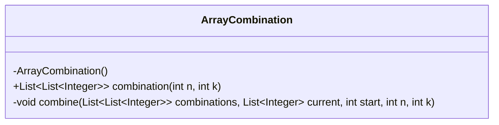
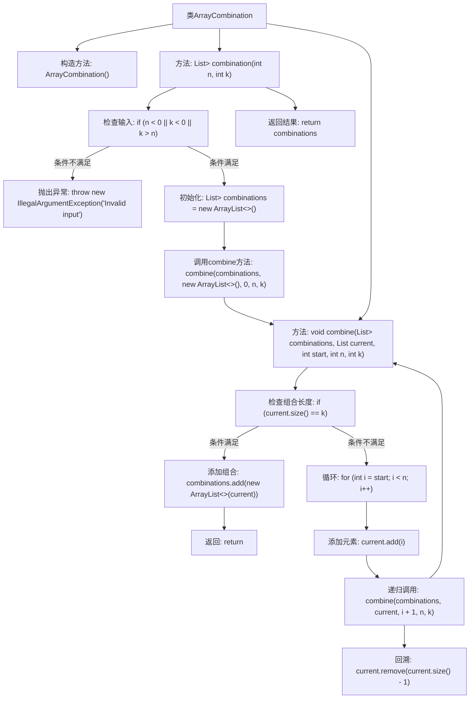

# 基础信息

|      |      |
|------|------|
| 名称 | ArrayCombination |
| 编码语言 | .java |
| 代码路径 | Java/src/main/java/com/thealgorithms/backtracking/ArrayCombination.java |
| 包名 | com.thealgorithms.backtracking |
| 依赖项 | ['java.util.ArrayList', 'java.util.List'] |
| 概述说明 | ArrayCombination类用回溯法生成0到n-1的长度为k的所有组合。 |

# 说明

ArrayCombination类用于生成从0到n-1的范围内，长度为k的所有可能组合。该类的实现基于回溯法，通过递归和剪枝策略，逐步构建并验证每个组合的有效性，确保最终输出的组合符合要求。此方法在保证组合完整性的同时，避免了不必要的计算，提高了效率。

# 类列表 Class Summary

| 名称   | 类型  | 说明 |
|-------|------|-------------|
| ArrayCombination | class | ArrayCombination类生成0到n-1的长度为k的所有组合，使用回溯法实现。 |

## 类 ArrayCombination

|      |      |
|------|------|
| 访问范围 | public final |
| 类型 | class |
| 名称 | ArrayCombination |
| 说明 | ArrayCombination类生成0到n-1的长度为k的所有组合，使用回溯法实现。 |

### UML类图

### 描述
`ArrayCombination` 是一个工具类，用于生成从 0 到 n-1 的整数中所有长度为 k 的组合。它包含一个私有的构造函数，确保类不能被实例化。`combination` 方法是公开的，用于生成组合并返回结果列表。`combine` 方法是一个私有的辅助方法，使用回溯算法来递归地构建组合。该类通过检查输入参数的有效性来确保程序的健壮性。

### 内部方法调用关系图

**描述：** 该流程图描述了`ArrayCombination`类的结构和功能。类中包含一个私有的构造方法和两个静态方法。`combination`方法用于生成所有长度为`k`的组合，并检查输入的有效性。`combine`方法通过回溯法递归地构建组合，并在达到指定长度时将其添加到结果列表中。流程图中详细展示了方法的调用顺序和条件判断，确保组合生成的正确性和完整性。

### 字段列表 Field List

| 名称  | 类型  | 说明 |
|-------|-------|------|

### 方法列表 Method List

| 名称  | 类型  | 说明 |
|-------|-------|------|
| combine | void | 递归生成组合，回溯法实现。 |
| combination | List<List<Integer>> | 生成从1到n中选取k个数的所有组合。 |

