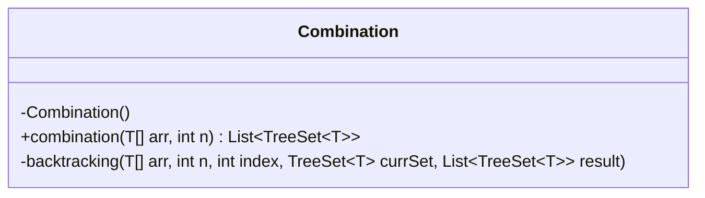
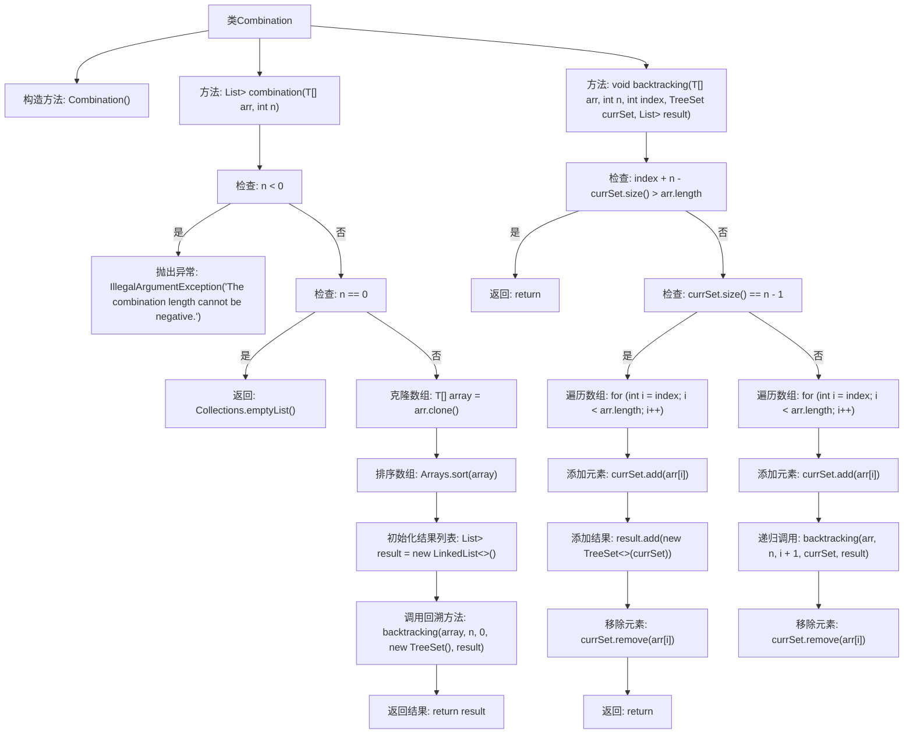

# 基础信息

|      |      |
|------|------|
| 名称 | Combination |
| 编码语言 | .java |
| 代码路径 | Java/src/main/java/com/thealgorithms/backtracking/Combination.java |
| 包名 | com.thealgorithms.backtracking |
| 依赖项 | ['java.util.Arrays', 'java.util.Collections', 'java.util.LinkedList', 'java.util.List', 'java.util.TreeSet'] |
| 概述说明 | 回溯法查找数组中长度为n的所有组合。 |

# 说明

组合类使用回溯法查找数组中所有长度为n的组合。该方法通过递归遍历数组，逐步构建可能的组合，并在达到指定长度时记录结果。回溯法通过剪枝优化，避免无效搜索，提高效率。该过程确保所有可能的组合都被探索，最终返回所有符合条件的组合。

# 类列表 Class Summary

| 名称   | 类型  | 说明 |
|-------|------|-------------|
| Combination | class | 组合类通过回溯法查找数组中所有长度为n的组合。 |

## 类 Combination

|      |      |
|------|------|
| 访问范围 | public final |
| 类型 | class |
| 名称 | Combination |
| 说明 | 组合类通过回溯法查找数组中所有长度为n的组合。 |

### UML类图

该代码定义了一个名为 `Combination` 的类，该类包含两个方法：`combination` 和 `backtracking`。`combination` 方法用于生成给定数组中所有长度为 `n` 的组合，并返回这些组合的列表。如果 `n` 为 0，则返回空列表。`backtracking` 方法是一个递归辅助方法，用于实际生成组合。该类是 `final` 的，且构造函数为私有，表明该类不可被继承且不可实例化。代码通过回溯算法实现了组合的生成，确保了结果的唯一性和有序性。

### 内部方法调用关系图

**描述：**
这段代码实现了一个组合生成器，使用回溯算法来生成给定数组中所有长度为n的组合。首先，代码检查输入参数n的有效性，如果n为负数则抛出异常，如果n为0则返回空列表。然后，克隆并排序输入数组，初始化结果列表，并调用回溯方法进行组合生成。回溯方法通过递归遍历数组，不断添加和移除元素，最终将所有符合条件的组合添加到结果列表中。

### 字段列表 Field List

| 名称  | 类型  | 说明 |
|-------|-------|------|

### 方法列表 Method List

| 名称  | 类型  | 说明 |
|-------|-------|------|
| combination | List<TreeSet<T>> | 生成数组元素长度为n的所有组合，并按升序排列返回。 |
| backtracking | void | 递归回溯算法生成数组子集，满足大小为n。 |

