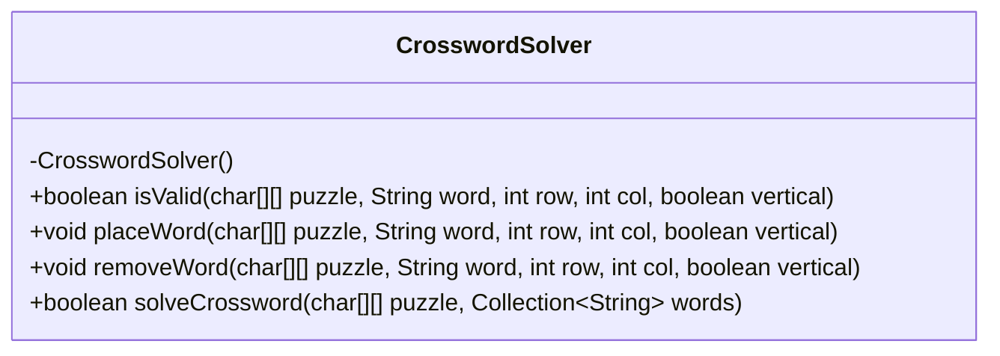
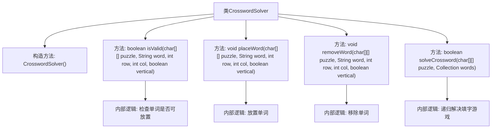

# 基础信息

|      |      |
|------|------|
| 名称 | CrosswordSolver |
| 编码语言 | .java |
| 代码路径 | Java/src/main/java/com/thealgorithms/backtracking/CrosswordSolver.java |
| 包名 | com.thealgorithms.backtracking |
| 依赖项 | ['java.util.ArrayList', 'java.util.Collection', 'java.util.List'] |
| 概述说明 | CrosswordSolver类实现填字游戏求解，支持验证、放置、移除单词及回溯功能。 |

# 说明

CrosswordSolver类专门用于填字游戏的求解，具备验证单词是否符合规则、在指定位置放置单词、移除已放置单词以及通过回溯算法寻找解决方案的功能。该类通过一系列方法确保填字游戏的逻辑正确性和求解过程的效率，最终实现填字游戏的完整求解。

# 类列表 Class Summary

| 名称   | 类型  | 说明 |
|-------|------|-------------|
| CrosswordSolver | class | CrosswordSolver类实现填字游戏求解，包含验证、放置、移除单词及回溯求解功能。 |

## 类 CrosswordSolver

|      |      |
|------|------|
| 访问范围 | public final |
| 类型 | class |
| 名称 | CrosswordSolver |
| 说明 | CrosswordSolver类实现填字游戏求解，包含验证、放置、移除单词及回溯求解功能。 |

### UML类图

**描述**：`CrosswordSolver` 类是一个用于解决填字谜题的实用工具类。它包含四个静态方法：`isValid` 用于检查单词是否可以放置在指定位置，`placeWord` 用于将单词放置在指定位置，`removeWord` 用于移除已放置的单词，`solveCrossword` 使用回溯算法尝试解决整个填字谜题。这些方法共同协作，确保单词能够正确地放置在谜题中，并在需要时进行回溯以寻找解决方案。

### 内部方法调用关系图

这段代码实现了一个填字游戏求解器，包含四个主要方法：`isValid`用于检查单词是否可以在指定位置放置，`placeWord`用于在指定位置放置单词，`removeWord`用于移除已放置的单词，`solveCrossword`使用回溯算法递归地解决填字游戏。流程图展示了类`CrosswordSolver`及其方法的调用关系，以及每个方法内部的逻辑处理步骤。

### 字段列表 Field List

| 名称  | 类型  | 说明 |
|-------|-------|------|

### 方法列表 Method List

| 名称  | 类型  | 说明 |
|-------|-------|------|
| solveCrossword | boolean | 解决填字游戏的递归方法，尝试放置单词并回溯。 |
| isValid | boolean | 检查单词在字谜网格中是否有效。 |
| placeWord | void | 在拼图中按行或列放置单词字符。 |
| removeWord | void | 该方法从字谜数组中移除指定单词，支持水平和垂直方向。 |

