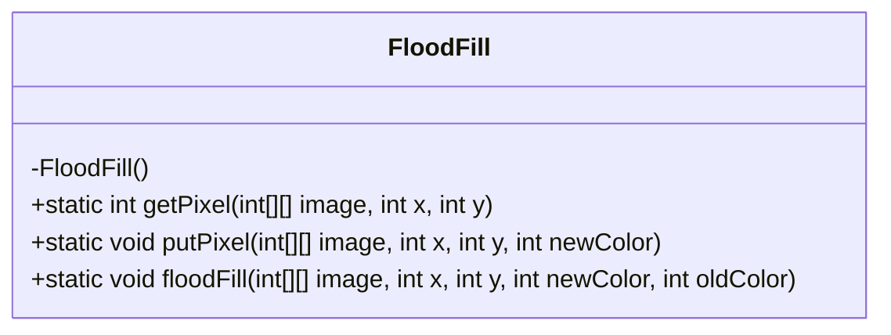
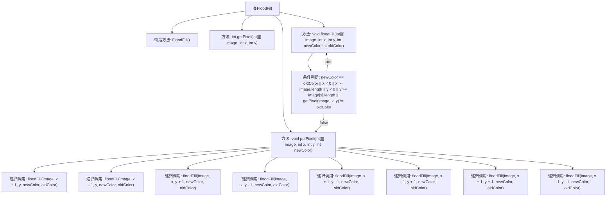

# 基础信息

|      |      |
|------|------|
| 名称 | FloodFill |
| 编码语言 | .java |
| 代码路径 | Java/src/main/java/com/thealgorithms/backtracking/FloodFill.java |
| 包名 | com.thealgorithms.backtracking |
| 依赖项 | [] |
| 概述说明 | FloodFill类实现二维图像颜色填充，支持水平和垂直及对角线递归填充。 |

# 说明

FloodFill类用于实现二维图像的颜色填充功能，支持水平、垂直以及对角线方向的递归填充。该功能能够根据指定起点和颜色，自动填充相邻区域，适用于图像处理和图形编辑等场景。

# 类列表 Class Summary

| 名称   | 类型  | 说明 |
|-------|------|-------------|
| FloodFill | class | FloodFill类实现二维图像颜色填充，支持水平和垂直及对角线递归填充。 |

## 类 FloodFill

|      |      |
|------|------|
| 访问范围 | public final |
| 类型 | class |
| 名称 | FloodFill |
| 说明 | FloodFill类实现二维图像颜色填充，支持水平和垂直及对角线递归填充。 |

### UML类图

### 描述
`FloodFill` 类是一个工具类，用于实现二维图像的洪水填充算法。它包含三个静态方法：`getPixel` 用于获取图像中指定坐标的颜色值，`putPixel` 用于在图像中指定坐标处设置新的颜色值，`floodFill` 则递归地填充图像中与起始点颜色相同且相邻的区域。该类通过递归调用自身，处理水平和垂直方向以及对角线方向的相邻像素，确保填充操作覆盖所有符合条件的区域。

### 内部方法调用关系图

这段代码实现了一个经典的洪水填充算法（Flood Fill），用于在二维图像中填充特定区域。`floodFill`方法通过递归调用自身，检查当前像素及其相邻像素（包括水平和垂直方向以及对角线方向），如果像素颜色与旧颜色匹配，则将其替换为新颜色。流程图展示了类的方法调用关系和递归逻辑，确保填充操作能够正确执行。

### 字段列表 Field List

| 名称  | 类型  | 说明 |
|-------|-------|------|

### 方法列表 Method List

| 名称  | 类型  | 说明 |
|-------|-------|------|
| putPixel | void | 静态方法putPixel用于在图像数组的指定位置设置新颜色。 |
| getPixel | int | 获取二维数组中指定坐标的像素值。 |
| floodFill | void | 递归实现图像填充，包括水平和垂直及对角线相邻像素。 |

