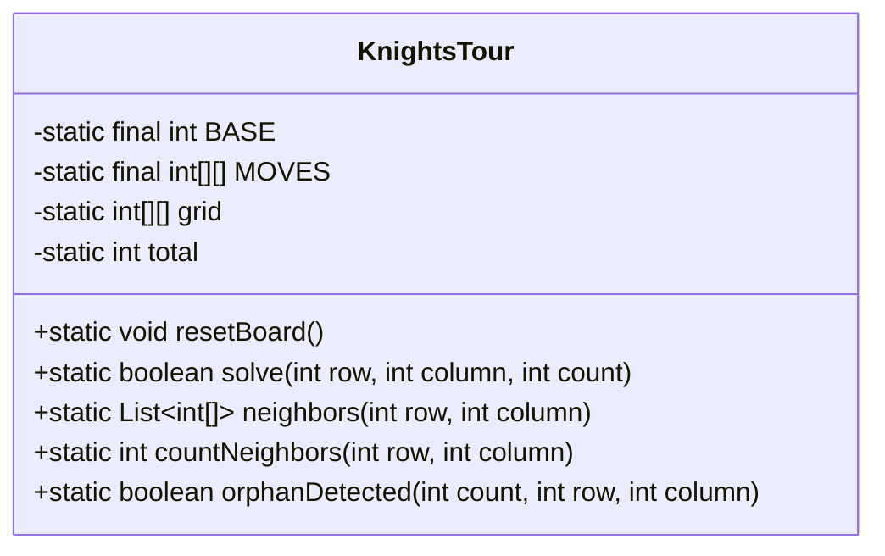

# 基础信息

|      |      |
|------|------|
| 名称 | KnightsTour |
| 编码语言 | .java |
| 代码路径 | Java/src/main/java/com/thealgorithms/backtracking/KnightsTour.java |
| 包名 | com.thealgorithms.backtracking |
| 依赖项 | ['java.util.ArrayList', 'java.util.Comparator', 'java.util.List'] |
| 概述说明 | 骑士巡游问题求解类，具备棋盘初始化、递归求解、邻居检测及孤儿检测功能。 |

# 说明

骑士巡游问题求解类是一个用于解决经典骑士巡游问题的工具，具备多项核心功能。首先，它能够初始化棋盘，为后续求解提供基础环境。其次，通过递归求解算法，尝试找到骑士在棋盘上的完整巡游路径。此外，该类还包含邻居检测功能，用于确定骑士当前位置的合法移动选项。最后，孤儿检测功能用于识别并处理可能导致递归无法继续的孤立位置，从而提高求解效率。整体设计旨在全面解决骑士巡游问题，确保路径的完整性和有效性。

# 类列表 Class Summary

| 名称   | 类型  | 说明 |
|-------|------|-------------|
| KnightsTour | class | 骑士巡游问题求解类，包含棋盘初始化、递归求解、邻居检测及孤儿检测功能。 |

## 类 KnightsTour

|      |      |
|------|------|
| 访问范围 | public final |
| 类型 | class |
| 名称 | KnightsTour |
| 说明 | 骑士巡游问题求解类，包含棋盘初始化、递归求解、邻居检测及孤儿检测功能。 |

### UML类图

**描述：**
`KnightsTour` 类实现了解决“骑士巡游问题”的算法。该类包含一个静态的12x12棋盘，其中外围两行两列作为边界标记为-1，内部8x8区域为0。`resetBoard`方法初始化棋盘，`solve`方法通过递归和回溯寻找解决方案。`neighbors`方法返回骑士当前位置的有效移动位置，`countNeighbors`计算每个位置的下一步移动数，`orphanDetected`检测是否会产生孤立位置。该算法通过Warnsdorff规则优化移动顺序，确保找到有效的巡游路径。

### 内部方法调用关系图

```mermaid
graph TD
    A["类KnightsTour"]
    B["属性: int BASE"]
    C["属性: int[][] MOVES"]
    D["属性: int[][] grid"]
    E["属性: int total"]
    F["方法: resetBoard()"]
    G["方法: solve(int row, int column, int count)"]
    H["方法: neighbors(int row, int column)"]
    I["方法: countNeighbors(int row, int column)"]
    J["方法: orphanDetected(int count, int row, int column)"]

    A --> B
    A --> C
    A --> D
    A --> E
    A --> F
    A --> G
    A --> H
    A --> I
    A --> J

    F --> K["初始化grid为BASE x BASE的二维数组"]
    F --> L["设置total为(BASE - 4) * (BASE - 4)"]
    F --> M["遍历grid，标记边界单元格为-1"]

    G --> N["检查count是否大于total"]
    G --> O["获取当前单元格的邻居"]
    G --> P["检查邻居是否为空且count不等于total"]
    G --> Q["按Warnsdorff规则排序邻居"]
    G --> R["遍历邻居，尝试移动"]
    G --> S["标记当前单元格为count"]
    G --> T["检查是否检测到孤儿"]
    G --> U["递归调用solve"]
    G --> V["回溯，重置当前单元格为0"]

    H --> W["遍历MOVES，计算有效邻居"]
    H --> X["返回有效邻居列表"]

    I --> Y["遍历MOVES，计算有效邻居数量"]
    I --> Z["返回有效邻居数量"]

    J --> AA["检查count是否小于total - 1"]
    J --> AB["获取当前单元格的邻居"]
    J --> AC["检查邻居的邻居数量是否为0"]
    J --> AD["返回是否检测到孤儿"]
```

这段代码实现了一个解决“骑士巡游问题”的算法。`KnightsTour`类通过递归和回溯的方法，尝试找到骑士在棋盘上移动的路径，使得骑士能够访问棋盘上的每一个单元格且不重复。`resetBoard`方法初始化棋盘，`solve`方法递归地尝试移动骑士，`neighbors`方法计算有效移动，`countNeighbors`方法计算每个位置的邻居数量，`orphanDetected`方法检测是否会导致无解的情况。

### 字段列表 Field List

| 名称  | 类型  | 说明 |
|-------|-------|------|
| BASE = 12 | int | 定义私有静态常量BASE，值为12。 |
| total | int | 定义了一个静态整型变量total。 |
| MOVES = {        {1, -2},        {2, -1},        {2, 1},        {1, 2},        {-1, 2},        {-2, 1},        {-2, -1},        {-1, -2},    } | int[][] | 定义8种马步移动方向的二维数组。 |
| grid | int[][] | 声明一个静态二维整型数组变量grid。 |

### 方法列表 Method List

| 名称  | 类型  | 说明 |
|-------|-------|------|
| neighbors | List<int[]> | 该方法返回指定位置的有效邻居列表，包含位置和邻居数量。 |
| countNeighbors | int | 计算指定位置周围符合条件的邻居数量。 |
| resetBoard | void | 重置棋盘，初始化网格，标记边界单元为-1。 |
| orphanDetected | boolean | 检测孤立点：若邻域无相邻点且计数小于总数减一，则返回真。 |
| solve | boolean | 递归解决棋盘问题，使用Warnsdorff规则排序邻居并回溯。 |

