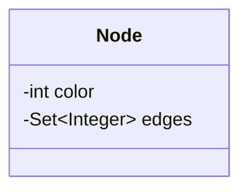
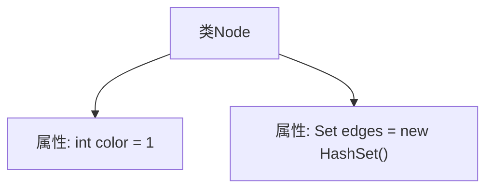
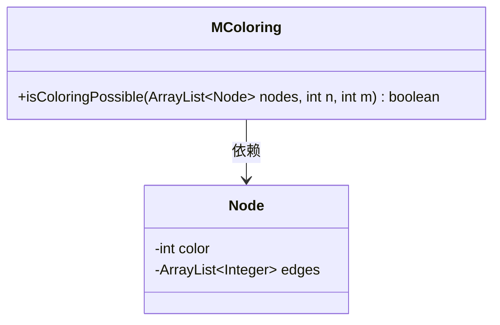
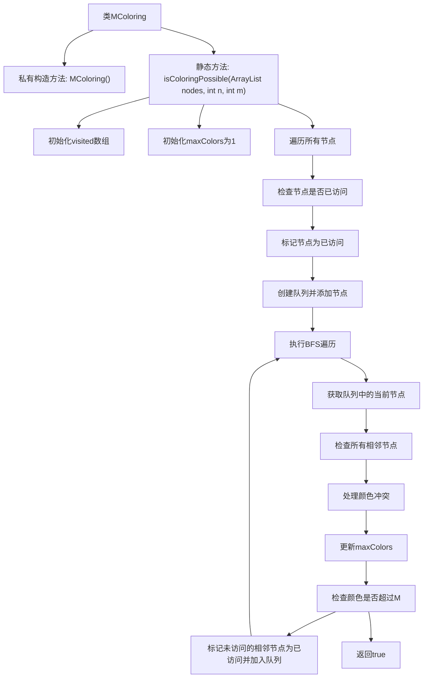

# 基础信息

|      |      |
|------|------|
| 名称 | MColoring |
| 编码语言 | .java |
| 代码路径 | Java/src/main/java/com/thealgorithms/backtracking/MColoring.java |
| 包名 | com.thealgorithms.backtracking |
| 依赖项 | ['java.util.ArrayList', 'java.util.HashSet', 'java.util.LinkedList', 'java.util.Queue', 'java.util.Set'] |
| 概述说明 | 节点类含颜色和邻接节点，MColoring类用BFS判断图是否可用M色着色且无冲突。 |

# 说明

节点类包含颜色属性和邻接节点集合，用于表示图中的节点及其连接关系。MColoring类通过广度优先搜索（BFS）遍历图中的节点，判断是否可以使用最多M种颜色对图进行着色，同时确保相邻节点颜色不同，避免颜色冲突。该算法有效解决了图的着色问题，确保着色方案符合要求。

# 类列表 Class Summary

| 名称   | 类型  | 说明 |
|-------|------|-------------|
| Node | class | 节点类包含颜色属性和邻接节点集合。 |
| MColoring | class | MColoring类判断图是否可用最多M种颜色着色，通过BFS遍历节点并避免颜色冲突。 |

## 类 Node

|      |      |
|------|------|
| 访问范围 | None |
| 类型 | class |
| 名称 | Node |
| 说明 | 节点类包含颜色属性和邻接节点集合。 |

### UML类图

该代码定义了一个名为 `Node` 的类，该类包含两个成员变量：`color` 和 `edges`。`color` 是一个整数类型的私有变量，初始值为 1，用于表示节点的颜色。`edges` 是一个 `Set<Integer>` 类型的私有变量，用于存储与该节点相邻的节点。通过 `Set` 集合，可以确保相邻节点的唯一性。该类的设计适用于需要表示节点及其相邻关系的场景，例如图论中的图结构。

### 内部方法调用关系图

这段代码定义了一个名为 `Node` 的类，该类包含两个属性：`color` 和 `edges`。`color` 是一个整型变量，初始值为 1，表示节点的颜色。`edges` 是一个 `Set<Integer>` 类型的集合，用于存储与该节点相邻的节点的标识符。这个类的主要作用是表示图中的一个节点，并记录其颜色和相邻节点的信息。

### 字段列表 Field List

| 名称  | 类型  | 说明 |
|-------|-------|------|
| color = 1 | int | 定义整型变量color并赋值为1。 |
| edges = new HashSet<Integer>() | Set<Integer> | 创建了一个存储整数的哈希集合edges。 |

### 方法列表 Method List

| 名称  | 类型  | 说明 |
|-------|-------|------|

## 类 MColoring

|      |      |
|------|------|
| 访问范围 | public final |
| 类型 | class |
| 名称 | MColoring |
| 说明 | MColoring类判断图是否可用最多M种颜色着色，通过BFS遍历节点并避免颜色冲突。 |

### UML类图

### 描述
`MColoring` 是一个工具类，提供了 `isColoringPossible` 方法，用于判断给定的图是否可以用最多 `M` 种颜色进行着色。该方法通过广度优先搜索（BFS）遍历图中的节点，并确保相邻节点不会使用相同的颜色。如果发现需要使用超过 `M` 种颜色的情况，则返回 `false`，否则返回 `true`。`Node` 类表示图中的节点，包含节点的颜色和相邻节点的列表。`MColoring` 类依赖于 `Node` 类来完成图的着色判断。

### 内部方法调用关系图

这段代码的流程图展示了`MColoring`类中的`isColoringPossible`方法的执行流程。该方法用于判断是否可以用最多M种颜色对图进行着色。流程从初始化visited数组和maxColors开始，随后遍历所有节点，对未访问的节点执行BFS遍历。在BFS过程中，处理相邻节点的颜色冲突，更新最大颜色数，并检查是否超过M种颜色。如果超过，则返回false；否则，继续处理直到所有节点都被访问，最终返回true。

### 字段列表 Field List

| 名称  | 类型  | 说明 |
|-------|-------|------|

### 方法列表 Method List

| 名称  | 类型  | 说明 |
|-------|-------|------|
| isColoringPossible | boolean | 检查节点图是否可用不超过M种颜色着色，通过BFS遍历并避免相邻节点颜色冲突。 |

