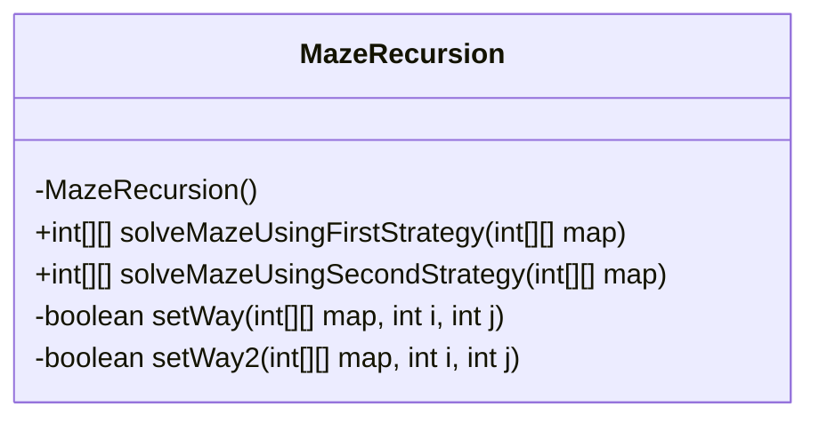
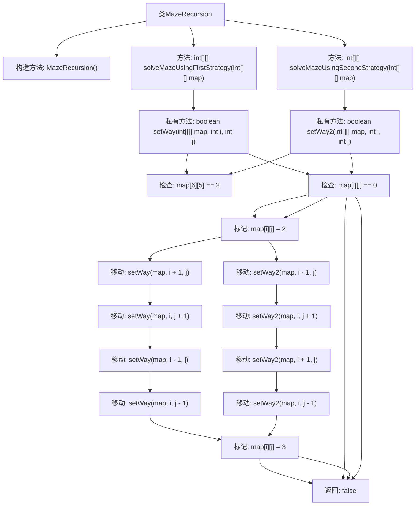

# 基础信息

|      |      |
|------|------|
| 名称 | MazeRecursion |
| 编码语言 | .java |
| 代码路径 | Java/src/main/java/com/thealgorithms/backtracking/MazeRecursion.java |
| 包名 | com.thealgorithms.backtracking |
| 依赖项 | [] |
| 概述说明 | MazeRecursion类提供两种递归策略，采用不同移动顺序解决迷宫问题。 |

# 说明

MazeRecursion类提供了两种递归策略来解决迷宫问题，这两种策略的主要区别在于移动顺序的不同。通过调整移动顺序，类能够以不同的方式探索迷宫路径，从而找到解决方案。

# 类列表 Class Summary

| 名称   | 类型  | 说明 |
|-------|------|-------------|
| MazeRecursion | class | MazeRecursion类提供两种递归策略解决迷宫问题，分别采用不同移动顺序。 |

## 类 MazeRecursion

|      |      |
|------|------|
| 访问范围 | public final |
| 类型 | class |
| 名称 | MazeRecursion |
| 说明 | MazeRecursion类提供两种递归策略解决迷宫问题，分别采用不同移动顺序。 |

### UML类图

**描述：**  
`MazeRecursion` 类是一个用于解决迷宫问题的工具类，提供了两种不同的策略来寻找迷宫路径。该类包含两个公共方法 `solveMazeUsingFirstStrategy` 和 `solveMazeUsingSecondStrategy`，分别使用不同的移动策略来求解迷宫。私有方法 `setWay` 和 `setWay2` 实现了递归算法，尝试在迷宫中找到从起点到终点的路径，并标记有效路径和死胡同。如果找到路径，返回标记后的迷宫；否则返回 `null`。

### 内部方法调用关系图

这段代码定义了一个`MazeRecursion`类，用于解决迷宫问题。它提供了两种不同的移动策略来寻找从起点到终点的路径。`solveMazeUsingFirstStrategy`方法使用“下 -> 右 -> 上 -> 左”的移动策略，而`solveMazeUsingSecondStrategy`方法使用“上 -> 右 -> 下 -> 左”的移动策略。每个策略通过递归方法`setWay`和`setWay2`来实现，标记有效路径为`2`，死胡同为`3`。如果找到路径，返回标记后的迷宫；否则返回`null`。

### 字段列表 Field List

| 名称  | 类型  | 说明 |
|-------|-------|------|

### 方法列表 Method List

| 名称  | 类型  | 说明 |
|-------|-------|------|
| solveMazeUsingFirstStrategy | int[][] | 解决迷宫问题的第一策略方法，返回处理后的地图或null。 |
| setWay | boolean | 递归探索迷宫，标记路径和死胡同。 |
| solveMazeUsingSecondStrategy | int[][] | 使用第二策略解决迷宫问题，成功返回地图，否则返回空。 |
| setWay2 | boolean | 递归搜索迷宫路径，标记可行路径和死胡同。 |

