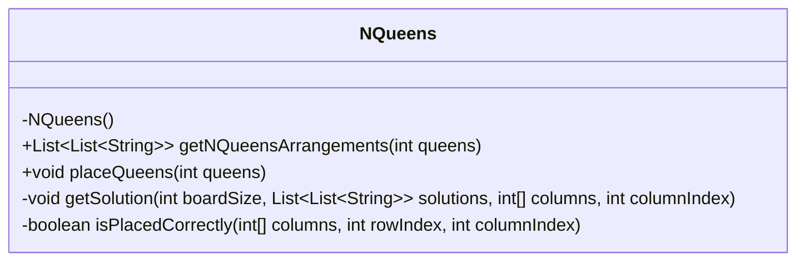
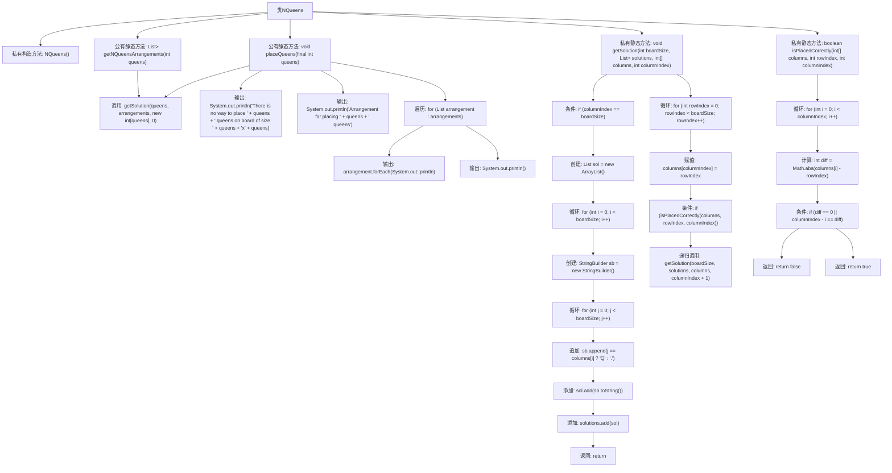

# 基础信息

|      |      |
|------|------|
| 名称 | NQueens |
| 编码语言 | .java |
| 代码路径 | Java/src/main/java/com/thealgorithms/backtracking/NQueens.java |
| 包名 | com.thealgorithms.backtracking |
| 依赖项 | ['java.util.ArrayList', 'java.util.List'] |
| 概述说明 | NQueens类使用回溯法解决N皇后问题，寻找所有合法布局。 |

# 说明

NQueens类实现了经典的N皇后问题，采用回溯算法来寻找所有合法的皇后布局。该问题要求在N×N的棋盘上放置N个皇后，使得它们互不攻击，即任何两个皇后不能在同一行、同一列或同一对角线上。回溯法通过递归尝试每个可能的皇后位置，并在发现冲突时回溯，逐步构建出所有符合条件的布局。该方法确保找到所有解，并在搜索过程中剪枝以提高效率。

# 类列表 Class Summary

| 名称   | 类型  | 说明 |
|-------|------|-------------|
| NQueens | class | NQueens类实现N皇后问题，通过回溯法找到所有合法布局。 |

## 类 NQueens

|      |      |
|------|------|
| 访问范围 | public final |
| 类型 | class |
| 名称 | NQueens |
| 说明 | NQueens类实现N皇后问题，通过回溯法找到所有合法布局。 |

### UML类图

### 描述
`NQueens` 类是一个用于解决N皇后问题的工具类，提供了两种方法：`getNQueensArrangements` 和 `placeQueens`。`getNQueensArrangements` 方法返回所有可能的N皇后摆放方案，而 `placeQueens` 方法则打印这些方案。`getSolution` 方法是一个递归回溯函数，用于尝试在棋盘上放置皇后，而 `isPlacedCorrectly` 方法则用于检查皇后是否可以安全地放置在指定位置。该类通过回溯算法确保所有可能的摆放方案都被找到。

### 内部方法调用关系图

这段代码实现了一个经典的N皇后问题解决方案。通过回溯算法，代码尝试在N×N的棋盘上放置N个皇后，确保它们互不攻击。`getNQueensArrangements`方法返回所有可能的皇后布局，而`placeQueens`方法则输出这些布局。`getSolution`方法递归地尝试放置皇后，`isPlacedCorrectly`方法则检查当前位置是否安全。整个流程通过递归和条件判断来确保所有可能的布局都被探索到。

### 字段列表 Field List

| 名称  | 类型  | 说明 |
|-------|-------|------|

### 方法列表 Method List

| 名称  | 类型  | 说明 |
|-------|-------|------|
| getNQueensArrangements | List<List<String>> | 静态方法返回N皇后问题的所有解，使用递归和回溯实现。 |
| isPlacedCorrectly | boolean | 检查皇后在棋盘上是否放置正确，避免冲突。 |
| getSolution | void | 递归求解N皇后问题，生成所有有效棋盘布局。 |
| placeQueens | void | 递归求解N皇后问题，输出所有可行解或无解提示。 |

