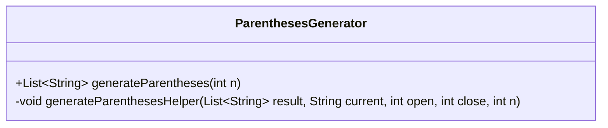
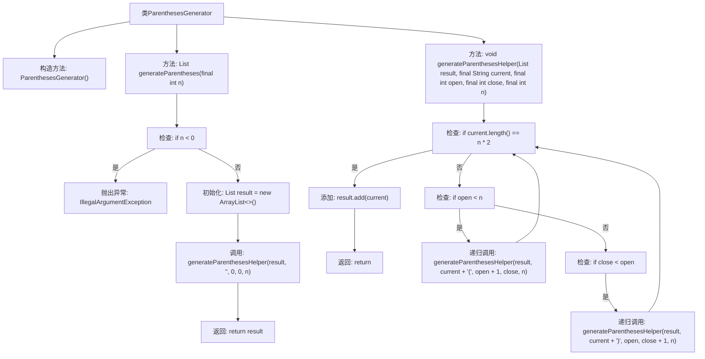

# 基础信息

|      |      |
|------|------|
| 名称 | ParenthesesGenerator |
| 编码语言 | .java |
| 代码路径 | Java/src/main/java/com/thealgorithms/backtracking/ParenthesesGenerator.java |
| 包名 | com.thealgorithms.backtracking |
| 依赖项 | ['java.util.ArrayList', 'java.util.List'] |
| 概述说明 | 生成指定数量括号的所有有效组合。 |

# 说明

该任务要求生成指定数量的括号对的所有有效组合。有效组合指的是括号必须正确配对和嵌套，确保每个左括号都有对应的右括号，并且顺序正确。例如，对于两对括号，有效的组合包括“()()”和“(())”。该任务通常通过递归或回溯算法实现，确保所有可能的组合都被探索，同时排除无效的配对情况。

# 类列表 Class Summary

| 名称   | 类型  | 说明 |
|-------|------|-------------|
| ParenthesesGenerator | class | 生成指定数量对括号的所有有效组合。 |

## 类 ParenthesesGenerator

|      |      |
|------|------|
| 访问范围 | public final |
| 类型 | class |
| 名称 | ParenthesesGenerator |
| 说明 | 生成指定数量对括号的所有有效组合。 |

### UML类图

这段代码定义了一个名为 `ParenthesesGenerator` 的类，该类包含一个公共静态方法 `generateParentheses` 和一个私有静态方法 `generateParenthesesHelper`。`generateParentheses` 方法用于生成指定数量的有效括号组合，并在输入参数小于0时抛出异常。`generateParenthesesHelper` 方法是一个递归辅助函数，用于生成所有可能的有效括号组合，并将其存储在结果列表中。该类通过递归的方式确保生成的括号组合始终是有效的。

### 内部方法调用关系图

这段代码实现了一个生成所有有效括号组合的类 `ParenthesesGenerator`。`generateParentheses` 方法负责生成指定数量的括号对，并返回所有有效组合的列表。`generateParenthesesHelper` 是一个递归辅助方法，用于构建和验证当前括号组合的有效性。代码通过递归和条件判断，确保生成的括号组合始终是有效的，避免了无效的嵌套和顺序。

### 字段列表 Field List

| 名称  | 类型  | 说明 |
|-------|-------|------|

### 方法列表 Method List

| 名称  | 类型  | 说明 |
|-------|-------|------|
| generateParentheses | List<String> | 生成指定数量有效括号组合的递归方法。 |
| generateParenthesesHelper | void | 递归生成有效括号组合，确保括号平衡且数量正确。 |

