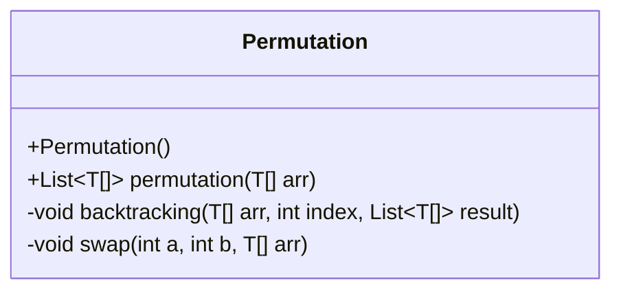
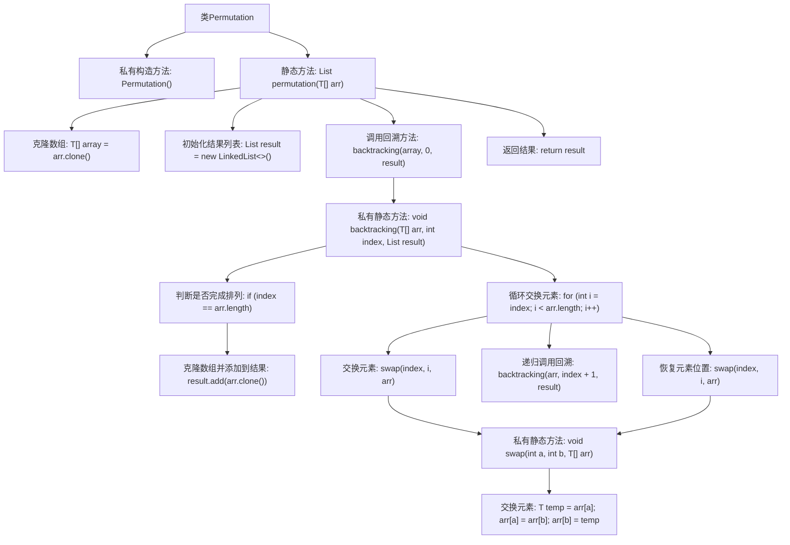

# 基础信息

|      |      |
|------|------|
| 名称 | Permutation |
| 编码语言 | .java |
| 代码路径 | Java/src/main/java/com/thealgorithms/backtracking/Permutation.java |
| 包名 | com.thealgorithms.backtracking |
| 依赖项 | ['java.util.LinkedList', 'java.util.List'] |
| 概述说明 | Permutation类使用回溯法生成数组所有排列。 |

# 说明

Permutation类利用回溯法生成给定数组的所有可能排列。回溯法通过递归探索所有可能的排列组合，确保每个元素在排列中仅出现一次。该方法通过逐步构建排列并在遇到无效选择时回溯，最终生成所有有效的排列结果。这种技术适用于需要穷举所有排列场景的问题。

# 类列表 Class Summary

| 名称   | 类型  | 说明 |
|-------|------|-------------|
| Permutation | class | Permutation类通过回溯法生成数组所有排列。 |

## 类 Permutation

|      |      |
|------|------|
| 访问范围 | public final |
| 类型 | class |
| 名称 | Permutation |
| 说明 | Permutation类通过回溯法生成数组所有排列。 |

### UML类图

**描述：**  
`Permutation` 类是一个工具类，用于计算给定数组的所有排列组合。它通过回溯算法实现，主要包含三个方法：`permutation` 用于初始化并返回所有排列结果，`backtracking` 用于递归地生成所有可能的排列，`swap` 用于交换数组中的两个元素。该类使用泛型 `T` 以支持不同类型的数组，并且所有方法都是静态的，表明该类不需要实例化即可使用。

### 内部方法调用关系图

这段代码实现了一个排列生成器，通过回溯算法生成给定数组的所有可能排列。首先，`permutation`方法克隆输入数组并初始化结果列表，然后调用`backtracking`方法进行回溯。`backtracking`方法通过交换数组元素生成所有排列，并在完成排列时将结果添加到列表中。`swap`方法用于交换数组中的两个元素。整个过程通过递归和回溯确保所有排列都被生成。

### 字段列表 Field List

| 名称  | 类型  | 说明 |
|-------|-------|------|

### 方法列表 Method List

| 名称  | 类型  | 说明 |
|-------|-------|------|
| permutation | List<T[]> | 静态方法生成数组全排列，返回结果列表。 |
| swap | void | 私有方法swap交换数组arr中a和b位置的元素。 |
| backtracking | void | 回溯算法实现数组全排列，通过交换元素生成所有可能组合。 |

