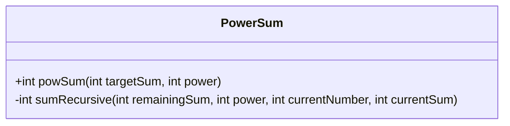
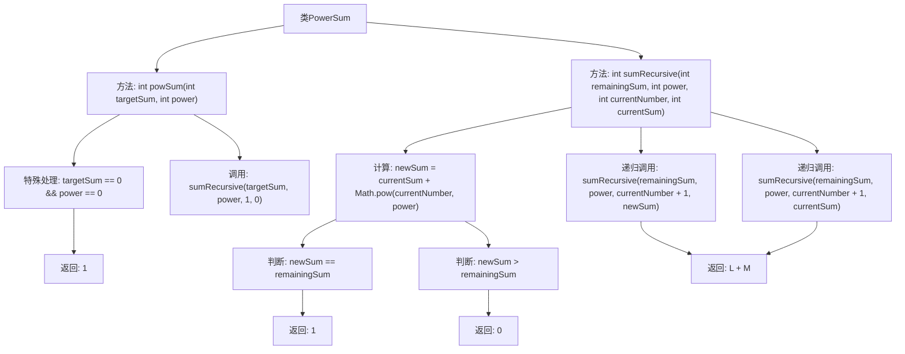

# 基础信息

|      |      |
|------|------|
| 名称 | PowerSum |
| 编码语言 | .java |
| 代码路径 | Java/src/main/java/com/thealgorithms/backtracking/PowerSum.java |
| 包名 | com.thealgorithms.backtracking |
| 依赖项 | [] |
| 概述说明 | 计算目标数表示为不同自然数的X次幂之和的方式数。 |

# 说明

该内容描述了一个数学问题，目标是计算将某个特定的自然数表示为不同自然数的X次幂之和的方式数。具体来说，需要找到所有可能的组合，其中每个组合中的自然数都是不同的，并且它们的X次幂相加等于目标数。这个问题涉及数论和组合数学，通常需要系统性地枚举和验证所有可能的组合，以确定满足条件的解的数量。

# 类列表 Class Summary

| 名称   | 类型  | 说明 |
|-------|------|-------------|
| PowerSum | class | 计算目标数表示为不同自然数的X次幂之和的方式数。 |

## 类 PowerSum

|      |      |
|------|------|
| 访问范围 | public |
| 类型 | class |
| 名称 | PowerSum |
| 说明 | 计算目标数表示为不同自然数的X次幂之和的方式数。 |

### UML类图

这段代码定义了一个名为 `PowerSum` 的类，该类包含两个方法：`powSum` 和 `sumRecursive`。`powSum` 方法用于计算将目标和表示为唯一自然数的 X 次幂和的方式数，而 `sumRecursive` 是一个递归方法，用于实际计算这些组合数。`powSum` 方法处理特殊情况，当目标和与幂都为零时返回 1，否则调用 `sumRecursive` 方法进行计算。`sumRecursive` 方法通过递归遍历自然数，计算当前和与目标和的匹配情况，并返回有效组合的数量。

### 内部方法调用关系图

这段代码定义了一个`PowerSum`类，其中包含两个方法：`powSum`和`sumRecursive`。`powSum`方法用于计算将目标数`targetSum`表示为不同自然数的`power`次幂之和的方式数。`sumRecursive`方法是一个递归函数，用于实际计算这些组合。代码首先处理特殊情况，当`targetSum`和`power`都为0时返回1。然后，`sumRecursive`方法通过递归调用计算所有可能的组合，并在找到匹配的组合时返回1，否则返回0。最终，`powSum`方法返回所有有效组合的总数。

### 字段列表 Field List

| 名称  | 类型  | 说明 |
|-------|-------|------|

### 方法列表 Method List

| 名称  | 类型  | 说明 |
|-------|-------|------|
| powSum | int | 计算目标和的幂次方组合数，特殊情况返回1。 |
| sumRecursive | int | 递归计算数字幂和，等于目标值返回1，大于返回0，否则继续递归。 |

