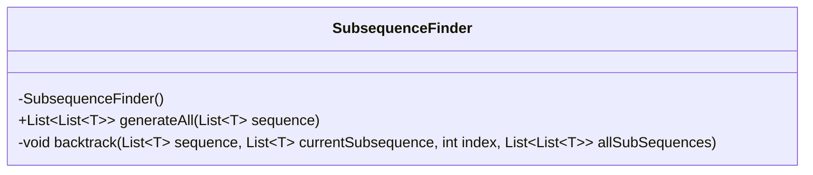
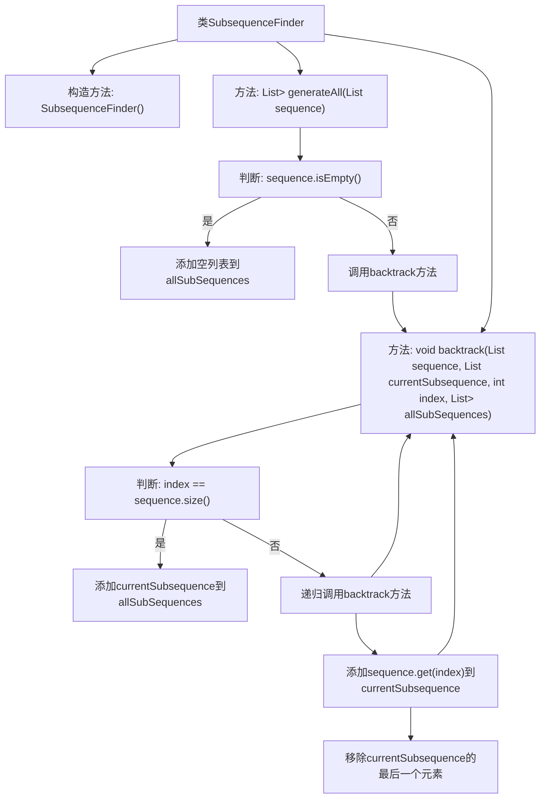

# 基础信息

|      |      |
|------|------|
| 名称 | SubsequenceFinder |
| 编码语言 | .java |
| 代码路径 | Java/src/main/java/com/thealgorithms/backtracking/SubsequenceFinder.java |
| 包名 | com.thealgorithms.backtracking |
| 依赖项 | ['java.util.ArrayList', 'java.util.List'] |
| 概述说明 | SubsequenceFinder类利用回溯算法生成列表的全部子序列。 |

# 说明

SubsequenceFinder类利用回溯算法来生成给定列表的所有子序列。回溯算法通过递归地探索所有可能的组合，确保不遗漏任何子序列。该方法系统地构建子序列，逐步添加或移除元素，并在每一步检查当前组合是否符合子序列的定义。通过这种方式，SubsequenceFinder类能够高效且全面地列出所有可能的子序列，适用于需要枚举子序列的各种应用场景。

# 类列表 Class Summary

| 名称   | 类型  | 说明 |
|-------|------|-------------|
| SubsequenceFinder | class | SubsequenceFinder类通过回溯算法生成列表的所有子序列。 |

## 类 SubsequenceFinder

|      |      |
|------|------|
| 访问范围 | public final |
| 类型 | class |
| 名称 | SubsequenceFinder |
| 说明 | SubsequenceFinder类通过回溯算法生成列表的所有子序列。 |

### UML类图

类图描述：
`SubsequenceFinder` 是一个工具类，用于生成给定列表的所有子序列。它包含一个私有的构造函数，确保无法实例化该类。主要方法 `generateAll` 接受一个列表作为输入，并返回所有可能的子序列列表。`backtrack` 是一个私有方法，通过递归和回溯的方式生成所有子序列。该方法在每次递归中决定是否包含当前元素，从而生成所有可能的组合。

### 内部方法调用关系图

这段代码实现了一个用于生成给定列表所有子序列的类 `SubsequenceFinder`。`generateAll` 方法首先检查输入列表是否为空，若为空则返回包含空列表的结果。否则，调用 `backtrack` 方法进行回溯，递归地生成所有可能的子序列。`backtrack` 方法通过遍历每个元素，决定是否将其加入当前子序列，并在递归结束后移除该元素，确保所有组合都被探索。最终，所有生成的子序列被存储在 `allSubSequences` 列表中并返回。

### 字段列表 Field List

| 名称  | 类型  | 说明 |
|-------|-------|------|

### 方法列表 Method List

| 名称  | 类型  | 说明 |
|-------|-------|------|
| backtrack | void | 递归回溯生成所有子序列。 |
| generateAll | List<List<T>> | 生成序列的所有子序列，使用回溯法实现。 |

