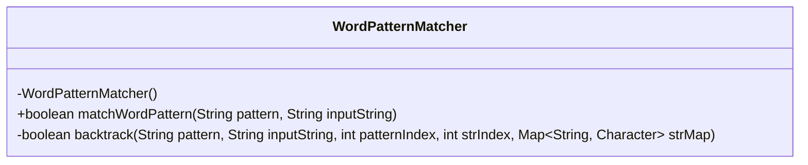
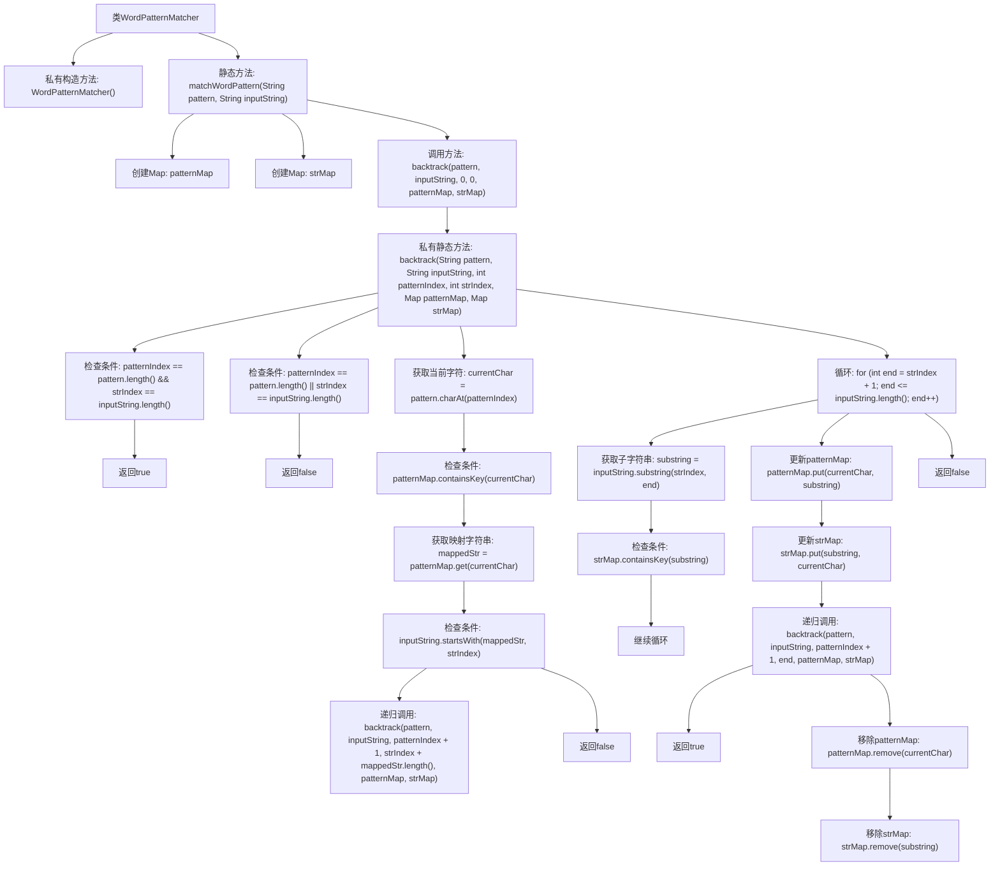

# 基础信息

|      |      |
|------|------|
| 名称 | WordPatternMatcher |
| 编码语言 | .java |
| 代码路径 | Java/src/main/java/com/thealgorithms/backtracking/WordPatternMatcher.java |
| 包名 | com.thealgorithms.backtracking |
| 依赖项 | ['java.util.HashMap', 'java.util.Map'] |
| 概述说明 | WordPatternMatcher类用回溯算法和双向映射表匹配字符串与模式。 |

# 说明

WordPatternMatcher类采用回溯算法来实现字符串与模式的匹配。该算法通过维护两个映射表来确保字符串与模式之间的双向一致性。具体来说，一个映射表用于记录字符串中的字符与模式中的字符之间的对应关系，另一个映射表则用于记录模式中的字符与字符串中的字符之间的对应关系。这种双向映射机制确保了匹配过程的准确性和一致性，使得算法能够有效地判断字符串是否符合给定的模式。通过回溯算法，WordPatternMatcher类能够在遇到不匹配的情况时进行回溯，尝试其他可能的匹配路径，从而提高匹配的成功率。

# 类列表 Class Summary

| 名称   | 类型  | 说明 |
|-------|------|-------------|
| WordPatternMatcher | class | WordPatternMatcher类通过回溯算法匹配字符串与模式，使用两个映射表确保双向一致性。 |

## 类 WordPatternMatcher

|      |      |
|------|------|
| 访问范围 | public final |
| 类型 | class |
| 名称 | WordPatternMatcher |
| 说明 | WordPatternMatcher类通过回溯算法匹配字符串与模式，使用两个映射表确保双向一致性。 |

### UML类图

这段代码定义了一个名为 `WordPatternMatcher` 的类，该类包含一个私有构造函数和一个静态的 `matchWordPattern` 方法，用于判断给定的模式是否与输入字符串匹配。`matchWordPattern` 方法依赖于一个私有的 `backtrack` 方法，该方法通过回溯算法来实现模式匹配。`backtrack` 方法使用两个映射表 `patternMap` 和 `strMap` 来存储模式字符与字符串之间的映射关系，并通过递归调用来检查匹配情况。整个过程通过回溯机制确保所有可能的匹配组合都被尝试，直到找到匹配或确认无匹配为止。

### 内部方法调用关系图

这段代码实现了一个模式匹配器，用于检查给定的模式是否与输入字符串匹配。它使用回溯算法来尝试不同的字符串和模式字符之间的映射关系。代码首先初始化两个映射表，然后通过递归调用回溯函数来尝试匹配。如果找到匹配的映射关系，则返回true，否则返回false。流程图展示了整个匹配过程的逻辑流，包括条件检查和递归调用。

### 字段列表 Field List

| 名称  | 类型  | 说明 |
|-------|-------|------|

### 方法列表 Method List

| 名称  | 类型  | 说明 |
|-------|-------|------|
| matchWordPattern | boolean | 匹配字符串模式与输入字符串的双向映射。 |
| backtrack | boolean | 回溯算法匹配字符串与模式。 |

