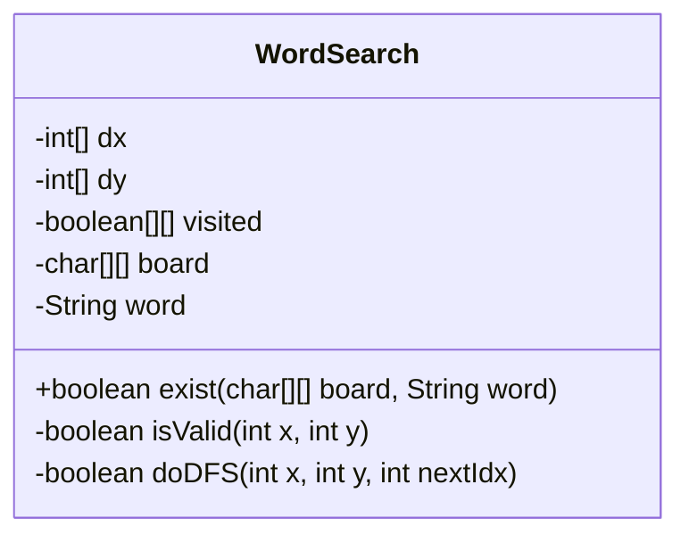
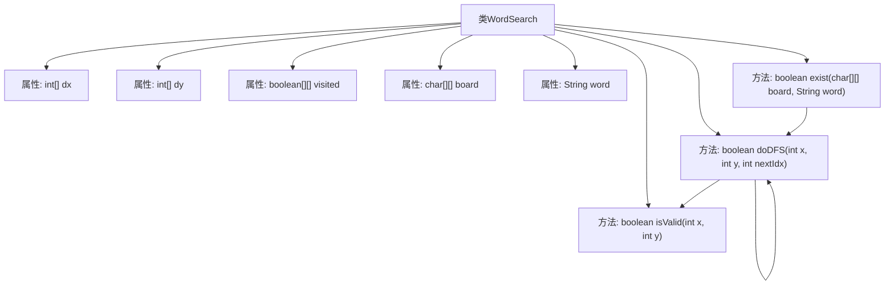
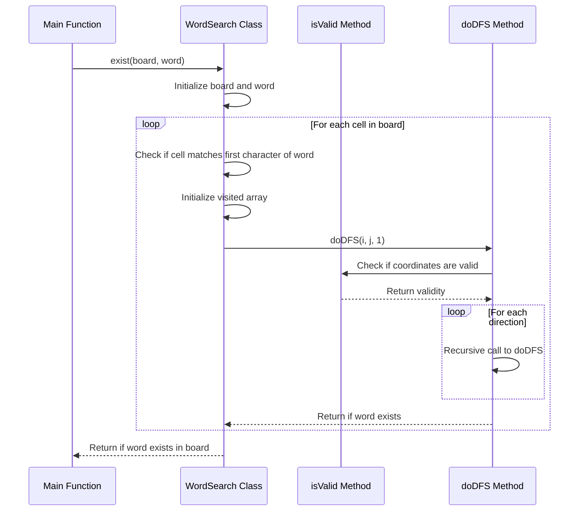

# 基础信息

|      |      |
|------|------|
| 名称 | WordSearch |
| 编码语言 | .java |
| 代码路径 | Java/src/main/java/com/thealgorithms/backtracking/WordSearch.java |
| 包名 | com.thealgorithms.backtracking |
| 依赖项 | [] |
| 概述说明 | WordSearch类通过DFS在二维字符数组中查找目标单词，支持回溯。 |

# 说明

WordSearch类采用深度优先搜索（DFS）算法在二维字符数组中查找目标单词。该算法通过递归遍历数组中的每个字符，检查是否与目标单词的当前字符匹配。如果匹配，则继续搜索相邻字符；如果不匹配，则回溯到上一个字符，尝试其他路径。这种方法确保能够全面搜索所有可能的路径，从而有效找到目标单词。

# 类列表 Class Summary

| 名称   | 类型  | 说明 |
|-------|------|-------------|
| WordSearch | class | WordSearch类使用DFS在二维字符数组中查找目标单词，支持回溯。 |

## 类 WordSearch

|      |      |
|------|------|
| 访问范围 | public |
| 类型 | class |
| 名称 | WordSearch |
| 说明 | WordSearch类使用DFS在二维字符数组中查找目标单词，支持回溯。 |

### UML类图

**描述：**  
`WordSearch` 类用于在二维字符网格中查找是否存在指定的单词。该类通过深度优先搜索（DFS）算法实现，从网格中的每个字符开始，检查是否能够匹配单词的字符序列。`exist` 方法是主入口，负责初始化搜索并调用 `doDFS` 方法进行递归搜索。`isValid` 方法用于检查坐标是否在网格范围内，而 `doDFS` 方法则执行实际的递归搜索和回溯操作。

### 内部方法调用关系图

**描述：**
该代码实现了一个单词搜索算法，通过深度优先搜索（DFS）在二维字符网格中查找目标单词。`WordSearch`类包含属性用于存储网格、访问状态和搜索方向，方法`isValid`检查坐标是否有效，`doDFS`执行DFS搜索，`exist`方法遍历网格并调用`doDFS`进行搜索。流程图展示了类结构和方法调用关系，时序图详细描述了`exist`方法如何调用`doDFS`和`isValid`方法进行单词搜索的过程。

### 字段列表 Field List

| 名称  | 类型  | 说明 |
|-------|-------|------|
| board | char[][] | 定义私有二维字符数组board。 |
| dx = {0, 0, 1, -1} | int[] | 定义了一个包含四个方向偏移量的整型数组。 |
| word | String | 定义了一个私有的字符串变量word。 |
| visited | boolean[][] | 定义了一个私有的布尔二维数组visited。 |
| dy = {1, -1, 0, 0} | int[] | 定义包含四个方向的Y轴移动数组。 |

### 方法列表 Method List

| 名称  | 类型  | 说明 |
|-------|-------|------|
| exist | boolean | 在二维字符数组中查找单词是否存在，使用深度优先搜索。 |
| isValid | boolean | 检查坐标(x,y)是否在二维数组board的有效范围内。 |
| doDFS | boolean | DFS回溯算法搜索单词路径，标记访问并返回结果。 |

