# 基础信息

|      |      |
|------|------|
| 名称 | backtracking |
| 编码语言 | .java |
| 代码路径 | Java/src/main/java/com/thealgorithms/backtracking |
| 包名 | Java.src.main.java.com.thealgorithms.backtracking |
| 概述说明 | 各类使用回溯法解决组合、排列、路径、迷宫、填充、N皇后、子序列、括号、模式匹配、图着色、单词搜索、填字游戏等问题。 |

# 说明

## 概述
该代码模块主要基于回溯算法实现了一系列经典的组合、排列、路径搜索、图着色、迷宫求解、填字游戏等问题。回溯法通过递归和剪枝策略，逐步构建并验证每个可能的解，确保最终输出的结果符合要求。模块中的类涵盖了从数组组合、排列生成到图论问题（如路径搜索、着色问题）以及字符串匹配、填字游戏等多个领域的算法实现。

## 主要业务场景
1. **组合与排列生成**：
   - `ArrayCombination`类生成从0到n-1范围内长度为k的所有组合。
   - `Permutation`类生成给定数组的所有排列。
   - `Combination`类查找数组中所有长度为n的组合。
   - `SubsequenceFinder`类生成给定列表的所有子序列。

2. **路径搜索与图论问题**：
   - `AllPathsFromSourceToTarget`类在图中查找从源点到目标点的所有路径。
   - `KnightsTour`类解决骑士巡游问题，找到骑士在棋盘上的完整巡游路径。
   - `MColoring`类判断是否可以使用最多M种颜色对图进行着色，确保相邻节点颜色不同。

3. **迷宫与图像处理**：
   - `MazeRecursion`类提供两种递归策略解决迷宫问题。
   - `FloodFill`类实现二维图像的颜色填充功能，支持水平、垂直和对角线方向的递归填充。

4. **经典问题求解**：
   - `NQueens`类解决N皇后问题，找到所有合法的皇后布局。
   - `PowerSum`类计算将自然数表示为不同自然数的X次幂之和的方式数。
   - `ParenthesesGenerator`类生成指定数量的括号对的所有有效组合。

5. **字符串匹配与填字游戏**：
   - `WordPatternMatcher`类实现字符串与模式的匹配，确保双向一致性。
   - `WordSearch`类在二维字符数组中查找目标单词。
   - `CrosswordSolver`类专门用于填字游戏的求解，通过回溯算法寻找解决方案。

该模块适用于需要穷举所有可能解的场景，如组合优化、路径规划、图论问题、字符串匹配等，具有高效且全面的算法实现。

### 包内部结构视图

```mermaid
graph TD
    backtracking --> ArrayCombination.java
    backtracking --> Permutation.java
    backtracking --> AllPathsFromSourceToTarget.java
    backtracking --> KnightsTour.java
    backtracking --> MazeRecursion.java
    backtracking --> FloodFill.java
    backtracking --> NQueens.java
    backtracking --> Combination.java
    backtracking --> PowerSum.java
    backtracking --> SubsequenceFinder.java
    backtracking --> ParenthesesGenerator.java
    backtracking --> WordPatternMatcher.java
    backtracking --> MColoring.java
    backtracking --> WordSearch.java
    backtracking --> CrosswordSolver.java
```

该流程图展示了Java项目中`backtracking`目录下的所有文件及其层级关系。`backtracking`作为根节点，包含了多个回溯算法相关的Java文件，如`ArrayCombination.java`、`Permutation.java`等。每个文件都是`backtracking`目录的直接子节点，展示了这些文件在同一层级下的组织结构。

# 文件列表 File List

| 名称   | 类型  | 说明 |
|-------|------|-------------|
| [MColoring.java](MColoring.md) | file | 节点类含颜色和邻接节点，MColoring类用BFS判断图是否可用M色着色且无冲突。 |
| [PowerSum.java](PowerSum.md) | file | 计算目标数表示为不同自然数的X次幂之和的方式数。 |
| [FloodFill.java](FloodFill.md) | file | FloodFill类实现二维图像颜色填充，支持水平和垂直及对角线递归填充。 |
| [AllPathsFromSourceToTarget.java](AllPathsFromSourceToTarget.md) | file | 该类通过邻接表存储图结构，递归查找并存储源点到目标点的所有路径。 |
| [CrosswordSolver.java](CrosswordSolver.md) | file | CrosswordSolver类实现填字游戏求解，支持验证、放置、移除单词及回溯功能。 |
| [WordSearch.java](WordSearch.md) | file | WordSearch类通过DFS在二维字符数组中查找目标单词，支持回溯。 |
| [WordPatternMatcher.java](WordPatternMatcher.md) | file | WordPatternMatcher类用回溯算法和双向映射表匹配字符串与模式。 |
| [ParenthesesGenerator.java](ParenthesesGenerator.md) | file | 生成指定数量括号的所有有效组合。 |
| [SubsequenceFinder.java](SubsequenceFinder.md) | file | SubsequenceFinder类利用回溯算法生成列表的全部子序列。 |
| [Combination.java](Combination.md) | file | 回溯法查找数组中长度为n的所有组合。 |
| [NQueens.java](NQueens.md) | file | NQueens类使用回溯法解决N皇后问题，寻找所有合法布局。 |
| [MazeRecursion.java](MazeRecursion.md) | file | MazeRecursion类提供两种递归策略，采用不同移动顺序解决迷宫问题。 |
| [KnightsTour.java](KnightsTour.md) | file | 骑士巡游问题求解类，具备棋盘初始化、递归求解、邻居检测及孤儿检测功能。 |
| [Permutation.java](Permutation.md) | file | Permutation类使用回溯法生成数组所有排列。 |
| [ArrayCombination.java](ArrayCombination.md) | file | ArrayCombination类用回溯法生成0到n-1的长度为k的所有组合。 |

