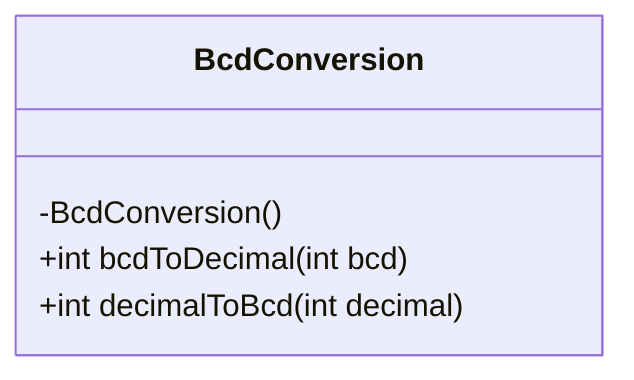
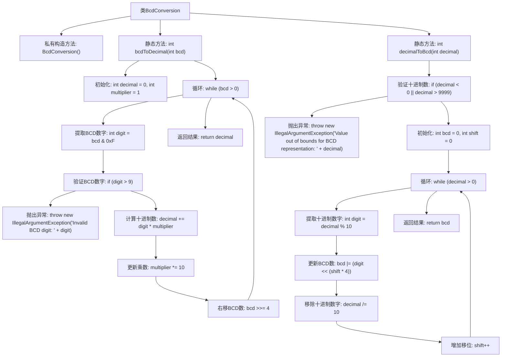

# 基础信息

|      |      |
|------|------|
| 名称 | BcdConversion |
| 编码语言 | .java |
| 代码路径 | Java/src/main/java/com/thealgorithms/bitmanipulation/BcdConversion.java |
| 包名 | com.thealgorithms.bitmanipulation |
| 依赖项 | [] |
| 概述说明 | BcdConversion类实现BCD与十进制互转，含校验和转换步骤。 |

# 说明

BcdConversion类提供了BCD码与十进制数之间的相互转换功能，包含了完整的校验和转换步骤，确保数据在转换过程中的准确性和完整性。

# 类列表 Class Summary

| 名称   | 类型  | 说明 |
|-------|------|-------------|
| BcdConversion | class | BcdConversion类实现BCD与十进制互转，包含校验和转换步骤。 |

## 类 BcdConversion

|      |      |
|------|------|
| 访问范围 | public final |
| 类型 | class |
| 名称 | BcdConversion |
| 说明 | BcdConversion类实现BCD与十进制互转，包含校验和转换步骤。 |

### UML类图

这段代码定义了一个名为 `BcdConversion` 的类，该类包含两个静态方法：`bcdToDecimal` 和 `decimalToBcd`。`bcdToDecimal` 方法将二进制编码的十进制数（BCD）转换为十进制数，而 `decimalToBcd` 方法则将十进制数转换为BCD。这两个方法都包含输入验证，以确保输入的数值在有效范围内。`BcdConversion` 类的构造函数被私有化，防止实例化该类。类图展示了该类的结构和方法的访问权限。

### 内部方法调用关系图

该流程图描述了`BcdConversion`类中的两个主要方法：`bcdToDecimal`和`decimalToBcd`。`bcdToDecimal`方法将BCD数转换为十进制数，首先验证BCD数字的有效性，然后逐位提取并计算十进制数。`decimalToBcd`方法将十进制数转换为BCD数，首先验证十进制数的范围，然后逐位提取并构建BCD数。两个方法都通过循环处理输入数字，并在过程中进行相应的位操作和计算。

### 字段列表 Field List

| 名称  | 类型  | 说明 |
|-------|-------|------|

### 方法列表 Method List

| 名称  | 类型  | 说明 |
|-------|-------|------|
| decimalToBcd | int | 将十进制数转换为BCD码，支持0到9999范围。 |
| bcdToDecimal | int | 将BCD码转换为十进制数，验证每位并计算。 |

