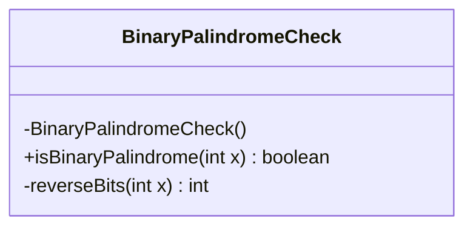
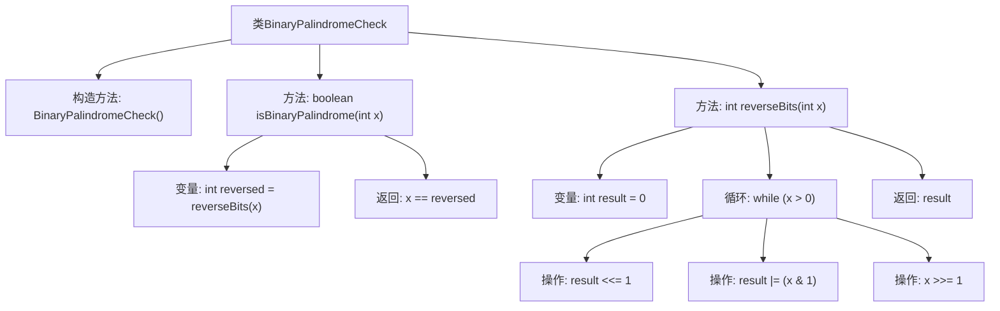

# 基础信息

|      |      |
|------|------|
| 名称 | BinaryPalindromeCheck |
| 编码语言 | .java |
| 代码路径 | Java/src/main/java/com/thealgorithms/bitmanipulation/BinaryPalindromeCheck.java |
| 包名 | com.thealgorithms.bitmanipulation |
| 依赖项 | [] |
| 概述说明 | 检查二进制数是否为回文。 |

# 说明

该功能旨在检查一个数字的二进制表示是否为回文。回文是指正读和反读都相同的序列。具体来说，该功能会将给定的数字转换为二进制形式，然后判断该二进制序列是否与其逆序相同。如果二进制序列与逆序一致，则该数字的二进制表示为回文；否则，不是回文。这一功能可以用于验证数字在二进制下的对称性。

# 类列表 Class Summary

| 名称   | 类型  | 说明 |
|-------|------|-------------|
| BinaryPalindromeCheck | class | 检查数字的二进制表示是否为回文。 |

## 类 BinaryPalindromeCheck

|      |      |
|------|------|
| 访问范围 | public final |
| 类型 | class |
| 名称 | BinaryPalindromeCheck |
| 说明 | 检查数字的二进制表示是否为回文。 |

### UML类图

这段代码定义了一个名为 `BinaryPalindromeCheck` 的类，该类包含两个静态方法：`isBinaryPalindrome` 和 `reverseBits`。`isBinaryPalindrome` 方法用于检查一个整数的二进制表示是否是回文，而 `reverseBits` 方法则用于反转整数的二进制位。`BinaryPalindromeCheck` 类的构造函数被声明为私有，以防止外部实例化。类图展示了类的结构及其方法的可见性。

### 内部方法调用关系图

这段代码定义了一个`BinaryPalindromeCheck`类，用于检查一个整数的二进制表示是否为回文。主要方法`isBinaryPalindrome`通过调用`reverseBits`方法反转整数的二进制位，然后比较原整数与反转后的整数是否相等。`reverseBits`方法通过循环和位操作实现二进制位的反转。流程图清晰地展示了类结构、方法调用关系以及内部操作的执行顺序。

### 字段列表 Field List

| 名称  | 类型  | 说明 |
|-------|-------|------|

### 方法列表 Method List

| 名称  | 类型  | 说明 |
|-------|-------|------|
| isBinaryPalindrome | boolean | 方法判断整数二进制是否为回文。 |
| reverseBits | int | 该函数通过位移和位运算反转整数的二进制位。 |

