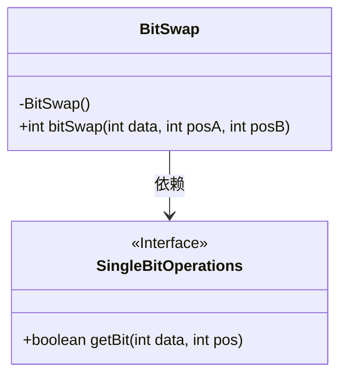
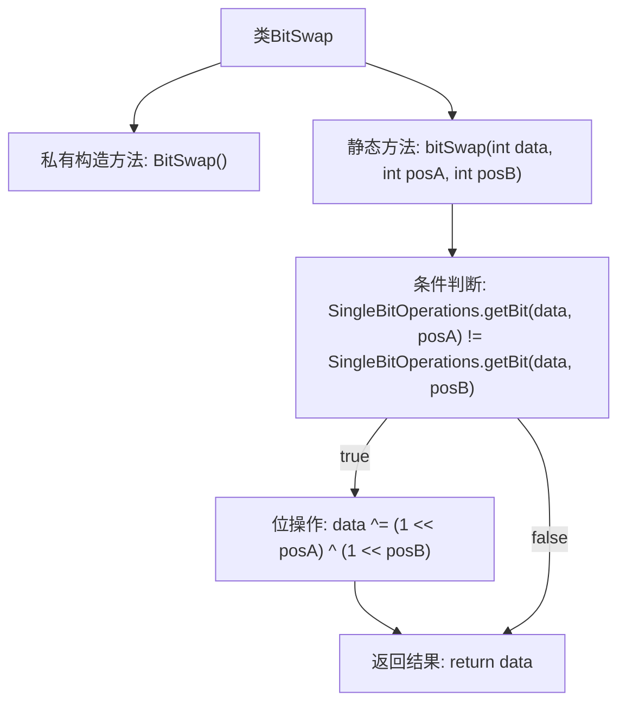

# 基础信息

|      |      |
|------|------|
| 名称 | BitSwap |
| 编码语言 | .java |
| 代码路径 | Java/src/main/java/com/thealgorithms/bitmanipulation/BitSwap.java |
| 包名 | com.thealgorithms.bitmanipulation |
| 依赖项 | [] |
| 概述说明 | BitSwap类提供bitSwap方法，用于交换整数data中posA和posB位置的比特。 |

# 说明

BitSwap类包含一个名为bitSwap的方法，用于交换整数data中指定位置posA和posB的比特值。该方法通过操作整数的二进制位，实现两个位置比特的互换，从而改变整数的二进制表示。这一功能在处理需要位操作的场景中非常有用，如数据加密、压缩或特定算法的实现。

# 类列表 Class Summary

| 名称   | 类型  | 说明 |
|-------|------|-------------|
| BitSwap | class | BitSwap类提供bitSwap方法，交换整数data中posA和posB位置的比特。 |

## 类 BitSwap

|      |      |
|------|------|
| 访问范围 | public final |
| 类型 | class |
| 名称 | BitSwap |
| 说明 | BitSwap类提供bitSwap方法，交换整数data中posA和posB位置的比特。 |

### UML类图

类图描述：  
`BitSwap` 类是一个工具类，用于交换整数中指定位置的比特位。它包含一个私有的构造函数 `BitSwap()`，确保该类不能被实例化。`bitSwap` 方法接收三个参数：整数 `data` 和两个位置 `posA` 和 `posB`，并返回交换后的整数。`BitSwap` 类依赖于 `SingleBitOperations` 接口的 `getBit` 方法，用于获取指定位置的比特值。`SingleBitOperations` 接口标记为 `<<Interface>>`，表示它是一个接口，包含一个 `getBit` 方法。

### 内部方法调用关系图

这段代码定义了一个名为 `BitSwap` 的类，该类包含一个私有构造方法和一个静态方法 `bitSwap`。`bitSwap` 方法用于交换整数 `data` 中位于 `posA` 和 `posB` 位置的两个比特位。首先，方法通过 `SingleBitOperations.getBit` 检查这两个比特位是否相同，如果不同，则通过位异或操作交换它们的位置，最后返回修改后的 `data`。流程图清晰地展示了这一逻辑流程。

### 字段列表 Field List

| 名称  | 类型  | 说明 |
|-------|-------|------|

### 方法列表 Method List

| 名称  | 类型  | 说明 |
|-------|-------|------|
| bitSwap | int | 交换整数data中posA和posB位的值。 |

