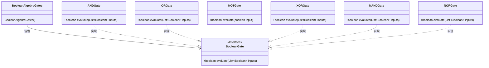
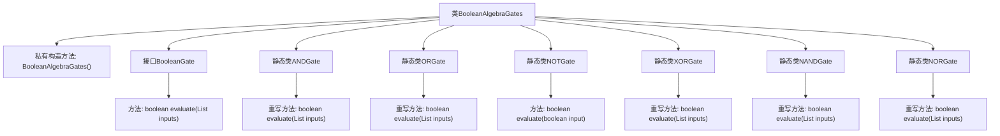

# 基础信息

|      |      |
|------|------|
| 名称 | BooleanAlgebraGates |
| 编码语言 | .java |
| 代码路径 | Java/src/main/java/com/thealgorithms/bitmanipulation/BooleanAlgebraGates.java |
| 包名 | com.thealgorithms.bitmanipulation |
| 依赖项 | ['java.util.List'] |
| 概述说明 | 布尔代数门实现包含AND、OR、NOT、XOR、NAND和NOR门。 |

# 说明

布尔代数门实现涵盖了基本逻辑门操作，包括与门（AND）、或门（OR）、非门（NOT）、异或门（XOR）、与非门（NAND）和或非门（NOR）。这些逻辑门是数字电路设计的基础，用于执行各种布尔运算。与门输出两个输入均为真时的真值，或门输出任一输入为真时的真值，非门对输入进行取反操作。异或门输出两个输入不同时的真值，与非门和或非门则分别在与门和或门的基础上进行取反操作。这些逻辑门的组合和连接构成了复杂的数字系统。

# 类列表 Class Summary

| 名称   | 类型  | 说明 |
|-------|------|-------------|
| BooleanAlgebraGates | class | 布尔代数门实现，包括AND、OR、NOT、XOR、NAND和NOR门。 |

## 类 BooleanAlgebraGates

|      |      |
|------|------|
| 访问范围 | public final |
| 类型 | class |
| 名称 | BooleanAlgebraGates |
| 说明 | 布尔代数门实现，包括AND、OR、NOT、XOR、NAND和NOR门。 |

### UML类图

这段代码定义了一个`BooleanAlgebraGates`类，其中包含多个布尔逻辑门的实现。`BooleanGate`是一个接口，定义了`evaluate`方法，用于评估布尔逻辑门的输出。`ANDGate`、`ORGate`、`XORGate`、`NANDGate`和`NORGate`分别实现了`BooleanGate`接口，表示不同的布尔逻辑门。`NOTGate`则是一个独立的类，用于实现非门操作。每个逻辑门类都提供了具体的`evaluate`方法，根据输入值计算并返回布尔结果。

### 内部方法调用关系图

该代码定义了一个名为`BooleanAlgebraGates`的类，其中包含多个静态内部类，分别实现了不同的布尔逻辑门（如AND、OR、NOT、XOR、NAND、NOR）。每个逻辑门类都实现了`BooleanGate`接口中的`evaluate`方法，用于根据输入列表计算布尔值。私有构造方法`BooleanAlgebraGates()`防止了类的实例化。流程图展示了类与接口、方法之间的关系，清晰地反映了各个逻辑门的实现及其调用关系。

### 字段列表 Field List

| 名称  | 类型  | 说明 |
|-------|-------|------|

### 方法列表 Method List

| 名称  | 类型  | 说明 |
|-------|-------|------|

