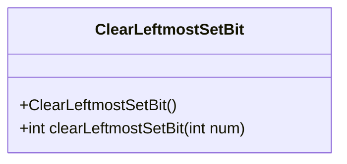
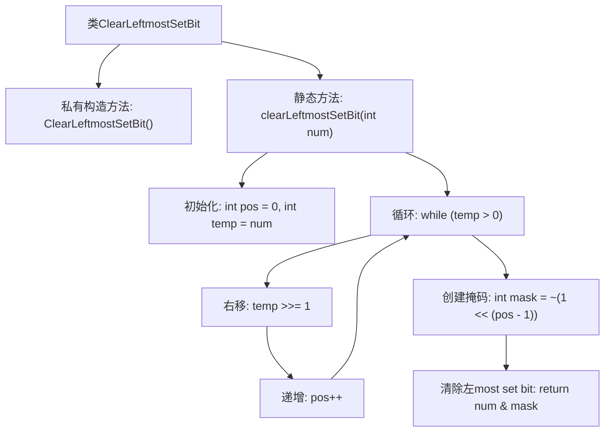

# 基础信息

|      |      |
|------|------|
| 名称 | ClearLeftmostSetBit |
| 编码语言 | .java |
| 代码路径 | Java/src/main/java/com/thealgorithms/bitmanipulation/ClearLeftmostSetBit.java |
| 包名 | com.thealgorithms.bitmanipulation |
| 依赖项 | [] |
| 概述说明 | 清除数字最左置位并返回结果。 |

# 说明

该任务要求清除给定数字的最左置位，并返回处理后的结果。最左置位指的是数字二进制表示中最高有效位（即最左边的1）。清除操作意味着将该位置为0，而保持其他位不变。这一操作通常用于位运算中，以改变数字的二进制表示，从而影响其数值。执行该操作后，返回的数字将不再包含原始数字的最高有效位。

# 类列表 Class Summary

| 名称   | 类型  | 说明 |
|-------|------|-------------|
| ClearLeftmostSetBit | class | 清除给定数字的最左置位，返回结果。 |

## 类 ClearLeftmostSetBit

|      |      |
|------|------|
| 访问范围 | public final |
| 类型 | class |
| 名称 | ClearLeftmostSetBit |
| 说明 | 清除给定数字的最左置位，返回结果。 |

### UML类图

**描述：**  
`ClearLeftmostSetBit` 类是一个工具类，用于清除给定整数的最左侧的置位（1）。该类包含一个私有的构造函数，防止实例化，以及一个静态方法 `clearLeftmostSetBit`，该方法通过计算最左侧置位的位置，生成掩码，并使用位操作清除该置位。该类的主要功能是通过位操作高效地处理整数的二进制表示。

### 内部方法调用关系图

**描述：**
这段代码定义了一个名为 `ClearLeftmostSetBit` 的类，其中包含一个静态方法 `clearLeftmostSetBit`，用于清除给定整数的最左设置位（即二进制表示中最左边的1）。首先，方法通过循环找到最左设置位的位置，然后创建一个掩码，将该位设置为0，最后通过按位与操作清除该位并返回结果。流程图展示了从初始化到返回结果的完整过程。

### 字段列表 Field List

| 名称  | 类型  | 说明 |
|-------|-------|------|

### 方法列表 Method List

| 名称  | 类型  | 说明 |
|-------|-------|------|
| clearLeftmostSetBit | int | 清除整数最左置位的方法。 |

