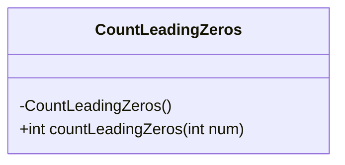
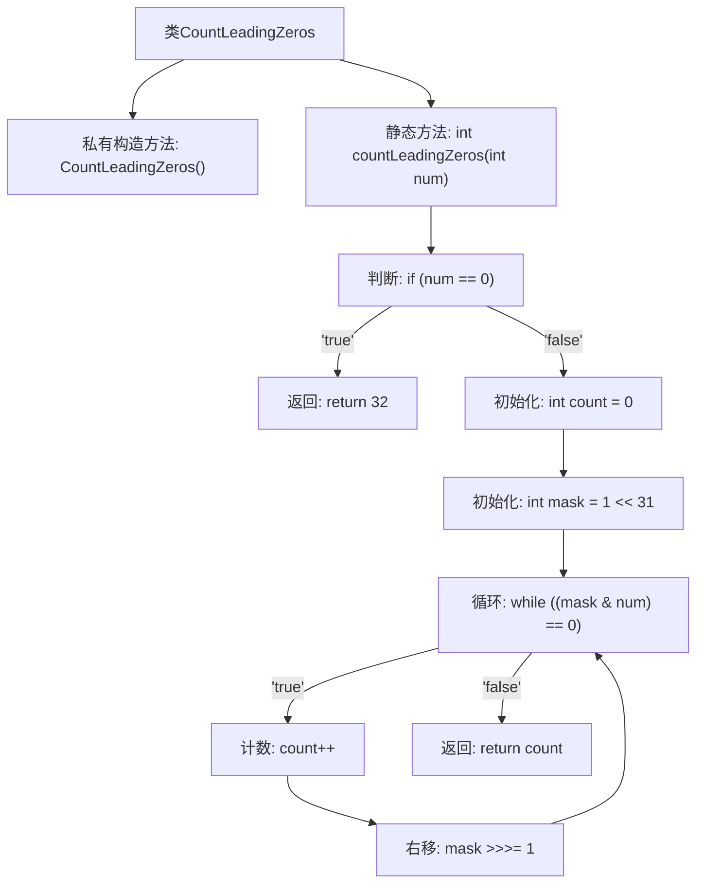

# 基础信息

|      |      |
|------|------|
| 名称 | CountLeadingZeros |
| 编码语言 | .java |
| 代码路径 | Java/src/main/java/com/thealgorithms/bitmanipulation/CountLeadingZeros.java |
| 包名 | com.thealgorithms.bitmanipulation |
| 依赖项 | [] |
| 概述说明 | 统计二进制数前导零个数，右移掩码至最左位为1。 |

# 说明

该方法通过右移掩码的方式，逐步检查二进制数的最左位是否为1，从而统计前导零的个数。具体操作是不断将掩码右移，直到最左位变为1，记录右移的次数即为前导零的数量。该方法适用于快速确定二进制数中最高有效位的位置，进而计算前导零的个数。

# 类列表 Class Summary

| 名称   | 类型  | 说明 |
|-------|------|-------------|
| CountLeadingZeros | class | 统计二进制数前导零的个数，通过右移掩码直到最左位为1。 |

## 类 CountLeadingZeros

|      |      |
|------|------|
| 访问范围 | public final |
| 类型 | class |
| 名称 | CountLeadingZeros |
| 说明 | 统计二进制数前导零的个数，通过右移掩码直到最左位为1。 |

### UML类图

**描述：**  
`CountLeadingZeros` 类是一个工具类，用于计算整数二进制表示中的前导零的数量。该类包含一个私有的构造函数，防止实例化，以及一个公有的静态方法 `countLeadingZeros`，该方法通过不断右移掩码直到找到最高位的1来计算前导零的数量。如果输入数字为0，则直接返回32，因为32位整数的所有位都是0。

### 内部方法调用关系图

这段代码定义了一个名为`CountLeadingZeros`的类，其中包含一个静态方法`countLeadingZeros`，用于计算一个整数的二进制表示中前导零的数量。方法首先检查输入是否为0，如果是，则直接返回32。否则，通过不断右移掩码并计数，直到找到第一个非零位，最终返回计数值。流程图展示了方法的执行步骤和逻辑分支。

### 字段列表 Field List

| 名称  | 类型  | 说明 |
|-------|-------|------|

### 方法列表 Method List

| 名称  | 类型  | 说明 |
|-------|-------|------|
| countLeadingZeros | int | 计算整数二进制前导零的个数，若为0则返回32。 |

