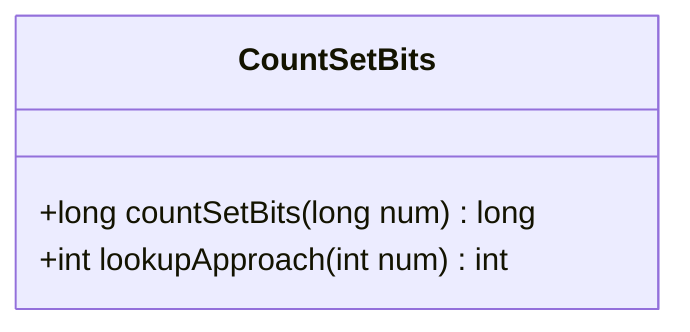
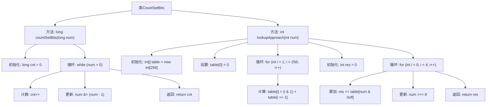

# 基础信息

|      |      |
|------|------|
| 名称 | CountSetBits |
| 编码语言 | .java |
| 代码路径 | Java/src/main/java/com/thealgorithms/bitmanipulation/CountSetBits.java |
| 包名 | com.thealgorithms.bitmanipulation |
| 依赖项 | [] |
| 概述说明 | Brian Kernighan算法高效计算二进制1的个数，查表法快速预处理0-255的1个数。 |

# 说明

Brian Kernighan算法利用n & (n-1)操作高效计算二进制数中1的个数，通过不断清除最低位的1来统计总数。查表法则预先计算0到255之间每个数的1的个数，并存储在表中，适用于快速查找和计算。两种方法各有优势，Kernighan算法适用于任意长度的二进制数，而查表法在处理固定长度数据时更为高效。

# 类列表 Class Summary

| 名称   | 类型  | 说明 |
|-------|------|-------------|
| CountSetBits | class | Brian Kernighan算法通过n & (n-1)高效计算二进制中1的个数。查表法预处理0-255的1个数，适用于快速计算。 |

## 类 CountSetBits

|      |      |
|------|------|
| 访问范围 | public |
| 类型 | class |
| 名称 | CountSetBits |
| 说明 | Brian Kernighan算法通过n & (n-1)高效计算二进制中1的个数。查表法预处理0-255的1个数，适用于快速计算。 |

### UML类图

**描述：**  
`CountSetBits` 类提供了两种方法来计算一个整数的二进制表示中置位（即值为1的位）的数量。第一种方法 `countSetBits` 使用了 Brian Kernighan 的算法，通过不断地将数字与它减一的结果进行按位与操作，来逐步消除最右边的置位，直到数字变为0。第二种方法 `lookupApproach` 则通过预处理的查找表来快速计算置位数量，将32位整数分为4个8位的块，每个块的置位数量通过查找表直接获取，最后将四个块的结果相加。这两种方法分别适用于不同的场景，`countSetBits` 适用于任意长度的整数，而 `lookupApproach` 则通过预处理提高了计算效率。

### 内部方法调用关系图

这段代码实现了一个类 `CountSetBits`，包含两种计算二进制数中置位（set bits）数量的方法。`countSetBits` 方法使用 Brian Kernighan 算法，通过不断清除最右边的置位来计数，时间复杂度为 O(k)，其中 k 是置位的数量。`lookupApproach` 方法通过预处理的查找表来快速计算置位数量，时间复杂度为 O(1)，但需要额外的空间来存储查找表。两种方法分别适用于不同的场景，前者适用于动态计算，后者适用于需要快速查询的场景。

### 字段列表 Field List

| 名称  | 类型  | 说明 |
|-------|-------|------|

### 方法列表 Method List

| 名称  | 类型  | 说明 |
|-------|-------|------|
| countSetBits | long | 计算二进制数中1的个数，使用位运算优化。 |
| lookupApproach | int | 该方法通过查表计算整数的二进制中1的个数。 |

