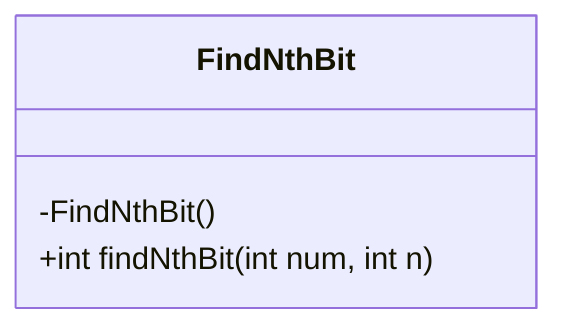
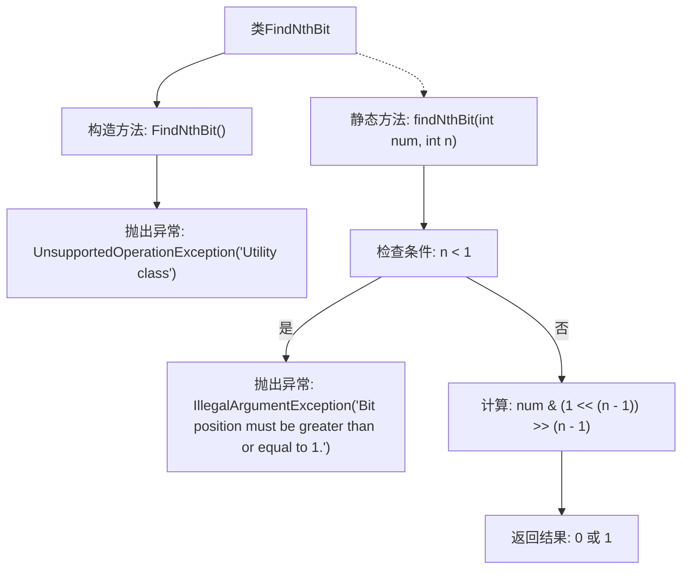

# 基础信息

|      |      |
|------|------|
| 名称 | FindNthBit |
| 编码语言 | .java |
| 代码路径 | Java/src/main/java/com/thealgorithms/bitmanipulation/FindNthBit.java |
| 包名 | com.thealgorithms.bitmanipulation |
| 依赖项 | [] |
| 概述说明 | FindNthBit类提供静态方法findNthBit，用于获取整数指定位置位的值，位位置需≥1。 |

# 说明

FindNthBit类是一个工具类，主要功能是通过静态方法findNthBit来获取整数中指定位置位的值。该方法要求位位置必须大于或等于1，以确保获取的位在有效范围内。该类的设计简洁，专注于提供位操作的实用功能。

# 类列表 Class Summary

| 名称   | 类型  | 说明 |
|-------|------|-------------|
| FindNthBit | class | FindNthBit类为工具类，通过静态方法findNthBit获取整数指定位置位的值，位位置需大于等于1。 |

## 类 FindNthBit

|      |      |
|------|------|
| 访问范围 | public final |
| 类型 | class |
| 名称 | FindNthBit |
| 说明 | FindNthBit类为工具类，通过静态方法findNthBit获取整数指定位置位的值，位位置需大于等于1。 |

### UML类图

类图描述：`FindNthBit` 是一个工具类，用于查找给定整数的第N位值。该类包含一个私有构造函数，防止实例化，并提供一个静态方法 `findNthBit`，该方法通过位操作从整数的二进制表示中提取第N位。如果传入的位位置小于1，方法会抛出 `IllegalArgumentException` 异常。

### 内部方法调用关系图

这段代码定义了一个工具类 `FindNthBit`，该类包含一个私有构造方法，用于防止实例化，并抛出一个 `UnsupportedOperationException` 异常。类中的静态方法 `findNthBit` 用于查找给定整数 `num` 的第 `n` 位二进制值。如果 `n` 小于 1，方法会抛出 `IllegalArgumentException` 异常。否则，方法通过位运算提取并返回第 `n` 位的值（0 或 1）。

### 字段列表 Field List

| 名称  | 类型  | 说明 |
|-------|-------|------|

### 方法列表 Method List

| 名称  | 类型  | 说明 |
|-------|-------|------|
| findNthBit | int | 查找整数num的第n位二进制值，若n小于1则抛出异常。 |

