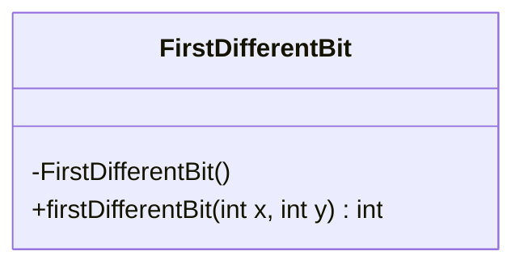
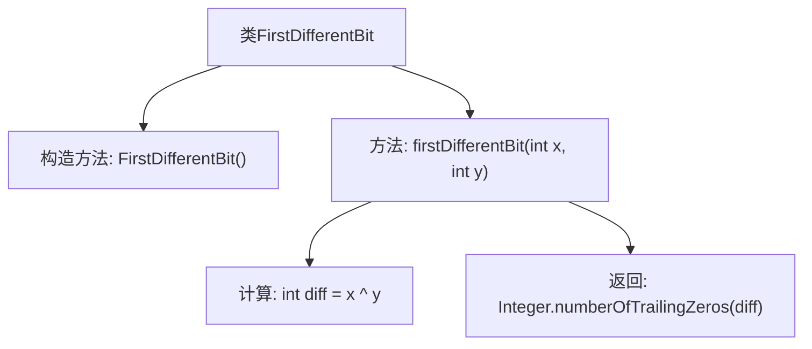

# 基础信息

|      |      |
|------|------|
| 名称 | FirstDifferentBit |
| 编码语言 | .java |
| 代码路径 | Java/src/main/java/com/thealgorithms/bitmanipulation/FirstDifferentBit.java |
| 包名 | com.thealgorithms.bitmanipulation |
| 依赖项 | [] |
| 概述说明 | FirstDifferentBit类用异或操作确定两整数首个不同位的索引。 |

# 说明

FirstDifferentBit类的主要功能是通过异或操作来确定两个整数中首个不同位的索引。具体来说，该类对两个整数进行异或运算，生成一个结果值，然后通过检查该结果值的二进制表示，找出第一个值为1的位的位置。这个位置即为两个整数在二进制表示中首个不同位的索引。该方法高效且直接，适用于需要快速定位整数差异的场景。

# 类列表 Class Summary

| 名称   | 类型  | 说明 |
|-------|------|-------------|
| FirstDifferentBit | class | FirstDifferentBit类通过异或操作找出两个整数首个不同位的索引。 |

## 类 FirstDifferentBit

|      |      |
|------|------|
| 访问范围 | public final |
| 类型 | class |
| 名称 | FirstDifferentBit |
| 说明 | FirstDifferentBit类通过异或操作找出两个整数首个不同位的索引。 |

### UML类图

类图描述：`FirstDifferentBit` 是一个不可继承的类，包含一个私有构造函数和一个公有静态方法 `firstDifferentBit`。该方法通过异或操作找到两个整数的第一个不同位，并返回其索引。类图展示了类的结构及其方法的访问权限。

### 内部方法调用关系图

该流程图描述了`FirstDifferentBit`类的结构和方法调用关系。`FirstDifferentBit`类包含一个私有构造方法和一个静态方法`firstDifferentBit`。该方法通过异或操作计算两个整数的差异位，然后使用`Integer.numberOfTrailingZeros`方法找到第一个不同位的索引。流程图清晰地展示了方法的执行步骤和类的关系。

### 字段列表 Field List

| 名称  | 类型  | 说明 |
|-------|-------|------|

### 方法列表 Method List

| 名称  | 类型  | 说明 |
|-------|-------|------|
| firstDifferentBit | int | 函数计算两个整数二进制表示中首个不同位的位置。 |

