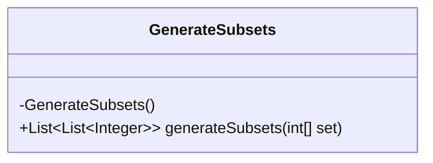
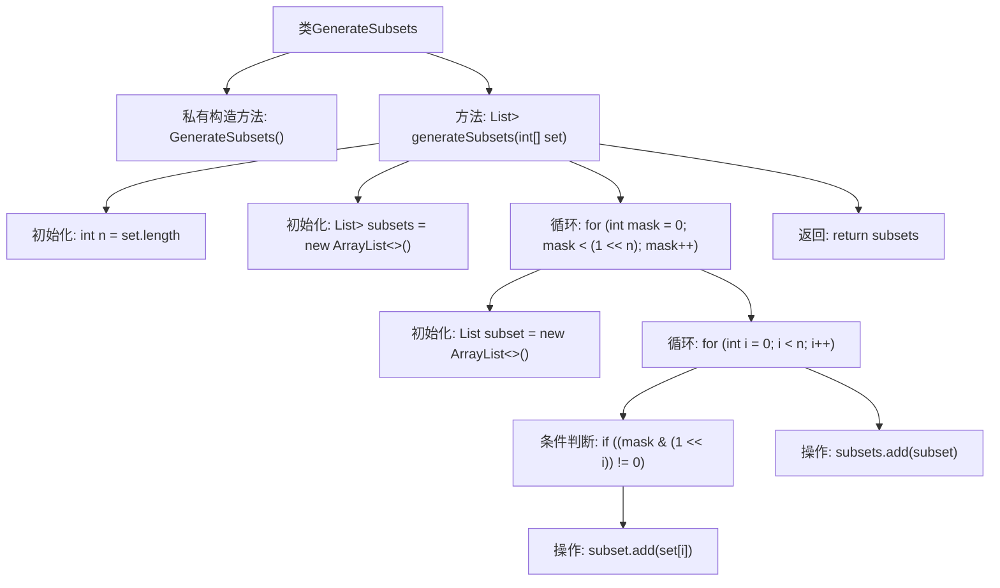

# 基础信息

|      |      |
|------|------|
| 名称 | GenerateSubsets |
| 编码语言 | .java |
| 代码路径 | Java/src/main/java/com/thealgorithms/bitmanipulation/GenerateSubsets.java |
| 包名 | com.thealgorithms.bitmanipulation |
| 依赖项 | ['java.util.ArrayList', 'java.util.List'] |
| 概述说明 | 位运算生成集合所有子集。 |

# 说明

通过位运算生成给定集合的所有子集，是一种高效且简洁的方法。具体步骤包括：首先，确定集合中元素的数量，记为n。然后，利用二进制数的特性，从0到2^n-1的每个数代表一个子集，其中每一位表示集合中对应元素是否被包含。通过遍历所有可能的二进制数，可以生成所有子集。这种方法避免了复杂的递归或迭代操作，直接利用位运算的特性，提高了生成子集的效率。

# 类列表 Class Summary

| 名称   | 类型  | 说明 |
|-------|------|-------------|
| GenerateSubsets | class | 通过位运算生成给定集合的所有子集。 |

## 类 GenerateSubsets

|      |      |
|------|------|
| 访问范围 | public final |
| 类型 | class |
| 名称 | GenerateSubsets |
| 说明 | 通过位运算生成给定集合的所有子集。 |

### UML类图

这段代码定义了一个名为 `GenerateSubsets` 的类，该类包含一个私有构造函数和一个公有静态方法 `generateSubsets`。`generateSubsets` 方法接收一个整数数组作为输入，并返回该数组所有子集的列表。方法通过位操作生成所有可能的子集，具体步骤包括：遍历所有可能的掩码值，检查每个掩码的每一位，如果某一位被设置，则将对应元素添加到当前子集中，最后将子集添加到结果列表中。

### 内部方法调用关系图

这段代码定义了一个名为`GenerateSubsets`的类，其中包含一个私有构造方法和一个静态方法`generateSubsets`。该方法通过位运算生成给定集合的所有子集。流程从初始化集合长度和子集列表开始，然后通过两个嵌套循环遍历所有可能的位掩码，检查每个位是否被设置，如果被设置则将对应元素添加到当前子集中，最后将子集添加到结果列表中并返回。

### 字段列表 Field List

| 名称  | 类型  | 说明 |
|-------|-------|------|

### 方法列表 Method List

| 名称  | 类型  | 说明 |
|-------|-------|------|
| generateSubsets | List<List<Integer>> | 生成数组所有子集，使用位掩码遍历组合。 |

