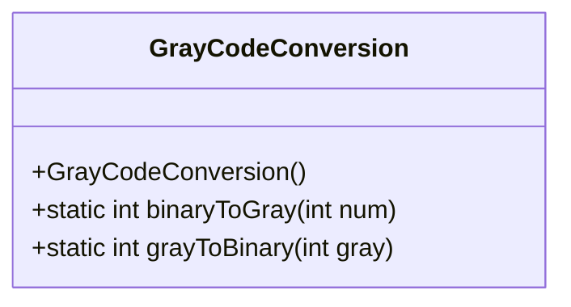
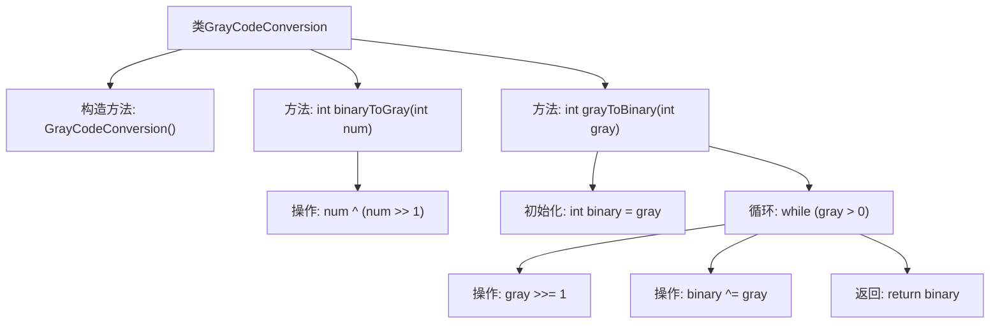

# 基础信息

|      |      |
|------|------|
| 名称 | GrayCodeConversion |
| 编码语言 | .java |
| 代码路径 | Java/src/main/java/com/thealgorithms/bitmanipulation/GrayCodeConversion.java |
| 包名 | com.thealgorithms.bitmanipulation |
| 依赖项 | [] |
| 概述说明 | GrayCodeConversion类实现二进制与格雷码互转。 |

# 说明

GrayCodeConversion类提供二进制与格雷码之间的相互转换功能。该类通过特定算法实现二进制数到格雷码的转换，以及格雷码到二进制数的逆向转换。格雷码是一种在相邻数值间仅有一位变化的编码方式，常用于减少数字信号传输中的错误。该类的实现确保了转换过程的准确性和高效性，适用于需要此类编码转换的应用场景。

# 类列表 Class Summary

| 名称   | 类型  | 说明 |
|-------|------|-------------|
| GrayCodeConversion | class | GrayCodeConversion类实现二进制与格雷码的相互转换。 |

## 类 GrayCodeConversion

|      |      |
|------|------|
| 访问范围 | public final |
| 类型 | class |
| 名称 | GrayCodeConversion |
| 说明 | GrayCodeConversion类实现二进制与格雷码的相互转换。 |

### UML类图

**描述：**  
`GrayCodeConversion` 是一个工具类，提供了将二进制数转换为格雷码以及将格雷码转换回二进制数的方法。该类包含两个静态方法：`binaryToGray` 和 `grayToBinary`。`binaryToGray` 方法通过异或操作将二进制数转换为格雷码，而 `grayToBinary` 方法则通过循环和异或操作将格雷码转换回二进制数。该类是 final 类，并且构造函数是私有的，因此无法被实例化，只能通过静态方法调用其功能。

### 内部方法调用关系图

这段代码定义了一个名为 `GrayCodeConversion` 的类，包含两个静态方法：`binaryToGray` 和 `grayToBinary`。`binaryToGray` 方法将二进制数转换为格雷码，通过位操作 `num ^ (num >> 1)` 实现。`grayToBinary` 方法将格雷码转换回二进制数，通过循环和位操作逐步恢复二进制数。流程图展示了类的结构和方法之间的调用关系，以及每个方法内部的操作步骤。

### 字段列表 Field List

| 名称  | 类型  | 说明 |
|-------|-------|------|

### 方法列表 Method List

| 名称  | 类型  | 说明 |
|-------|-------|------|
| binaryToGray | int | 将二进制数转换为格雷码的静态方法。 |
| grayToBinary | int | 将格雷码转换为二进制码的函数实现。 |

