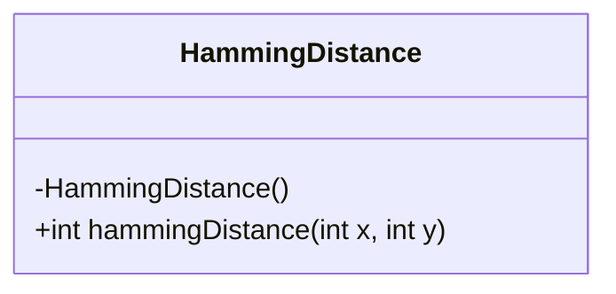
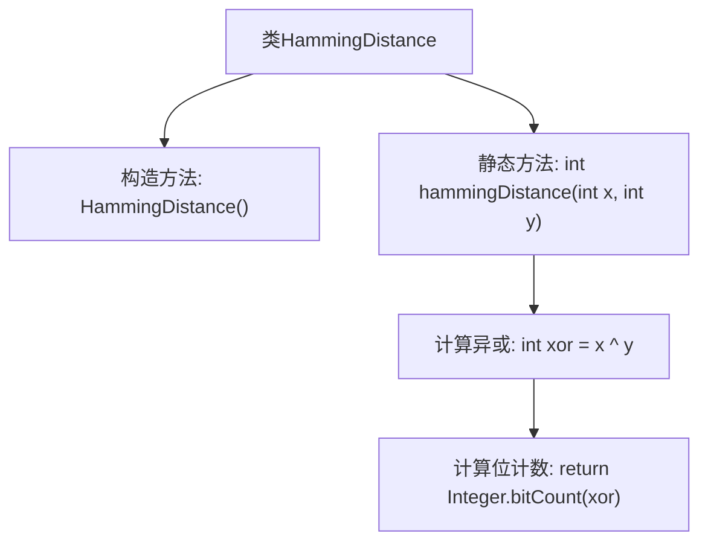

# 基础信息

|      |      |
|------|------|
| 名称 | HammingDistance |
| 编码语言 | .java |
| 代码路径 | Java/src/main/java/com/thealgorithms/bitmanipulation/HammingDistance.java |
| 包名 | com.thealgorithms.bitmanipulation |
| 依赖项 | [] |
| 概述说明 | 计算两整数汉明距离，返回不同位数数量。 |

# 说明

该内容描述了一个用于计算两个整数汉明距离的类。汉明距离是指两个等长整数在二进制表示中不同位数的数量。该类的核心功能是接收两个整数作为输入，通过比较它们的二进制位，统计并返回不同位数的数量。这一过程不涉及具体的代码实现，而是专注于描述类的功能和作用。

# 类列表 Class Summary

| 名称   | 类型  | 说明 |
|-------|------|-------------|
| HammingDistance | class | 计算两个整数汉明距离的类，返回不同位数的数量。 |

## 类 HammingDistance

|      |      |
|------|------|
| 访问范围 | public final |
| 类型 | class |
| 名称 | HammingDistance |
| 说明 | 计算两个整数汉明距离的类，返回不同位数的数量。 |

### UML类图

这段代码定义了一个名为 `HammingDistance` 的类，该类包含一个私有构造函数和一个公有静态方法 `hammingDistance`。`hammingDistance` 方法计算两个整数之间的汉明距离，即两个整数的二进制表示中不同位的数量。该方法通过异或操作和 `Integer.bitCount` 方法来实现这一计算。由于构造函数是私有的，该类不能被实例化，只能通过静态方法直接调用。

### 内部方法调用关系图

这段代码定义了一个名为 `HammingDistance` 的类，该类包含一个私有的构造方法和一个静态方法 `hammingDistance`。`hammingDistance` 方法用于计算两个整数之间的汉明距离，即两个整数二进制表示中不同位的数量。首先，通过异或操作 `x ^ y` 得到两个整数的不同位，然后使用 `Integer.bitCount` 方法计算异或结果中1的个数，即为汉明距离。流程图清晰地展示了类的结构和方法执行的步骤。

### 字段列表 Field List

| 名称  | 类型  | 说明 |
|-------|-------|------|

### 方法列表 Method List

| 名称  | 类型  | 说明 |
|-------|-------|------|
| hammingDistance | int | 计算两个整数汉明距离的静态方法。 |

