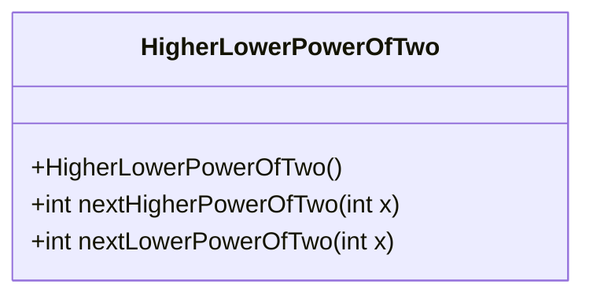
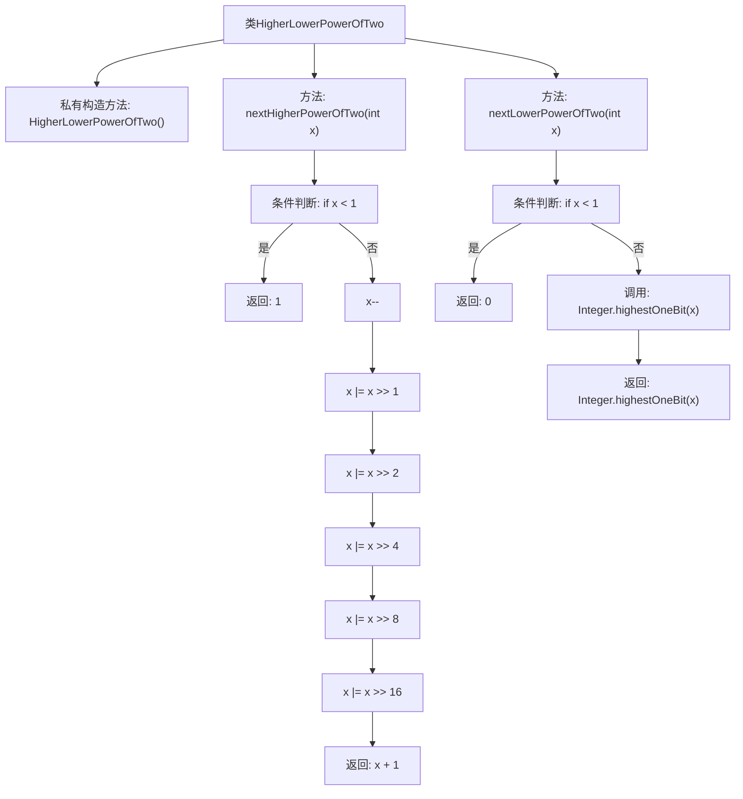

# 基础信息

|      |      |
|------|------|
| 名称 | HigherLowerPowerOfTwo |
| 编码语言 | .java |
| 代码路径 | Java/src/main/java/com/thealgorithms/bitmanipulation/HigherLowerPowerOfTwo.java |
| 包名 | com.thealgorithms.bitmanipulation |
| 依赖项 | [] |
| 概述说明 | 类HigherLowerPowerOfTwo提供查找高、低2的幂次方的方法。 |

# 说明

类HigherLowerPowerOfTwo提供了一种方法来查找给定数字的下一个更高或更低的2的幂次方。该类旨在帮助用户快速确定与输入数字最接近的2的幂次方，无论是向上还是向下取整。通过调用相应的方法，用户可以轻松获取符合要求的数值，从而在需要处理2的幂次方的场景中提高效率。

# 类列表 Class Summary

| 名称   | 类型  | 说明 |
|-------|------|-------------|
| HigherLowerPowerOfTwo | class | 类HigherLowerPowerOfTwo提供查找下一个高、低2的幂次方的方法。 |

## 类 HigherLowerPowerOfTwo

|      |      |
|------|------|
| 访问范围 | public final |
| 类型 | class |
| 名称 | HigherLowerPowerOfTwo |
| 说明 | 类HigherLowerPowerOfTwo提供查找下一个高、低2的幂次方的方法。 |

### UML类图

**描述：**
`HigherLowerPowerOfTwo` 是一个工具类，提供了两个静态方法来计算给定整数的下一个更高或更低的2的幂次方。`nextHigherPowerOfTwo` 方法通过位操作找到比输入数大的最小2的幂次方，而 `nextLowerPowerOfTwo` 方法则返回不大于输入数的最大2的幂次方。该类设计为不可实例化，所有方法均为静态，适合用于数学计算或性能优化场景。

### 内部方法调用关系图

这段代码定义了一个名为 `HigherLowerPowerOfTwo` 的类，其中包含两个静态方法：`nextHigherPowerOfTwo` 和 `nextLowerPowerOfTwo`。`nextHigherPowerOfTwo` 方法通过位操作找到给定整数的下一个更高的2的幂次方，而 `nextLowerPowerOfTwo` 方法则通过调用 `Integer.highestOneBit` 找到给定整数的下一个更低的2的幂次方。流程图清晰地展示了这两个方法的逻辑流程，包括条件判断、位操作和返回值。

### 字段列表 Field List

| 名称  | 类型  | 说明 |
|-------|-------|------|

### 方法列表 Method List

| 名称  | 类型  | 说明 |
|-------|-------|------|
| nextHigherPowerOfTwo | int | 计算大于等于x的最小2的幂次方数。 |
| nextLowerPowerOfTwo | int | 方法返回小于等于输入整数的最大2的幂次方。 |

