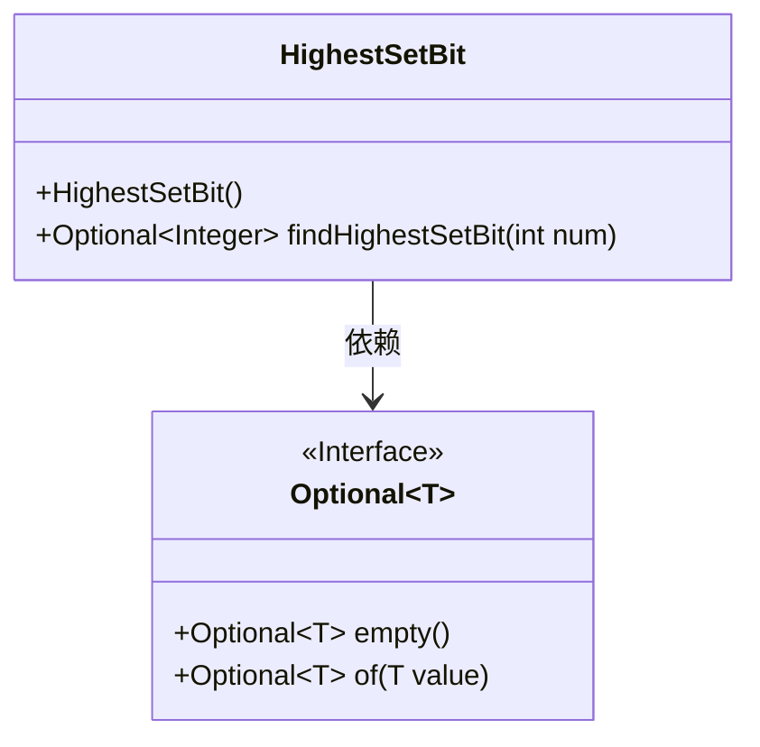
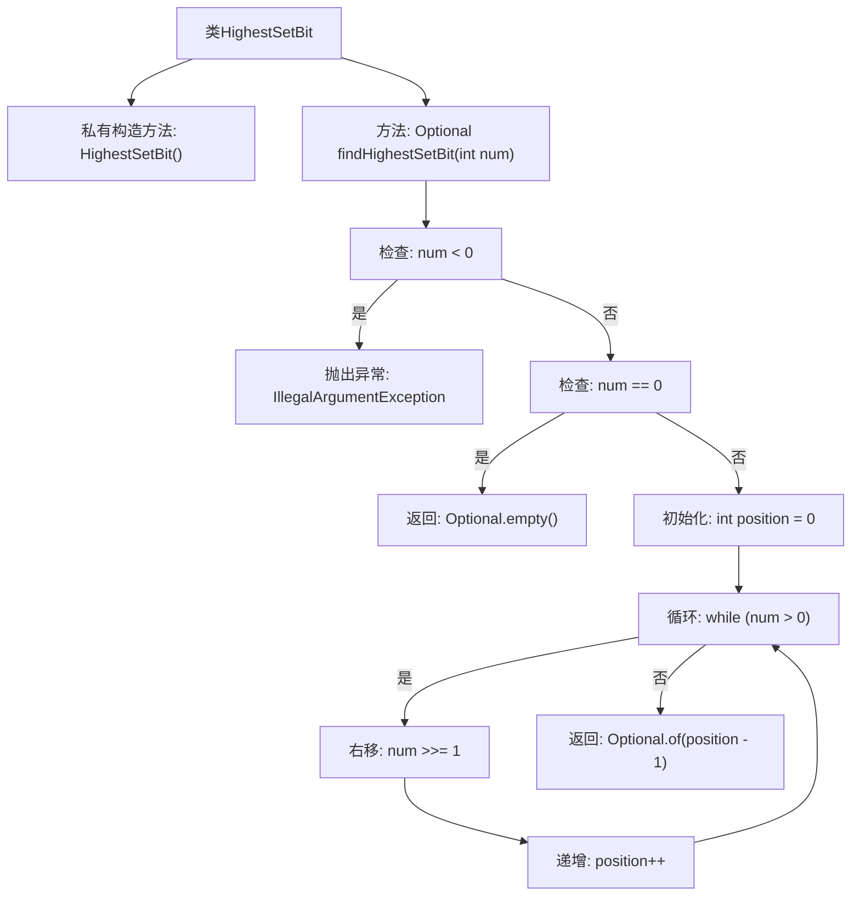

# 基础信息

|      |      |
|------|------|
| 名称 | HighestSetBit |
| 编码语言 | .java |
| 代码路径 | Java/src/main/java/com/thealgorithms/bitmanipulation/HighestSetBit.java |
| 包名 | com.thealgorithms.bitmanipulation |
| 依赖项 | ['java.util.Optional'] |
| 概述说明 | 查找整数最高有效位索引，负数报错，0返回空。 |

# 说明

该功能用于查找给定整数的最高有效位，并返回其位置索引。如果输入的整数为负数，则系统会报错。如果输入的整数为0，则返回空值。该功能主要用于确定整数二进制表示中最高位的位置，适用于需要处理二进制数据的场景。

# 类列表 Class Summary

| 名称   | 类型  | 说明 |
|-------|------|-------------|
| HighestSetBit | class | 查找整数最高有效位，返回位置索引，负数报错，0返回空。 |

## 类 HighestSetBit

|      |      |
|------|------|
| 访问范围 | public final |
| 类型 | class |
| 名称 | HighestSetBit |
| 说明 | 查找整数最高有效位，返回位置索引，负数报错，0返回空。 |

### UML类图

**描述：**  
`HighestSetBit` 是一个工具类，用于查找给定整数中最高有效位的索引。它包含一个私有构造函数，确保该类不能被实例化。`findHighestSetBit` 方法接收一个非负整数作为输入，返回一个 `Optional` 对象，其中包含最高有效位的索引（从0开始）。如果输入为0，则返回 `Optional.empty()`；如果输入为负数，则抛出 `IllegalArgumentException`。`Optional` 是一个泛型接口，提供了 `empty()` 和 `of()` 方法，用于处理可能为空的值。

### 内部方法调用关系图

这段代码定义了一个名为 `HighestSetBit` 的类，其中包含一个私有构造方法和一个静态方法 `findHighestSetBit`。该方法用于查找给定整数中最高有效位的索引，并返回一个 `Optional<Integer>` 对象。如果输入为负数，则抛出 `IllegalArgumentException` 异常；如果输入为0，则返回 `Optional.empty()`。通过循环右移操作，逐步确定最高有效位的位置，最终返回该位置的零基索引。

### 字段列表 Field List

| 名称  | 类型  | 说明 |
|-------|-------|------|

### 方法列表 Method List

| 名称  | 类型  | 说明 |
|-------|-------|------|
| findHighestSetBit | Optional<Integer> | 该方法查找整数最高有效位位置，负数报错，零返回空。 |

