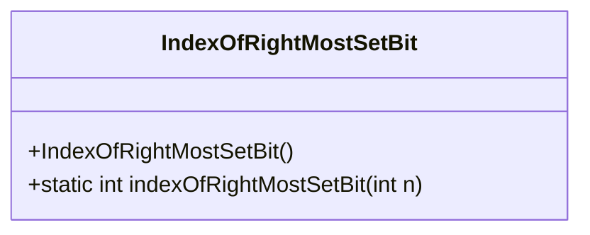
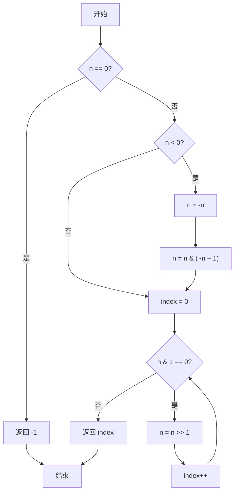
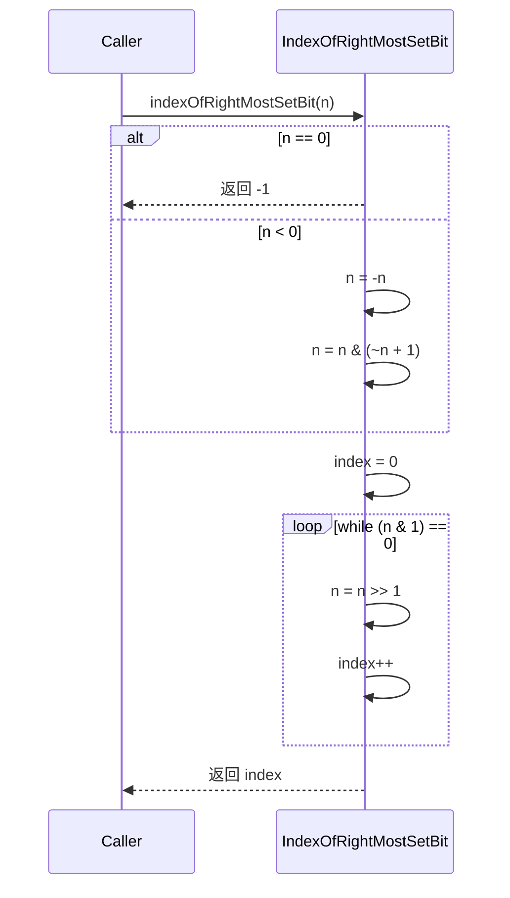
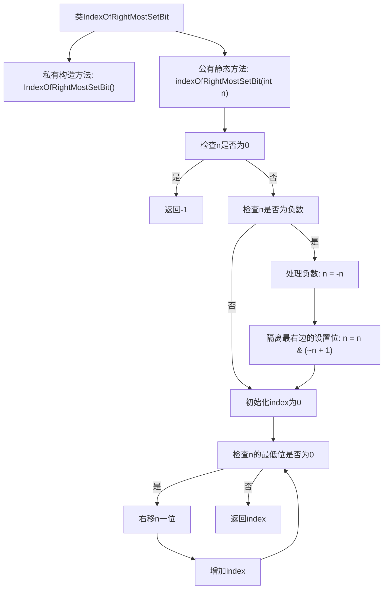

# 基础信息

|      |      |
|------|------|
| 名称 | IndexOfRightMostSetBit |
| 编码语言 | .java |
| 代码路径 | Java/src/main/java/com/thealgorithms/bitmanipulation/IndexOfRightMostSetBit.java |
| 包名 | com.thealgorithms.bitmanipulation |
| 依赖项 | [] |
| 概述说明 | 查找整数最右置位索引，返回零基索引，无置位返回-1。 |

# 说明

该描述涉及一个算法问题，要求查找一个整数的最右置位（即二进制表示中最右边的1）的索引，并返回其基于零的索引值。如果整数中没有置位（即整数值为0），则返回-1。该问题通常需要通过位运算来解决，具体实现可能涉及移位和逻辑操作，但描述中未包含具体代码或实现细节。

# 类列表 Class Summary

| 名称   | 类型  | 说明 |
|-------|------|-------------|
| IndexOfRightMostSetBit | class | 查找整数最右置位索引，返回零基索引，无置位返回-1。 |

## 类 IndexOfRightMostSetBit

|      |      |
|------|------|
| 访问范围 | public final |
| 类型 | class |
| 名称 | IndexOfRightMostSetBit |
| 说明 | 查找整数最右置位索引，返回零基索引，无置位返回-1。 |

### UML类图

**描述：**  
`IndexOfRightMostSetBit` 类提供了一个静态方法 `indexOfRightMostSetBit`，用于查找给定整数中最右侧设置位的索引。如果输入为0，则返回-1。对于负数，该方法首先计算其二进制补码，然后通过位操作找到最右侧的设置位。流程图展示了方法的逻辑流程，时序图则展示了方法调用的顺序和条件判断。

### 内部方法调用关系图

这段代码定义了一个名为`IndexOfRightMostSetBit`的类，其中包含一个静态方法`indexOfRightMostSetBit`，用于查找给定整数中最右边的设置位的索引。方法首先检查输入是否为0，如果是则返回-1。如果输入为负数，则通过计算其二进制补码来处理。然后，方法通过右移操作逐位检查，直到找到最右边的设置位，并返回其索引。流程图清晰地展示了方法的执行流程和条件判断。

### 字段列表 Field List

| 名称  | 类型  | 说明 |
|-------|-------|------|

### 方法列表 Method List

| 名称  | 类型  | 说明 |
|-------|-------|------|
| indexOfRightMostSetBit | int | 该方法返回整数最右侧置位的位置索引，处理负数和零。 |

