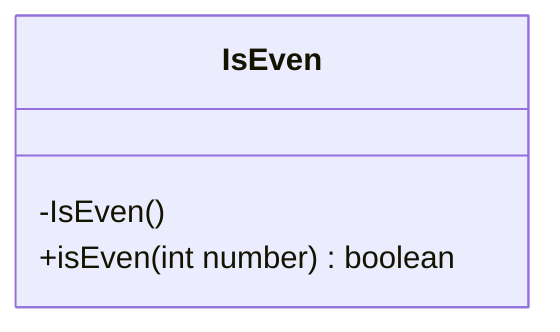
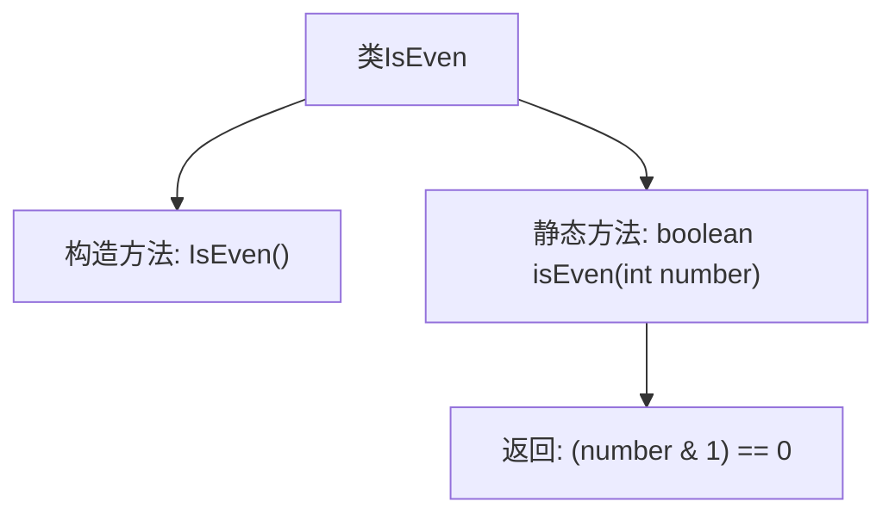

# 基础信息

|      |      |
|------|------|
| 名称 | IsEven |
| 编码语言 | .java |
| 代码路径 | Java/src/main/java/com/thealgorithms/bitmanipulation/IsEven.java |
| 包名 | com.thealgorithms.bitmanipulation |
| 依赖项 | [] |
| 概述说明 | IsEven类包含静态方法isEven，用于判断整数是否为偶数。 |

# 说明

IsEven类包含一个名为isEven的静态方法，用于判断一个整数是否为偶数。该方法通过接收一个整数作为输入，返回一个布尔值，表示该整数是否为偶数。该功能简单直接，适用于需要快速判断整数奇偶性的场景。

# 类列表 Class Summary

| 名称   | 类型  | 说明 |
|-------|------|-------------|
| IsEven | class | IsEven类提供静态方法isEven，判断整数是否为偶数。 |

## 类 IsEven

|      |      |
|------|------|
| 访问范围 | public final |
| 类型 | class |
| 名称 | IsEven |
| 说明 | IsEven类提供静态方法isEven，判断整数是否为偶数。 |

### UML类图

这段代码定义了一个名为 `IsEven` 的最终类，该类包含一个私有构造函数和一个静态方法 `isEven`。`isEven` 方法接收一个整数参数 `number`，并通过位运算判断该数是否为偶数，返回布尔值。由于构造函数是私有的，该类不能被实例化，只能通过静态方法 `isEven` 来调用其功能。这个类的设计简单且高效，专门用于判断一个整数是否为偶数。

### 内部方法调用关系图

这段代码定义了一个名为 `IsEven` 的不可继承类，其中包含一个私有的构造方法和一个静态方法 `isEven`。`isEven` 方法用于判断传入的整数是否为偶数，通过位运算 `(number & 1) == 0` 来实现。如果结果为 `true`，则表示该数为偶数，否则为奇数。代码结构简洁，功能明确，适用于快速判断整数的奇偶性。

### 字段列表 Field List

| 名称  | 类型  | 说明 |
|-------|-------|------|

### 方法列表 Method List

| 名称  | 类型  | 说明 |
|-------|-------|------|
| isEven | boolean | 判断整数是否为偶数的静态方法。 |

