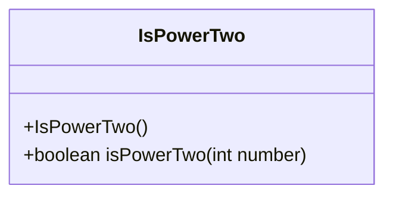
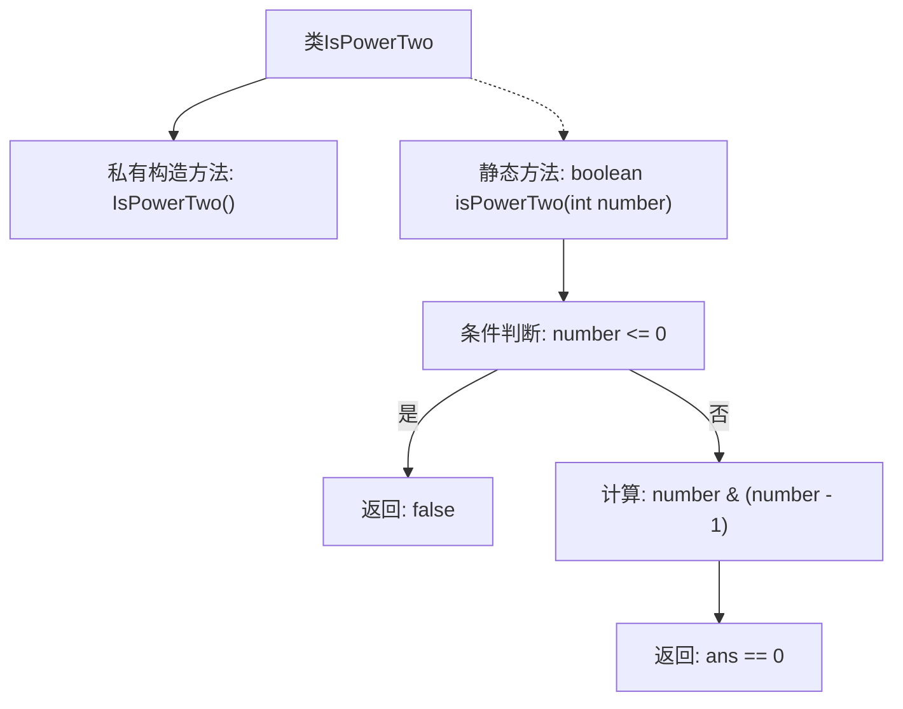

# 基础信息

|      |      |
|------|------|
| 名称 | IsPowerTwo |
| 编码语言 | .java |
| 代码路径 | Java/src/main/java/com/thealgorithms/bitmanipulation/IsPowerTwo.java |
| 包名 | com.thealgorithms.bitmanipulation |
| 依赖项 | [] |
| 概述说明 | 通过位运算快速判断整数是否为2的幂次方。 |

# 说明

判断整数是否为2的幂次方的方法利用位运算进行快速检测。具体来说，一个整数如果是2的幂次方，其二进制表示中仅有一个1，其余位均为0。通过将整数与其减1后的数进行按位与运算，若结果为0，则该整数是2的幂次方。这种方法高效且简洁，适用于快速判断。

# 类列表 Class Summary

| 名称   | 类型  | 说明 |
|-------|------|-------------|
| IsPowerTwo | class | 判断整数是否为2的幂次方，利用位运算快速检测。 |

## 类 IsPowerTwo

|      |      |
|------|------|
| 访问范围 | public final |
| 类型 | class |
| 名称 | IsPowerTwo |
| 说明 | 判断整数是否为2的幂次方，利用位运算快速检测。 |

### UML类图

这段代码定义了一个名为 `IsPowerTwo` 的不可继承的类，其中包含一个私有的构造函数和一个公有的静态方法 `isPowerTwo`。`isPowerTwo` 方法用于判断一个整数是否是2的幂。该方法通过检查整数是否大于零，并且该整数与其减一后的值进行按位与运算的结果是否为零来判断。如果满足条件，则返回 `true`，否则返回 `false`。该类没有其他成员变量或方法，且不可被实例化。

### 内部方法调用关系图

流程图描述了`IsPowerTwo`类的结构和`isPowerTwo`方法的执行流程。首先，类`IsPowerTwo`包含一个私有构造方法和一个静态方法`isPowerTwo`。`isPowerTwo`方法首先检查输入的数是否小于等于0，如果是则返回`false`；否则，计算该数与它减1的按位与结果，若结果为0则返回`true`，否则返回`false`。该流程图清晰地展示了方法内部的逻辑判断和计算步骤。

### 字段列表 Field List

| 名称  | 类型  | 说明 |
|-------|-------|------|

### 方法列表 Method List

| 名称  | 类型  | 说明 |
|-------|-------|------|
| isPowerTwo | boolean | 判断整数是否为2的幂次方，返回布尔值。 |

