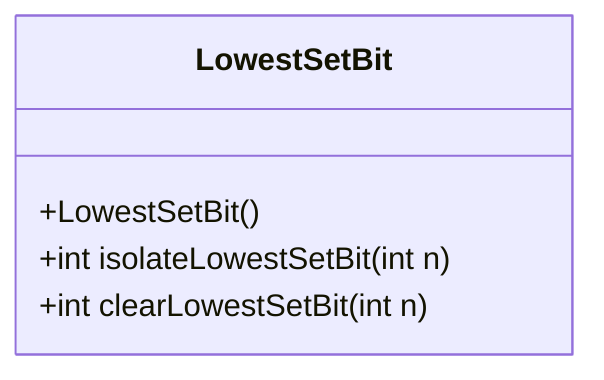
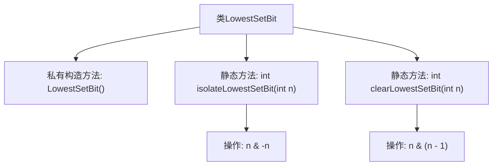

# 基础信息

|      |      |
|------|------|
| 名称 | LowestSetBit |
| 编码语言 | .java |
| 代码路径 | Java/src/main/java/com/thealgorithms/bitmanipulation/LowestSetBit.java |
| 包名 | com.thealgorithms.bitmanipulation |
| 依赖项 | [] |
| 概述说明 | LowestSetBit类提供隔离和清除最低有效位的方法。 |

# 说明

LowestSetBit类是一个专门用于处理二进制数最低有效位的工具类。它提供了两个主要功能：隔离最低有效位和清除最低有效位。隔离最低有效位是指提取并返回二进制数中最低的1位，而清除最低有效位则是将二进制数中最低的1位变为0。这些功能在需要处理二进制位操作的场景中非常有用，例如在算法优化、数据结构处理或位掩码操作中。通过使用LowestSetBit类，开发者可以更高效地实现这些操作，提升代码的性能和可读性。

# 类列表 Class Summary

| 名称   | 类型  | 说明 |
|-------|------|-------------|
| LowestSetBit | class | LowestSetBit类提供隔离和清除最低有效位的方法。 |

## 类 LowestSetBit

|      |      |
|------|------|
| 访问范围 | public final |
| 类型 | class |
| 名称 | LowestSetBit |
| 说明 | LowestSetBit类提供隔离和清除最低有效位的方法。 |

### UML类图

这段代码定义了一个名为 `LowestSetBit` 的类，该类包含两个静态方法：`isolateLowestSetBit` 和 `clearLowestSetBit`。`isolateLowestSetBit` 方法用于隔离给定整数的最低有效位（LSB），而 `clearLowestSetBit` 方法则用于清除给定整数的最低有效位。该类通过私有构造函数隐藏了默认的公共构造函数，确保无法实例化该类。这些方法通过位操作实现功能，适用于处理二进制数的场景。

### 内部方法调用关系图

这段代码定义了一个名为`LowestSetBit`的类，其中包含两个静态方法：`isolateLowestSetBit`和`clearLowestSetBit`。`isolateLowestSetBit`方法通过`n & -n`操作来隔离给定数字的最低有效位，而`clearLowestSetBit`方法通过`n & (n - 1)`操作来清除给定数字的最低有效位。类中还包含一个私有构造方法，用于隐藏默认的公共构造方法。

### 字段列表 Field List

| 名称  | 类型  | 说明 |
|-------|-------|------|

### 方法列表 Method List

| 名称  | 类型  | 说明 |
|-------|-------|------|
| isolateLowestSetBit | int | 该方法通过位运算返回整数最低有效位的值。 |
| clearLowestSetBit | int | 清除整数最低有效位的函数。 |

