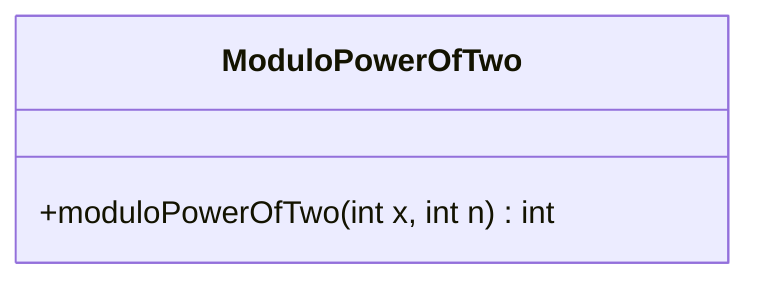
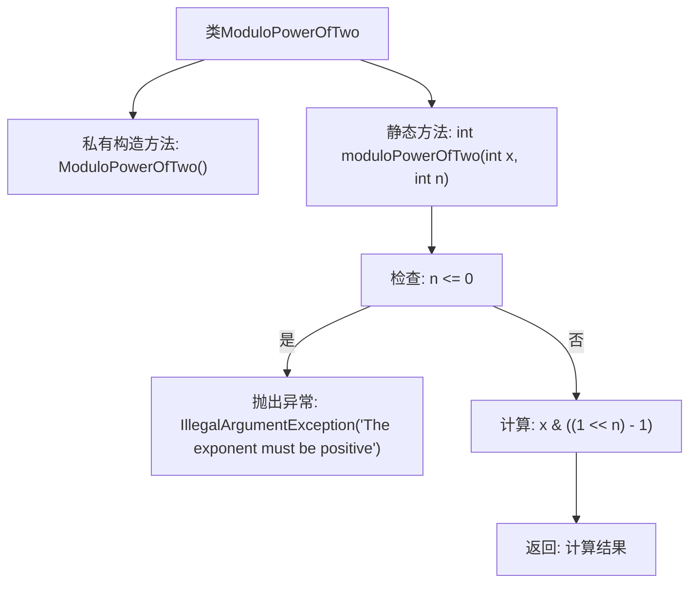

# 基础信息

|      |      |
|------|------|
| 名称 | ModuloPowerOfTwo |
| 编码语言 | .java |
| 代码路径 | Java/src/main/java/com/thealgorithms/bitmanipulation/ModuloPowerOfTwo.java |
| 包名 | com.thealgorithms.bitmanipulation |
| 依赖项 | [] |
| 概述说明 | 计算整数除以2的n次方的余数，n为正整数。 |

# 说明

该任务要求计算一个整数除以2的n次方的余数，其中n必须为正整数。具体来说，给定一个整数和一个正整数n，需要找到该整数除以2的n次方后的余数。这一过程涉及整数除法和取模运算，确保结果的正确性和有效性。关键点在于确保指数n为正，以避免无效的计算。

# 类列表 Class Summary

| 名称   | 类型  | 说明 |
|-------|------|-------------|
| ModuloPowerOfTwo | class | 计算整数除以2的n次方的余数，确保指数为正。 |

## 类 ModuloPowerOfTwo

|      |      |
|------|------|
| 访问范围 | public final |
| 类型 | class |
| 名称 | ModuloPowerOfTwo |
| 说明 | 计算整数除以2的n次方的余数，确保指数为正。 |

### UML类图

**描述：**  
`ModuloPowerOfTwo` 类是一个工具类，用于计算给定整数 `x` 除以 `2^n` 的余数。该类包含一个静态方法 `moduloPowerOfTwo`，该方法接收两个参数：`x`（被除数）和 `n`（指数，即 2 的幂）。方法首先检查 `n` 是否为正数，如果 `n` 小于等于 0，则抛出 `IllegalArgumentException` 异常。否则，通过位运算 `x & ((1 << n) - 1)` 计算并返回余数。该类是 `final` 的，且构造函数为私有，防止实例化。

### 内部方法调用关系图

这段代码定义了一个名为 `ModuloPowerOfTwo` 的类，该类包含一个私有构造方法和一个静态方法 `moduloPowerOfTwo`。该方法用于计算给定整数 `x` 除以 `2^n` 的余数。首先，方法会检查指数 `n` 是否为正数，如果不是则抛出 `IllegalArgumentException` 异常。如果 `n` 为正数，则通过位运算 `x & ((1 << n) - 1)` 计算余数并返回结果。流程图清晰地展示了方法的执行流程和条件判断。

### 字段列表 Field List

| 名称  | 类型  | 说明 |
|-------|-------|------|

### 方法列表 Method List

| 名称  | 类型  | 说明 |
|-------|-------|------|
| moduloPowerOfTwo | int | 该方法计算x对2的n次方的模，要求n为正数。 |

