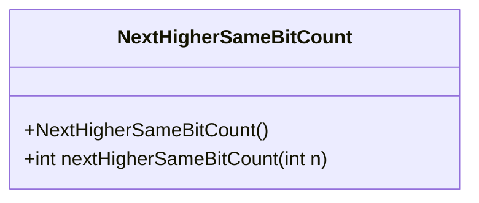
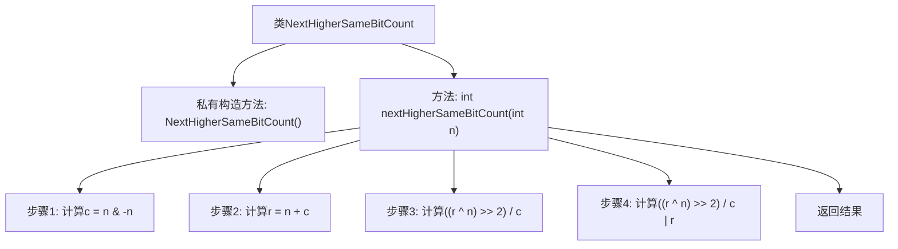

# 基础信息

|      |      |
|------|------|
| 名称 | NextHigherSameBitCount |
| 编码语言 | .java |
| 代码路径 | Java/src/main/java/com/thealgorithms/bitmanipulation/NextHigherSameBitCount.java |
| 包名 | com.thealgorithms.bitmanipulation |
| 依赖项 | [] |
| 概述说明 | 寻找比特数相同的下一个更大整数。 |

# 说明

查找具有相同比特数的下一个更大整数，意味着需要在给定整数的基础上，找到一个比它大的最小整数，且该整数的二进制表示中1的个数与原整数相同。这个过程通常涉及位操作，通过调整整数的二进制位来满足条件。具体步骤包括找到最低位的1，将其移动到更高位，并确保新整数的二进制表示中1的个数不变。这种方法在优化算法和数据处理中具有重要应用。

# 类列表 Class Summary

| 名称   | 类型  | 说明 |
|-------|------|-------------|
| NextHigherSameBitCount | class | 查找具有相同比特数的下一个更大整数。 |

## 类 NextHigherSameBitCount

|      |      |
|------|------|
| 访问范围 | public final |
| 类型 | class |
| 名称 | NextHigherSameBitCount |
| 说明 | 查找具有相同比特数的下一个更大整数。 |

### UML类图

**描述：**  
`NextHigherSameBitCount` 类是一个工具类，用于计算给定整数 `n` 的下一个具有相同设置位数（即二进制表示中1的个数）的更高整数。该类包含一个私有构造函数，防止实例化，以及一个静态方法 `nextHigherSameBitCount`，该方法通过位操作实现功能。方法首先找到 `n` 的最右设置位 `c`，然后计算 `n + c` 的最右设置位 `r`，最后通过位运算组合结果，返回下一个具有相同设置位数的更高整数。

### 内部方法调用关系图

这段代码定义了一个名为 `NextHigherSameBitCount` 的类，其中包含一个私有构造方法和一个静态方法 `nextHigherSameBitCount`。该方法通过一系列位操作，找到输入整数 `n` 的下一个具有相同置位（即二进制表示中1的个数）的更高整数。流程图展示了方法的执行步骤，从计算右置位到最终结果的组合与返回。

### 字段列表 Field List

| 名称  | 类型  | 说明 |
|-------|-------|------|

### 方法列表 Method List

| 名称  | 类型  | 说明 |
|-------|-------|------|
| nextHigherSameBitCount | int | 该方法计算与输入整数n具有相同二进制位数的下一个更高整数。 |

