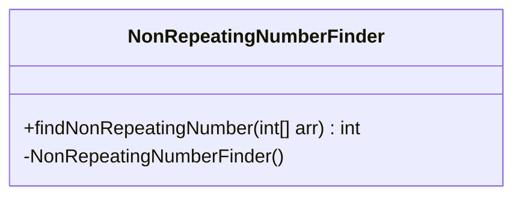
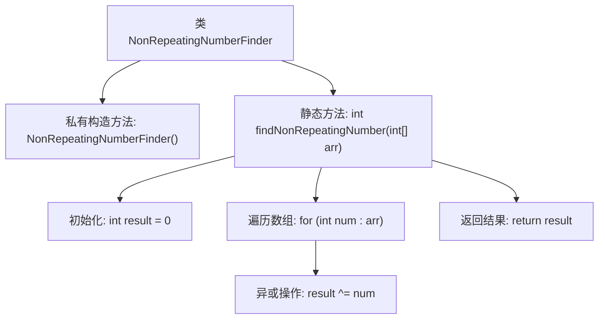

# 基础信息

|      |      |
|------|------|
| 名称 | NonRepeatingNumberFinder |
| 编码语言 | .java |
| 代码路径 | Java/src/main/java/com/thealgorithms/bitmanipulation/NonRepeatingNumberFinder.java |
| 包名 | com.thealgorithms.bitmanipulation |
| 依赖项 | [] |
| 概述说明 | 通过异或运算查找数组中唯一不重复的数字。 |

# 说明

非重复数查找类通过异或运算来识别数组中唯一不重复的数字。异或运算具有交换律和结合律，相同数字异或结果为0，而任何数与0异或结果为其本身。因此，通过遍历数组并对所有元素进行异或运算，最终结果即为唯一不重复的数字。该方法时间复杂度为O(n)，空间复杂度为O(1)，高效且节省内存。

# 类列表 Class Summary

| 名称   | 类型  | 说明 |
|-------|------|-------------|
| NonRepeatingNumberFinder | class | 非重复数查找类，通过异或运算找出数组中唯一不重复的数字。 |

## 类 NonRepeatingNumberFinder

|      |      |
|------|------|
| 访问范围 | public final |
| 类型 | class |
| 名称 | NonRepeatingNumberFinder |
| 说明 | 非重复数查找类，通过异或运算找出数组中唯一不重复的数字。 |

### UML类图

这段代码定义了一个名为 `NonRepeatingNumberFinder` 的类，该类包含一个私有构造函数和一个静态公有方法 `findNonRepeatingNumber`。`findNonRepeatingNumber` 方法接受一个整数数组作为参数，并返回数组中唯一不重复的数字。如果数组为空，则返回 0。该方法通过异或操作（`^`）来找出唯一不重复的数字，因为异或操作具有自反性，即 `a ^ a = 0`，且 `a ^ 0 = a`。因此，最终结果就是数组中唯一不重复的数字。

### 内部方法调用关系图

该流程图描述了`NonRepeatingNumberFinder`类的结构和`findNonRepeatingNumber`方法的执行流程。类包含一个私有构造方法和一个静态方法`findNonRepeatingNumber`，该方法通过异或操作找到数组中唯一不重复的数字。流程从初始化结果变量开始，遍历数组并对每个元素进行异或操作，最后返回结果。

### 字段列表 Field List

| 名称  | 类型  | 说明 |
|-------|-------|------|

### 方法列表 Method List

| 名称  | 类型  | 说明 |
|-------|-------|------|
| findNonRepeatingNumber | int | 该方法通过异或运算找出数组中唯一的非重复数字。 |

