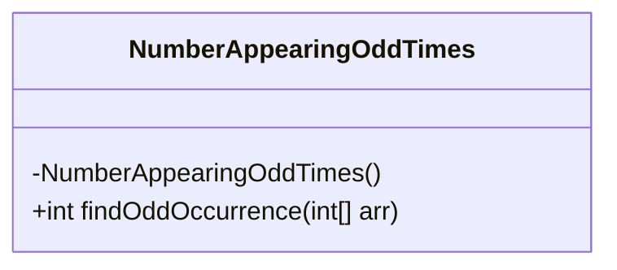
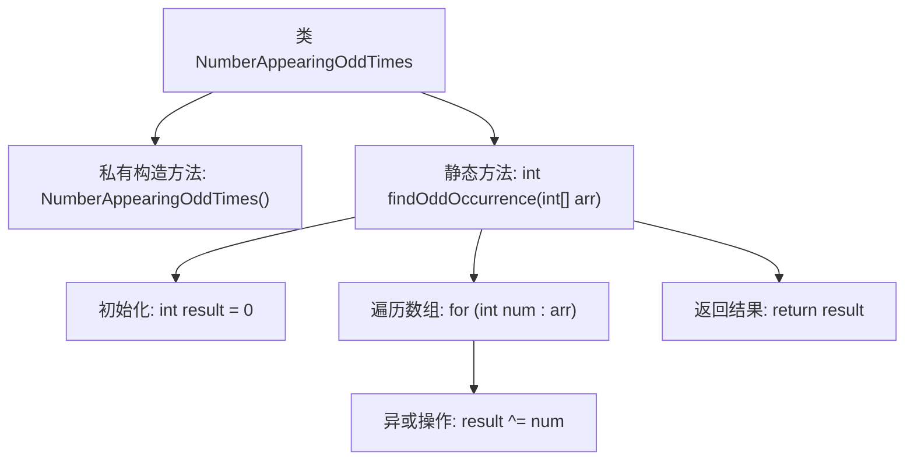

# 基础信息

|      |      |
|------|------|
| 名称 | NumberAppearingOddTimes |
| 编码语言 | .java |
| 代码路径 | Java/src/main/java/com/thealgorithms/bitmanipulation/NumberAppearingOddTimes.java |
| 包名 | com.thealgorithms.bitmanipulation |
| 依赖项 | [] |
| 概述说明 | 查找数组中唯一出现奇数次的整数。 |

# 说明

该任务要求在一个数组中找到唯一出现奇数次的整数。通常，数组中每个整数出现的次数都是偶数次，只有一个整数出现的次数是奇数次。解决这个问题的方法通常涉及遍历数组，使用某种机制来记录每个整数的出现次数，最终识别出出现奇数次的整数。这种问题常见于算法和数据结构的相关练习中，旨在考察对数组处理和位操作的理解。

# 类列表 Class Summary

| 名称   | 类型  | 说明 |
|-------|------|-------------|
| NumberAppearingOddTimes | class | 查找数组中出现奇数次的唯一整数。 |

## 类 NumberAppearingOddTimes

|      |      |
|------|------|
| 访问范围 | public final |
| 类型 | class |
| 名称 | NumberAppearingOddTimes |
| 说明 | 查找数组中出现奇数次的唯一整数。 |

### UML类图

**描述：**  
`NumberAppearingOddTimes` 类是一个工具类，用于查找在数组中出现奇数次的整数。该类包含一个私有构造函数，防止实例化，并提供一个静态方法 `findOddOccurrence`，该方法通过异或操作遍历数组，最终返回出现奇数次的整数。这个类适用于处理数组中只有一个元素出现奇数次，其余元素出现偶数次的情况。

### 内部方法调用关系图

**描述：**  
该代码定义了一个名为`NumberAppearingOddTimes`的类，其中包含一个私有构造方法和一个静态方法`findOddOccurrence`。该方法通过异或操作遍历输入数组，找到并返回出现奇数次的整数。流程图展示了类的结构以及方法的执行步骤，包括初始化、遍历数组、异或操作和返回结果。

### 字段列表 Field List

| 名称  | 类型  | 说明 |
|-------|-------|------|

### 方法列表 Method List

| 名称  | 类型  | 说明 |
|-------|-------|------|
| findOddOccurrence | int | 该方法通过异或运算找出数组中唯一出现奇数次的数。 |

