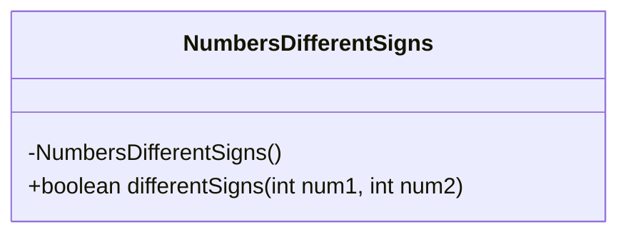
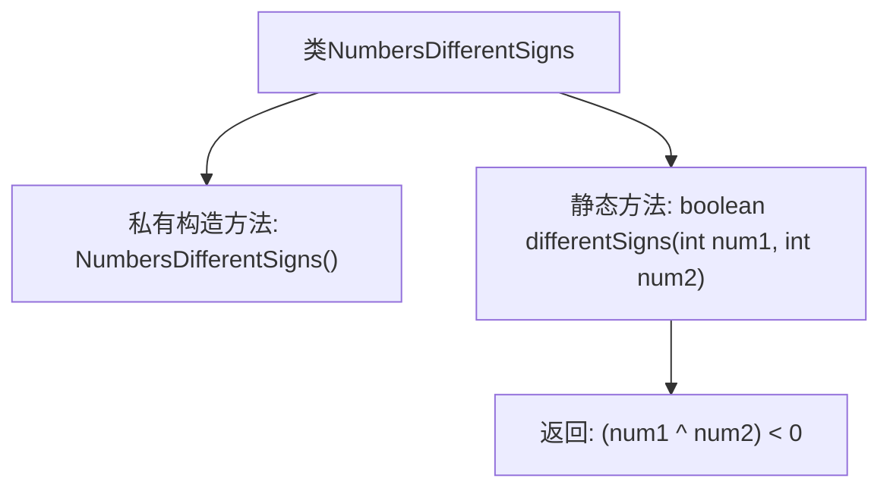

# 基础信息

|      |      |
|------|------|
| 名称 | NumbersDifferentSigns |
| 编码语言 | .java |
| 代码路径 | Java/src/main/java/com/thealgorithms/bitmanipulation/NumbersDifferentSigns.java |
| 包名 | com.thealgorithms.bitmanipulation |
| 依赖项 | [] |
| 概述说明 | 通过位运算判断两整数符号是否相反。 |

# 说明

该内容描述了通过位运算来判断两个整数的符号是否相反的方法。位运算通常涉及二进制操作，通过比较两个整数的最高位（符号位）来确定它们的符号是否一致。如果两个整数的符号位不同，则它们的符号相反；反之，则符号相同。这种方法利用了二进制表示中符号位的特性，能够高效地判断两个整数的符号关系。

# 类列表 Class Summary

| 名称   | 类型  | 说明 |
|-------|------|-------------|
| NumbersDifferentSigns | class | 通过位运算判断两整数符号是否相反。 |

## 类 NumbersDifferentSigns

|      |      |
|------|------|
| 访问范围 | public final |
| 类型 | class |
| 名称 | NumbersDifferentSigns |
| 说明 | 通过位运算判断两整数符号是否相反。 |

### UML类图

这段代码定义了一个名为 `NumbersDifferentSigns` 的类，该类包含一个私有的构造函数和一个公有的静态方法 `differentSigns`。`differentSigns` 方法通过位运算（XOR）来判断两个整数是否具有不同的符号。如果两个数的符号不同，则返回 `true`，否则返回 `false`。由于构造函数是私有的，该类不能被实例化，只能通过静态方法调用。

### 内部方法调用关系图

这段代码定义了一个名为`NumbersDifferentSigns`的最终类，其中包含一个私有构造方法和一个静态方法`differentSigns`。该静态方法通过位异或操作判断两个整数是否具有不同的符号，如果符号不同则返回`true`，否则返回`false`。流程图展示了类的结构以及方法的调用关系，清晰地反映了代码的逻辑流程。

### 字段列表 Field List

| 名称  | 类型  | 说明 |
|-------|-------|------|

### 方法列表 Method List

| 名称  | 类型  | 说明 |
|-------|-------|------|
| differentSigns | boolean | 该方法通过异或运算判断两个整数符号是否不同。 |

