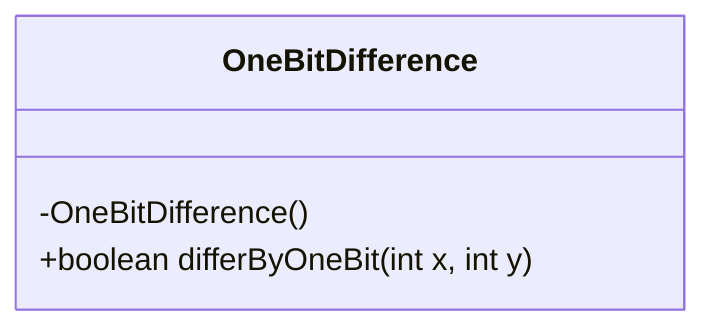
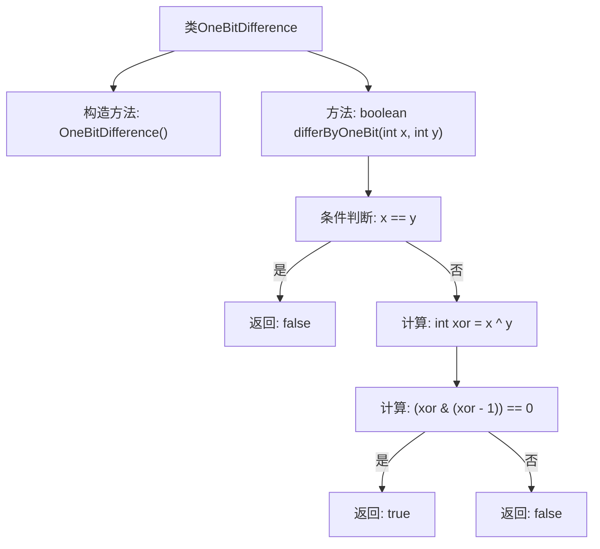

# 基础信息

|      |      |
|------|------|
| 名称 | OneBitDifference |
| 编码语言 | .java |
| 代码路径 | Java/src/main/java/com/thealgorithms/bitmanipulation/OneBitDifference.java |
| 包名 | com.thealgorithms.bitmanipulation |
| 依赖项 | [] |
| 概述说明 | 判断两整数是否仅有一位数字不同。 |

# 说明

该任务要求检查两个整数是否仅有一位不同。具体来说，需要比较这两个整数的每一位，确保只有一个位置上的数字不同，而其他所有位置上的数字都相同。这涉及到逐位比较两个整数的每一位，并统计不同的位数。如果统计结果仅有一位不同，则返回肯定结果；否则返回否定结果。

# 类列表 Class Summary

| 名称   | 类型  | 说明 |
|-------|------|-------------|
| OneBitDifference | class | 检查两个整数是否仅有一位不同。 |

## 类 OneBitDifference

|      |      |
|------|------|
| 访问范围 | public final |
| 类型 | class |
| 名称 | OneBitDifference |
| 说明 | 检查两个整数是否仅有一位不同。 |

### UML类图

这段代码定义了一个名为 `OneBitDifference` 的类，该类包含一个私有构造函数和一个公有静态方法 `differByOneBit`。`differByOneBit` 方法用于检查两个整数是否在二进制表示下仅有一位不同。该方法通过异或运算和位运算来实现这一功能，首先计算两个整数的异或结果，然后检查该结果是否为2的幂次方（即仅有一位为1）。如果是，则返回 `true`，否则返回 `false`。这个类是一个工具类，因此构造函数被私有化，防止实例化。

### 内部方法调用关系图

这段代码定义了一个名为 `OneBitDifference` 的类，其中包含一个静态方法 `differByOneBit`，用于判断两个整数是否仅有一位不同。方法首先检查两个整数是否相等，如果相等则返回 `false`。否则，通过异或操作计算两个整数的差异位，并检查差异位是否只有一个位为1。如果是，则返回 `true`，否则返回 `false`。流程图清晰地展示了方法的逻辑流程和条件判断。

### 字段列表 Field List

| 名称  | 类型  | 说明 |
|-------|-------|------|

### 方法列表 Method List

| 名称  | 类型  | 说明 |
|-------|-------|------|
| differByOneBit | boolean | 该方法判断两个整数是否仅有一位二进制不同。 |

