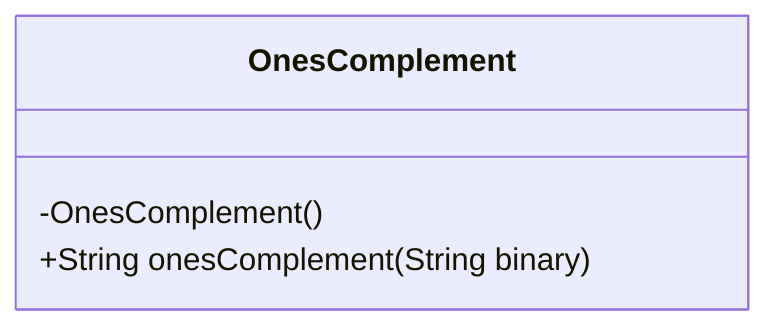
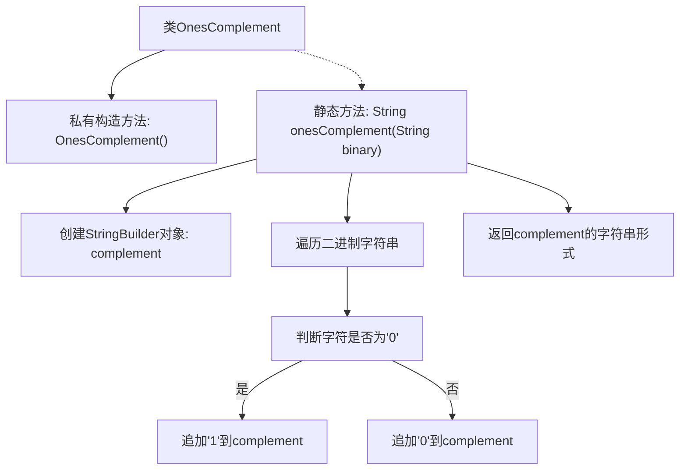

# 基础信息

|      |      |
|------|------|
| 名称 | OnesComplement |
| 编码语言 | .java |
| 代码路径 | Java/src/main/java/com/thealgorithms/bitmanipulation/OnesComplement.java |
| 包名 | com.thealgorithms.bitmanipulation |
| 依赖项 | [] |
| 概述说明 | OnesComplement类用于计算二进制数的反码。 |

# 说明

OnesComplement类专门用于计算二进制数的反码。反码是二进制数的一种表示方法，通过将原二进制数的每一位取反（即0变为1，1变为0）来得到。该类提供了相应的功能，使得用户可以方便地输入一个二进制数，并获取其反码结果。该类的设计旨在简化反码计算过程，适用于需要处理二进制反码的各种应用场景。

# 类列表 Class Summary

| 名称   | 类型  | 说明 |
|-------|------|-------------|
| OnesComplement | class | OnesComplement类提供二进制数的反码计算功能。 |

## 类 OnesComplement

|      |      |
|------|------|
| 访问范围 | public final |
| 类型 | class |
| 名称 | OnesComplement |
| 说明 | OnesComplement类提供二进制数的反码计算功能。 |

### UML类图

类图描述：
`OnesComplement` 类是一个工具类，用于计算二进制数的反码。该类包含一个私有构造函数，确保无法实例化。`onesComplement` 方法接受一个二进制字符串作为输入，遍历每个字符并将其反转（'0' 变为 '1'，'1' 变为 '0'），最终返回反转后的字符串。该类的主要功能是实现二进制数的反码计算，适用于需要处理二进制数据的场景。

### 内部方法调用关系图

这段代码定义了一个名为`OnesComplement`的类，该类包含一个私有构造方法和一个静态方法`onesComplement`。`onesComplement`方法接收一个二进制字符串作为输入，通过遍历字符串中的每个字符，将`0`转换为`1`，将`1`转换为`0`，最终返回转换后的字符串。流程图展示了从类定义到方法调用的完整过程，包括字符判断和字符串构建的步骤。

### 字段列表 Field List

| 名称  | 类型  | 说明 |
|-------|-------|------|

### 方法列表 Method List

| 名称  | 类型  | 说明 |
|-------|-------|------|
| onesComplement | String | 该方法将二进制字符串逐位取反，生成其反码。 |

