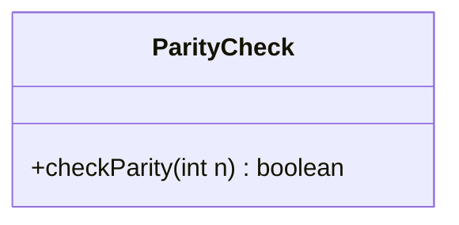
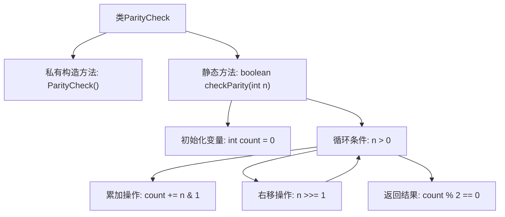

# 基础信息

|      |      |
|------|------|
| 名称 | ParityCheck |
| 编码语言 | .java |
| 代码路径 | Java/src/main/java/com/thealgorithms/bitmanipulation/ParityCheck.java |
| 包名 | com.thealgorithms.bitmanipulation |
| 依赖项 | [] |
| 概述说明 | ParityCheck类的checkParity方法检查整数奇偶性并返回布尔值。 |

# 说明

ParityCheck类提供了一个静态方法checkParity，该方法用于判断输入的整数是奇数还是偶数。该方法接收一个整数作为参数，并返回一个布尔值，其中true表示该整数为偶数，false表示该整数为奇数。这个方法的主要功能是通过简单的计算来确定整数的奇偶性，适用于需要快速判断整数性质的场景。

# 类列表 Class Summary

| 名称   | 类型  | 说明 |
|-------|------|-------------|
| ParityCheck | class | ParityCheck类包含一个静态方法checkParity，用于检查给定整数的奇偶性，返回布尔值。 |

## 类 ParityCheck

|      |      |
|------|------|
| 访问范围 | public final |
| 类型 | class |
| 名称 | ParityCheck |
| 说明 | ParityCheck类包含一个静态方法checkParity，用于检查给定整数的奇偶性，返回布尔值。 |

### UML类图

**描述：**  
`ParityCheck` 类是一个工具类，用于检查给定整数的奇偶性。该类包含一个静态方法 `checkParity`，该方法通过计算整数的二进制表示中 `1` 的个数来判断其奇偶性。如果 `1` 的个数为偶数，则返回 `true`，否则返回 `false`。由于该类是 `final` 的，并且构造函数为私有，因此无法被继承或实例化，确保了工具类的单例性质。

### 内部方法调用关系图

这段代码定义了一个名为 `ParityCheck` 的类，其中包含一个私有构造方法和一个静态方法 `checkParity`。`checkParity` 方法用于检查给定整数的奇偶性，通过计算二进制表示中 `1` 的个数，如果个数为偶数则返回 `true`，否则返回 `false`。流程图展示了方法的执行流程，从初始化变量到循环计算，最终返回结果。

### 字段列表 Field List

| 名称  | 类型  | 说明 |
|-------|-------|------|

### 方法列表 Method List

| 名称  | 类型  | 说明 |
|-------|-------|------|
| checkParity | boolean | 该方法检查整数n的二进制表示中1的个数是否为偶数。 |

