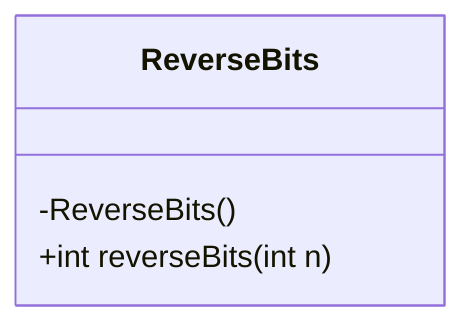
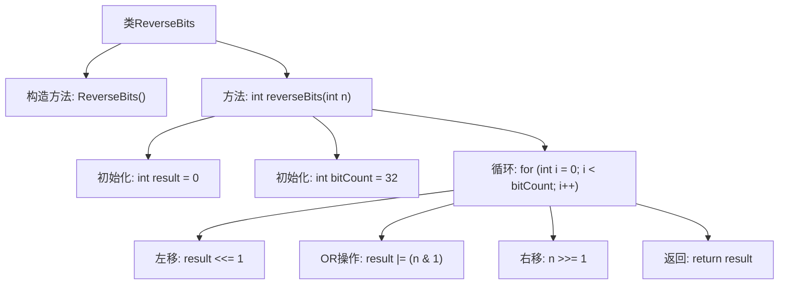

# 基础信息

|      |      |
|------|------|
| 名称 | ReverseBits |
| 编码语言 | .java |
| 代码路径 | Java/src/main/java/com/thealgorithms/bitmanipulation/ReverseBits.java |
| 包名 | com.thealgorithms.bitmanipulation |
| 依赖项 | [] |
| 概述说明 | ReverseBits类用于反转32位整数的二进制位。 |

# 说明

ReverseBits类是一个专门用于处理32位整数的工具类，其主要功能是实现对32位整数的二进制位进行反转操作。通过该类提供的方法，用户可以方便地将一个32位整数的二进制位顺序完全颠倒，从而实现位的反转。这一功能在处理某些需要位操作的算法或问题时非常有用，例如在图像处理、加密算法或位运算优化等领域。ReverseBits类的设计简洁高效，能够确保反转操作的准确性和性能。

# 类列表 Class Summary

| 名称   | 类型  | 说明 |
|-------|------|-------------|
| ReverseBits | class | ReverseBits类提供反转32位整数二进制位的方法。 |

## 类 ReverseBits

|      |      |
|------|------|
| 访问范围 | public final |
| 类型 | class |
| 名称 | ReverseBits |
| 说明 | ReverseBits类提供反转32位整数二进制位的方法。 |

### UML类图

这段代码定义了一个名为 `ReverseBits` 的类，该类包含一个私有的构造函数和一个公有的静态方法 `reverseBits`。`reverseBits` 方法用于反转一个32位整数的二进制位。通过循环32次，每次将结果左移一位，然后将输入整数的最低位与结果进行按位或操作，最后将输入整数右移一位。最终返回反转后的整数。由于 `ReverseBits` 类的构造函数是私有的，因此该类不能被实例化，只能通过静态方法 `reverseBits` 来调用其功能。

### 内部方法调用关系图

这段代码定义了一个名为 `ReverseBits` 的类，其中包含一个静态方法 `reverseBits`，用于反转一个32位整数的二进制位。方法通过循环遍历每一位，使用左移和右移操作以及位运算来逐步构建反转后的整数。流程图展示了类的结构以及方法内部的操作步骤，从初始化变量到循环处理每一位，最后返回结果。

### 字段列表 Field List

| 名称  | 类型  | 说明 |
|-------|-------|------|

### 方法列表 Method List

| 名称  | 类型  | 说明 |
|-------|-------|------|
| reverseBits | int | 反转32位整数的二进制位。 |

