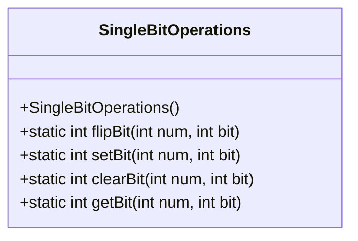
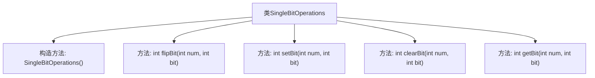

# 基础信息

|      |      |
|------|------|
| 名称 | SingleBitOperations |
| 编码语言 | .java |
| 代码路径 | Java/src/main/java/com/thealgorithms/bitmanipulation/SingleBitOperations.java |
| 包名 | com.thealgorithms.bitmanipulation |
| 依赖项 | [] |
| 概述说明 | 单比特操作类支持翻转、设置、清除和获取指定比特位功能。 |

# 说明

单比特操作类提供了一系列功能，用于对指定比特位进行操作。主要功能包括翻转比特位，即将当前状态取反；设置比特位，将其置为1；清除比特位，将其置为0；以及获取比特位的当前状态。这些操作能够精确控制单个比特位，适用于需要对二进制数据进行精细处理的场景。

# 类列表 Class Summary

| 名称   | 类型  | 说明 |
|-------|------|-------------|
| SingleBitOperations | class | 单比特操作类，提供翻转、设置、清除和获取指定比特位功能。 |

## 类 SingleBitOperations

|      |      |
|------|------|
| 访问范围 | public final |
| 类型 | class |
| 名称 | SingleBitOperations |
| 说明 | 单比特操作类，提供翻转、设置、清除和获取指定比特位功能。 |

### UML类图

**描述：**  
`SingleBitOperations` 类是一个工具类，提供了对整数中单个位进行操作的方法。这些方法包括翻转指定位、设置指定位为1、清除指定位（设置为0）以及获取指定位的值。所有方法都是静态的，因此可以直接通过类名调用，而无需实例化对象。该类通过位操作符（如 `^`、`|`、`&`、`~` 和 `<<`）实现这些功能，适用于需要高效处理位操作的场景。

### 内部方法调用关系图

该流程图展示了`SingleBitOperations`类的结构及其内部方法。`SingleBitOperations`类是一个工具类，提供了四个静态方法用于操作整数的单个位。这些方法包括`flipBit`用于翻转指定位，`setBit`用于设置指定位为1，`clearBit`用于清除指定位（设置为0），以及`getBit`用于获取指定位的值。每个方法都接受一个整数和一个位位置作为参数，并返回操作后的结果。

### 字段列表 Field List

| 名称  | 类型  | 说明 |
|-------|-------|------|

### 方法列表 Method List

| 名称  | 类型  | 说明 |
|-------|-------|------|
| clearBit | int | 该方法清除整数num中指定bit位的值。 |
| getBit | int | 获取整数num的第bit位值。 |
| setBit | int | 静态方法setBit通过位运算将整数的指定位设置为1。 |
| flipBit | int | 该方法通过异或运算翻转整数的指定位。 |

