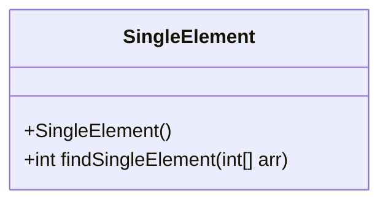
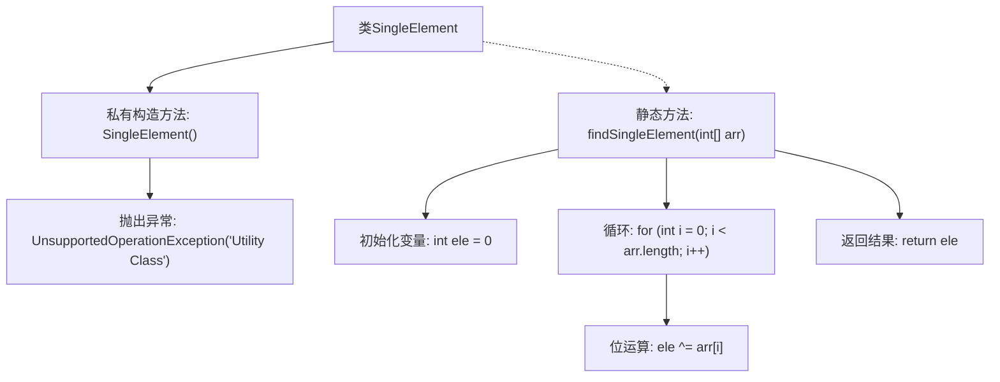

# 基础信息

|      |      |
|------|------|
| 名称 | SingleElement |
| 编码语言 | .java |
| 代码路径 | Java/src/main/java/com/thealgorithms/bitmanipulation/SingleElement.java |
| 包名 | com.thealgorithms.bitmanipulation |
| 依赖项 | [] |
| 概述说明 | 单例类使用位运算XOR在O(n)时间内查找数组中的唯一非重复元素。 |

# 说明

单例类利用位运算中的XOR操作，在时间复杂度为O(n)的情况下，能够高效地查找数组中唯一的非重复元素。该方法通过遍历数组，将每个元素依次进行XOR运算，最终得到的结果即为数组中唯一的非重复元素。这种算法简单且高效，适用于处理大规模数据集的场景。

# 类列表 Class Summary

| 名称   | 类型  | 说明 |
|-------|------|-------------|
| SingleElement | class | 单例类通过位运算XOR在O(n)时间内查找数组中唯一的非重复元素。 |

## 类 SingleElement

|      |      |
|------|------|
| 访问范围 | public final |
| 类型 | class |
| 名称 | SingleElement |
| 说明 | 单例类通过位运算XOR在O(n)时间内查找数组中唯一的非重复元素。 |

### UML类图

这段代码定义了一个名为 `SingleElement` 的最终类，该类包含一个私有构造函数和一个公有静态方法 `findSingleElement`。私有构造函数用于防止类的实例化，并在尝试实例化时抛出 `UnsupportedOperationException`。`findSingleElement` 方法通过位运算 XOR 来查找数组中唯一不重复的元素，该数组中的其他元素都恰好出现两次。该方法的时间复杂度为 O(n)，空间复杂度为 O(1)。

### 内部方法调用关系图

这段代码定义了一个名为 `SingleElement` 的最终类，该类包含一个私有构造方法和一个静态方法 `findSingleElement`。私有构造方法用于防止类的实例化，并在尝试实例化时抛出 `UnsupportedOperationException` 异常。静态方法 `findSingleElement` 通过位运算 XOR 在数组中查找唯一不重复的元素，并返回该元素。该方法的时间复杂度为 O(n)，空间复杂度为 O(1)。

### 字段列表 Field List

| 名称  | 类型  | 说明 |
|-------|-------|------|

### 方法列表 Method List

| 名称  | 类型  | 说明 |
|-------|-------|------|
| findSingleElement | int | 查找数组中唯一不重复的元素。 |

