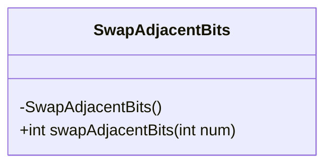
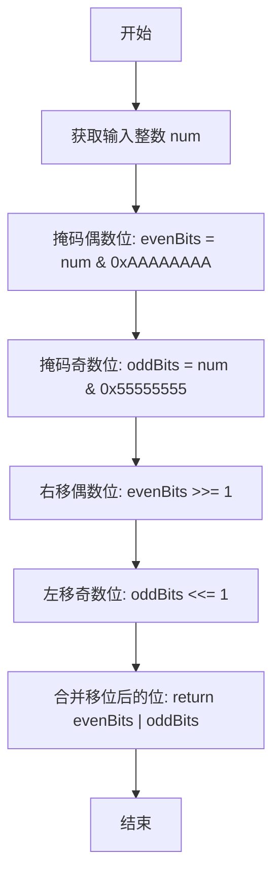
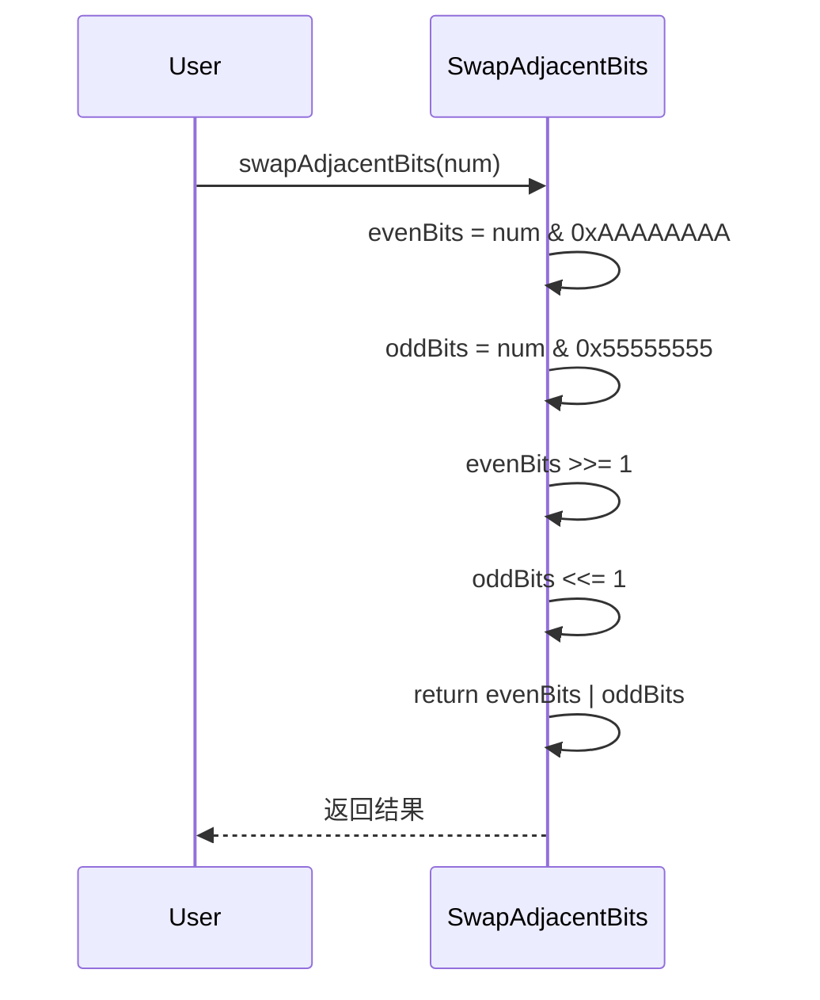
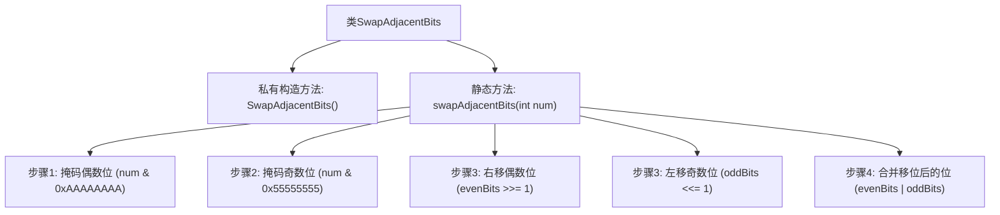

# 基础信息

|      |      |
|------|------|
| 名称 | SwapAdjacentBits |
| 编码语言 | .java |
| 代码路径 | Java/src/main/java/com/thealgorithms/bitmanipulation/SwapAdjacentBits.java |
| 包名 | com.thealgorithms.bitmanipulation |
| 依赖项 | [] |
| 概述说明 | 交换整数相邻位，使用掩码和位移操作完成。 |

# 说明

该方法通过使用掩码和位移操作来交换整数的相邻位。具体步骤包括：首先，创建掩码以提取奇数位和偶数位；然后，通过位移操作将奇数位和偶数位分别移动到对方的位置；最后，将移动后的位重新组合，完成相邻位的交换。此方法高效且适用于需要快速交换整数相邻位的场景。

# 类列表 Class Summary

| 名称   | 类型  | 说明 |
|-------|------|-------------|
| SwapAdjacentBits | class | 交换整数相邻位，通过掩码和位移实现。 |

## 类 SwapAdjacentBits

|      |      |
|------|------|
| 访问范围 | public final |
| 类型 | class |
| 名称 | SwapAdjacentBits |
| 说明 | 交换整数相邻位，通过掩码和位移实现。 |

### UML类图

**描述：**  
`SwapAdjacentBits` 类提供了一个静态方法 `swapAdjacentBits`，用于交换整数中相邻的位。该方法通过掩码操作分别提取偶数和奇数位，然后通过移位操作交换它们的位置，最后将移位后的位合并返回。类图展示了类的结构，流程图和时序图分别描述了方法的执行流程和调用顺序。

### 内部方法调用关系图

这段代码定义了一个名为 `SwapAdjacentBits` 的类，其中包含一个静态方法 `swapAdjacentBits`，用于交换给定整数的相邻位。方法首先通过掩码操作分离出偶数位和奇数位，然后分别对它们进行右移和左移操作，最后将移位后的位合并返回结果。该代码通过位操作高效地实现了相邻位的交换。

### 字段列表 Field List

| 名称  | 类型  | 说明 |
|-------|-------|------|

### 方法列表 Method List

| 名称  | 类型  | 说明 |
|-------|-------|------|
| swapAdjacentBits | int | 交换整数相邻位的函数，通过掩码和位移实现。 |

